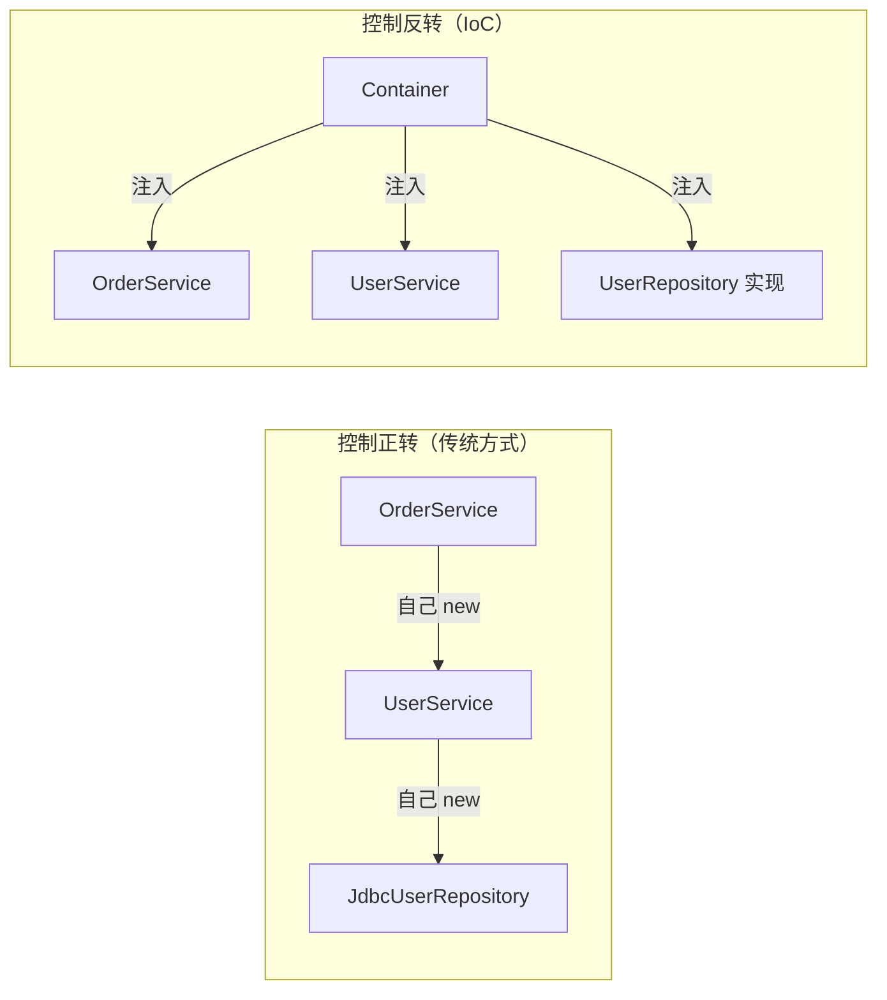
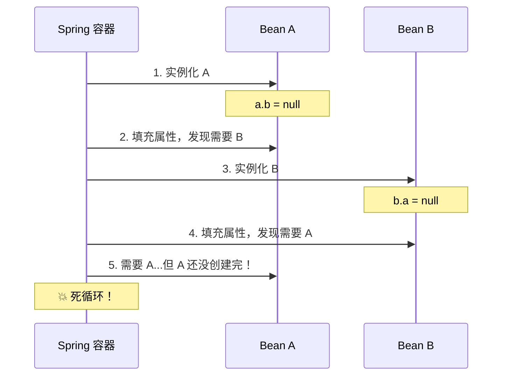
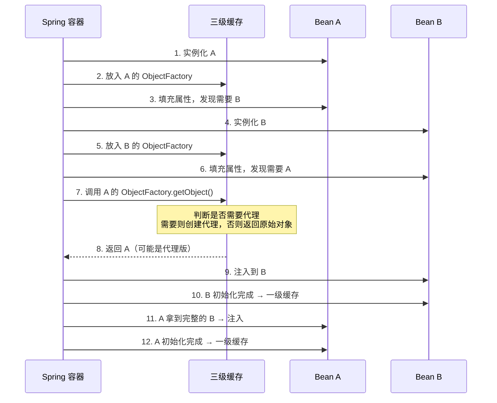

# IoC 与依赖注入

## 对象为什么不能自己 new？

写 Java 的人，谁都 new 过对象。`new UserService()` 一行代码，对象就活了，多简单。

但你有没有遇到过这种情况——

你写了一个 `OrderService`，它依赖 `UserService`、`ProductService`、`PaymentService`。你在 `OrderService` 的构造函数里把这三个依赖都 new 出来了。跑得好好的，直到有一天：

1. 测试的时候想 mock `PaymentService`，发现根本 mock 不了，因为它是 `new` 出来的，你没法替换成假的。
2. `UserService` 的构造函数改了，加了个参数，你得把 `OrderService` 里那行 `new UserService()` 也改了。然后发现还有 20 个地方也 new 了它。
3. 想把 `ProductService` 从单例改成每次请求新建一个，结果要改几十个 `new` 的地方。

这就是 **对象自己管自己的创建和依赖** 带来的问题：**耦合**。

不是说 `new` 有罪。`new` 本身没问题，问题是 **"谁来决定创建什么、怎么组装"** 这件事，不应该由使用者来操心。

### 没有 IoC 的日子

看一个真实的例子。假设我们要做一个简单的下单流程：

```java
// 数据库访问层
public class JdbcUserRepository implements UserRepository {
    public JdbcUserRepository(String url, String user, String password) {
        // 初始化数据库连接
    }
}

// 业务层
public class UserService {
    private UserRepository repo;

    public UserService() {
        // 自己创建依赖——耦合死了
        this.repo = new JdbcUserRepository(
            "jdbc:mysql://localhost:3306/db", "root", "123456"
        );
    }

    public User findById(Long id) {
        return repo.findById(id);
    }
}

// 更上层
public class OrderService {
    private UserService userService;
    private PaymentService paymentService;

    public OrderService() {
        this.userService = new UserService();       // 又 new 了一遍
        this.paymentService = new PaymentService(); // 再 new 一遍
    }
}
```

问题清单：

- `UserService` 硬编码了 `JdbcUserRepository`，想换成 `MyBatisUserRepository`？改源码。
- 数据库连接信息写死在代码里，换环境得改代码重新编译。
- `OrderService` 知道 `UserService` 的具体实现，耦合传递。
- 测试时没法注入 mock 对象，单元测试几乎不可能。

这就是 **控制正转**（Normal Flow）——每个对象自己控制依赖的创建。对象既是使用者，又是创建者，身兼两职。

### IoC：把"创建"这件事交出去

IoC（Inversion of Control，控制反转）的核心思想就一句话：

**不要自己 new 依赖，让别人（容器）帮你创建和组装。**

"控制反转"这个名字听起来高大上，其实就是 **"谁来 new"这件事反转了**。以前是你自己 new，现在是容器帮你 new。

```java
// 依赖关系说清楚就行，不用自己 new
public class UserService {
    private final UserRepository repo;

    // 容器会帮你注入一个合适的实现
    public UserService(UserRepository repo) {
        this.repo = repo;
    }
}

public class OrderService {
    private final UserService userService;
    private final PaymentService paymentService;

    public OrderService(UserService userService, PaymentService paymentService) {
        this.userService = userService;
        this.paymentService = paymentService;
    }
}
```

看到区别了吗？`UserService` 不再关心 `UserRepository` 的具体实现是谁，`OrderService` 也不再关心 `UserService` 怎么创建的。大家只声明"我需要什么"，容器负责"给什么"。

这就是 **依赖注入（Dependency Injection, DI）**——IoC 的一种具体实现方式。



### Spring 容器到底帮了什么忙？

Spring 的 IoC 容器做的事情，说白了就三件：

1. **管理对象的创建**——你告诉它"我有这些 Bean"，它帮你 new 出来。
2. **管理对象之间的依赖关系**——你说"A 依赖 B"，它帮你把 B 注入到 A 里。
3. **管理对象的生命周期**——什么时候创建、什么时候销毁，它来管。

用 Spring 改写上面的例子：

```java
// 告诉 Spring：这是一个 Bean，需要被管理
@Repository
public class JdbcUserRepository implements UserRepository {
    // Spring 会自动注入数据源配置
    @Autowired
    private DataSource dataSource;

    @Override
    public User findById(Long id) {
        // ...
    }
}

@Service
public class UserService {
    private final UserRepository repo;

    // Spring 看到这个构造函数，知道要注入一个 UserRepository
    @Autowired
    public UserService(UserRepository repo) {
        this.repo = repo;
    }
}

@Service
public class OrderService {
    private final UserService userService;
    private final PaymentService paymentService;

    @Autowired
    public OrderService(UserService userService, PaymentService paymentService) {
        this.userService = userService;
        this.paymentService = paymentService;
    }
}
```

启动 Spring 容器后，它会：

1. 扫描所有带 `@Repository`、`@Service` 等注解的类
2. 创建这些类的实例（Bean）
3. 根据依赖关系，自动把 `JdbcUserRepository` 注入到 `UserService`，把 `UserService` 和 `PaymentService` 注入到 `OrderService`

整个过程你不需要写一行 `new` 代码。

### 一个容易混淆的点

IoC 是一种 **思想**，DI 是 IoC 的一种 **实现方式**。还有其他方式实现 IoC，比如 **服务定位器模式**（Service Locator），但 DI 是最主流、最被认可的方式。

Spring 的 DI 实现是通过容器 + 注解（或 XML）来完成的。但 DI 这个思想本身不依赖 Spring，你可以自己写一个简单的容器来实现 DI，只不过 Spring 帮你做好了，而且做得很好。

---

## 依赖注入的三种姿势

既然要让容器帮我们注入依赖，那"怎么告诉容器"呢？Spring 提供了三种方式。

### 构造器注入（推荐）

```java
@Service
public class OrderService {
    private final UserService userService;
    private final PaymentService paymentService;

    @Autowired  // 可以省略——Spring 4.3+ 单构造函数自动注入
    public OrderService(UserService userService, PaymentService paymentService) {
        this.userService = userService;
        this.paymentService = paymentService;
    }
}
```

**优点：**
- 依赖一目了然，看构造函数就知道这个类需要什么
- 字段可以声明为 `final`，创建后不可变，线程安全
- 可以做校验，构造函数里就能检查参数是否为空
- 测试友好，直接 `new OrderService(mock1, mock2)` 就能测试

**缺点：**
- 依赖太多时构造函数参数列表很长（但这是设计问题，不是注入方式的问题）

### Setter 注入

```java
@Service
public class OrderService {
    private UserService userService;
    private PaymentService paymentService;

    @Autowired
    public void setUserService(UserService userService) {
        this.userService = userService;
    }

    @Autowired
    public void setPaymentService(PaymentService paymentService) {
        this.paymentService = paymentService;
    }
}
```

**优点：**
- 可以在创建后重新注入（可选依赖的场景）
- 参数多的时候比构造函数清晰

**缺点：**
- 依赖不明确，你不知道哪些是必须的、哪些是可选的
- 对象创建后处于"半成品"状态——new 出来了但依赖还没注入，有 NPE 风险
- 字段不能是 `final`

### 字段注入（不推荐）

```java
@Service
public class OrderService {
    @Autowired
    private UserService userService;

    @Autowired
    private PaymentService paymentService;
}
```

**优点：**
- 代码最少，看着简洁

**缺点：**
- 依赖被隐藏了，看字段声明看不出哪些是外部注入的
- 字段不能是 `final`
- 无法在构造时做依赖校验
- **测试困难**——你没法 `new OrderService()` 然后注入 mock，只能用反射或者 Spring Test
- 鼓励了"依赖随便加"的坏习惯，一个类注入十几个依赖也不会觉得痛

### 对比

| 维度 | 构造器注入 | Setter 注入 | 字段注入 |
|------|-----------|------------|---------|
| 依赖可见性 | ✅ 一眼看到 | ❌ 分散在多个方法 | ❌ 隐藏在字段里 |
| 不可变性 | ✅ 可以 final | ❌ 不行 | ❌ 不行 |
| 测试友好 | ✅ 直接 new | ✅ 也能 mock | ❌ 需要反射 |
| 空安全 | ✅ 构造时校验 | ❌ 可能遗漏 | ❌ 可能遗漏 |
| 代码量 | 中等 | 最多 | 最少 |

**结论：用构造器注入。** 字段注入是 Spring 早期为了"方便"引入的，但它带来的便利是以牺牲代码质量为代价的。Spring 官方也推荐构造器注入。

如果你看到团队里全是字段注入，别急着全改——但新代码请用构造器注入。

---

## @Autowired 和 @Resource：不只是注解不同

这两个注解都能做依赖注入，很多人以为只是"写法不同"。其实背后的机制完全不同。

### @Autowired——按类型找

`@Autowired` 是 Spring 自己的注解，**默认按类型（byType）匹配**。

```java
@Autowired
private UserRepository repo;  // Spring 找所有 UserRepository 类型的 Bean
```

当容器里只有一个 `UserRepository` 类型的 Bean 时，没问题。但如果存在多个实现：

```java
@Repository
public class JdbcUserRepository implements UserRepository { }

@Repository
public class MyBatisUserRepository implements UserRepository { }
```

这时候 `@Autowired` 就懵了——两个都是 `UserRepository`，注入哪个？

解决方案是配合 `@Qualifier` 指定名字：

```java
@Autowired
@Qualifier("myBatisUserRepository")
private UserRepository repo;
```

或者用 `@Primary` 标记一个"默认"的：

```java
@Primary
@Repository
public class JdbcUserRepository implements UserRepository { }
```

### @Resource——先找名字，再找类型

`@Resource` 是 JSR-250 标准注解（`javax.annotation.Resource`），**默认按名字（byName）匹配**。

```java
@Resource
private UserRepository repo;  // 先找名字叫 "repo" 的 Bean，找不到再按类型
```

它的工作流程：

1. 先看有没有名字等于字段名（或 setter 方法名对应的属性名）的 Bean
2. 如果有，直接注入
3. 如果没有，退回到按类型匹配
4. 可以通过 `@Resource(name = "xxx")` 显式指定名字

### 关键区别

```mermaid
graph TD
    A["@Autowired"] -->|1. 按类型| B{找到多个?}
    B -->|否| C[直接注入]
    B -->|是| D{有 @Qualifier?}
    D -->|是| E[按限定符选]
    D -->|否| F{有 @Primary?}
    F -->|是| G[选 Primary]
    F -->|否| H[报错 NoUniqueBeanDefinitionException]

    I["@Resource"] -->|1. 按名字| J{找到?}
    J -->|是| K[直接注入]
    J -->|否||2. 按类型| L{找到多个?}
    L -->|否| M[直接注入]
    L -->|是| N[报错]
```

| 维度 | @Autowired | @Resource |
|------|-----------|-----------|
| 来源 | Spring 注解 | JSR-250 标准 |
| 匹配策略 | 默认按类型 | 默认按名字 |
| 指定名字 | @Qualifier | name 属性 |
| 是否必须有 | required=false 可选 | 不支持（找不到就报错） |
| 可用位置 | 构造器/Setter/字段 | Setter/字段 |

### 实际选择

大多数 Spring 项目用 `@Autowired`，因为它是 Spring 原生注解，功能更丰富（支持 `required=false`、`@Qualifier`、`@Primary` 等）。

`@Resource` 的优势是它是 Java 标准，不依赖 Spring。但说实话，如果你用 Spring 开发，这个"标准"意义不大——你已经离不开 Spring 了。

**个人建议：用 `@Autowired`，遇到多个实现时用 `@Qualifier` 或 `@Primary`。** 保持团队统一就好。

---

## 循环依赖与三级缓存

这是 Spring 面试的"重灾区"，但大多数文章讲得像背书。我们换个方式——从一个实际问题出发。

### 场景

```java
@Service
public class A {
    @Autowired
    private B b;
}

@Service
public class B {
    @Autowired
    private A a;
}
```

A 依赖 B，B 也依赖 A。这合理吗？**大多数情况下不合理**，说明你的设计有问题，应该提取公共部分到第三个类。但现实中确实存在这种情况（特别是老项目），Spring 得想办法解决。

### 先理解问题本质

假设 Spring 要创建 A：

1. 实例化 A（`new A()`，此时 A 的 `b` 字段是 null）
2. 填充属性，发现 A 需要 B → 去创建 B
3. 实例化 B（`new B()`，此时 B 的 `a` 字段是 null）
4. 填充属性，发现 B 需要 A → 去创建 A
5. **A 还没创建完呢！** → 无限循环



### 一级缓存够不够？

最直觉的想法：搞一个缓存，A 实例化后就放进去，B 再来找 A 的时候就能找到了。

```java
Map<String, Object> singletonObjects = new HashMap<>();
```

但有个问题：缓存里放的是 **半成品** A（`b` 字段还是 null）。如果这时候有其他 Bean 也来拿 A，拿到的是个残缺的对象，用的时候会 NPE。

### 二级缓存够不够？

那就搞两个缓存：

```java
Map<String, Object> singletonObjects = new HashMap<>();       // 完成品
Map<String, Object> earlySingletonObjects = new HashMap<>();   // 半成品
```

流程变成：

1. 实例化 A，放入 `earlySingletonObjects`
2. 填充属性，发现需要 B → 去创建 B
3. 实例化 B，放入 `earlySingletonObjects`
4. B 需要 A → 从 `earlySingletonObjects` 拿到半成品 A → 注入
5. B 初始化完成，放入 `singletonObjects`
6. A 拿到完整的 B，注入
7. A 初始化完成，放入 `singletonObjects`

这不就解决了？

**大多数情况确实够了。** 但有一个特殊情况——如果 A 被 AOP 代理了呢？

### 为什么要三级缓存？

假设 A 需要 AOP 代理：

```java
@Service
public class A {
    @Autowired
    private B b;

    @Transactional  // 这个方法需要 AOP 代理
    public void doSomething() { }
}
```

A 的代理对象（ProxyA）通常是在 **初始化完成后** 由 `BeanPostProcessor` 创建的。但在循环依赖场景下，B 需要在 **属性填充阶段** 就拿到 A 的引用。

如果 B 拿到的是原始 A（不是 ProxyA），那后续通过 B 调用 A 的方法时，`@Transactional` 就不生效了——因为 B 手里的是原版 A，不是代理版。

所以需要在 **提前暴露** 的时候就能创建代理。这就是第三级缓存的作用：

```java
// 三级缓存
Map<String, Object> singletonObjects = new HashMap<>();              // 一级：完成品
Map<String, Object> earlySingletonObjects = new HashMap<>();          // 二级：半成品（可能是代理）
Map<String, ObjectFactory<?>> singletonFactories = new HashMap<>();   // 三级：对象工厂
```

关键在第三级缓存存的不是对象本身，而是一个 **ObjectFactory（对象工厂）**。这个工厂的逻辑是：

- 如果需要 AOP 代理，就返回代理对象
- 如果不需要，就返回原始对象

流程变成：



### 三级缓存的完整总结

| 缓存级别 | 存什么 | 用途 |
|---------|-------|------|
| 一级 `singletonObjects` | 完整的 Bean | 最终使用 |
| 二级 `earlySingletonObjects` | 早期引用（可能是代理） | 解决循环依赖时复用 |
| 三级 `singletonFactories` | ObjectFactory | 决定是否需要提前代理 |

### 什么情况下循环依赖解决不了？

**构造器注入的循环依赖没法解决。** 因为构造器注入要求在构造时就传入依赖，而此时 Bean 还没实例化完，连三级缓存都还没放进去。

```java
@Service
public class A {
    public A(B b) { }  // ❌ 循环依赖，报错
}

@Service
public class B {
    public B(A a) { }  // ❌ 循环依赖，报错
}
```

这时候 Spring 会直接抛 `BeanCurrentlyInCreationException`。

解决方案：
1. 用 `@Lazy` 延迟注入——注入的不是真正的 B，而是一个代理，用到的时候才去拿
2. 重新设计，消除循环依赖

```java
@Service
public class A {
    private final B b;

    public A(@Lazy B b) {  // ✅ 注入一个懒加载代理
        this.b = b;
    }
}
```

### 最后的判断

三级缓存的设计很精巧，但它本质上是在 **修补一个糟糕的设计**。如果你的代码出现了循环依赖，优先考虑重构而不是依赖 Spring 的三级缓存。记住：

> 循环依赖能解决 ≠ 循环依赖应该存在
