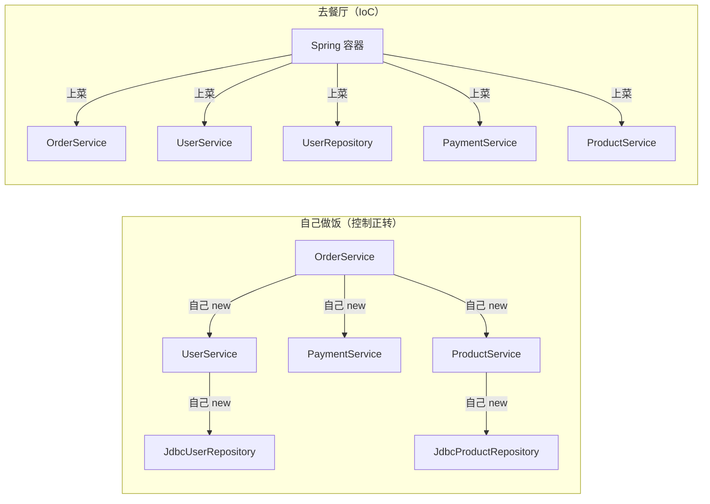
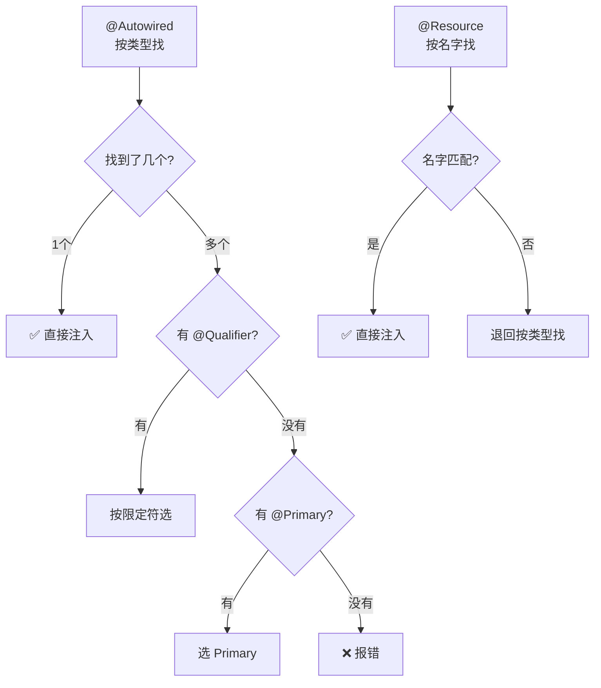
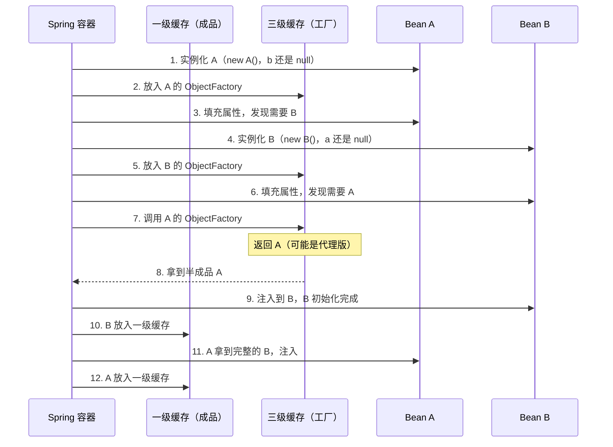

# IoC 与依赖注入

写 Java 的人，谁都 new 过对象。但你有没有遇到过这种情况——

凌晨两点，你被叫起来处理线上故障。打开代码一看，`OrderService` 里硬编码了 `new JdbcUserRepository("jdbc:mysql://10.0.0.1:3306/prod", "root", "root123")`。问题是，这个数据库地址上个月已经换了。你改了，编译，打包，部署。折腾到凌晨四点。

第二天复盘，你发现同样的 `new JdbcUserRepository(...)` 散落在 17 个文件里。改了 3 个，漏了 14 个。

这不是 bug，这是 **设计病**。

## 自己 new 对象，到底出了什么问题？

先看一段代码，这段代码你可能写过，或者正在写：

```java
public class OrderService {
    private UserService userService = new UserService();
    private PaymentService paymentService = new PaymentService();
    private ProductService productService = new ProductService(
        new JdbcProductRepository("jdbc:mysql://localhost:3306/db", "root", "123")
    );

    public void createOrder(Long userId, Long productId, int quantity) {
        User user = userService.findById(userId);
        Product product = productService.findById(productId);
        paymentService.charge(user, product.getPrice() * quantity);
        // ...
    }
}
```

跑得通。功能没问题。但你来回答几个问题：

1. **想测试 `createOrder` 方法**，但不想真的调用 `PaymentService`（会扣钱）。你能把 `paymentService` 换成一个假的吗？
2. **数据库地址换了**，你要改几个文件？
3. **想把 `ProductService` 从单例改成每次请求新建一个**，要改哪里？
4. **`UserService` 的构造函数加了个参数**，有多少个地方要跟着改？

答案分别是：很难、很多、到处改、不知道（因为你不确定有多少地方 new 了它）。

这就是 **控制正转**——每个对象自己负责创建自己的依赖。对象既是使用者，又是创建者，身兼两职。就像一个人既当厨师又当食客，一边炒菜一边吃饭，能不乱吗？

## 一个类比：自己做饭 vs 去餐厅

想象你饿了。

**自己做饭的流程：**
1. 去超市买菜（获取原材料）
2. 洗菜、切菜（初始化）
3. 开火、炒菜（组装依赖）
4. 盛盘、上桌（完成创建）
5. 吃饭（使用）
6. 洗碗、收拾（销毁）

你得知道每种菜从哪买、怎么处理、怎么搭配。你是厨师，也是食客。

**去餐厅的流程：**
1. 坐下，看菜单，点菜（声明依赖）
2. 等服务员上菜（容器注入）
3. 吃饭（使用）

你不需要知道菜从哪来、怎么做的。你只说"我要一份宫保鸡丁"，餐厅（容器）负责搞定一切。

Spring 的 IoC 容器就是这个 **餐厅**。



左边一团乱麻，右边井然有序。区别在哪？**"谁来创建"这件事，反转了。**

## IoC：把"创建权"交出去

IoC（Inversion of Control，控制反转），名字听起来高大上，本质就一句话：

**不要自己 new 依赖，告诉容器"我需要什么"，让它帮你创建和组装。**

"控制"指的是 **对象的创建和依赖关系的控制权**。"反转"指的是这个控制权从 **使用者** 转移到了 **容器**。

用餐厅的类比来说：以前你是自己买菜做饭的厨师，现在你是点菜的顾客。你把"做什么菜、怎么做"的控制权交给了餐厅。

改写上面的代码：

```java
@Service
public class OrderService {
    private final UserService userService;
    private final PaymentService paymentService;
    private final ProductService productService;

    // Spring 看到这个构造函数，知道需要注入这三个依赖
    // 就像你告诉餐厅"我要这三道菜"，它帮你搞定
    public OrderService(UserService userService,
                        PaymentService paymentService,
                        ProductService productService) {
        this.userService = userService;
        this.paymentService = paymentService;
        this.productService = productService;
    }
}
```

`OrderService` 不再关心 `UserService` 怎么创建、`PaymentService` 用什么实现。它只声明"我需要这些依赖"，容器负责注入。

这就像你去餐厅点菜——你不需要知道宫保鸡丁的鸡肉是哪个供应商提供的，花生是哪里产的，厨师用的是什么牌子的酱油。你只管点菜，餐厅管供应链。

## 依赖注入的三种姿势：先猜再看

既然要让容器注入依赖，那怎么"告诉容器"呢？Spring 提供了三种方式。先看代码，你猜猜哪种最好：

**方式一：**
```java
@Service
public class OrderService {
    private final UserService userService;
    private final PaymentService paymentService;

    public OrderService(UserService userService, PaymentService paymentService) {
        this.userService = userService;
        this.paymentService = paymentService;
    }
}
```

**方式二：**
```java
@Service
public class OrderService {
    private UserService userService;
    private PaymentService paymentService;

    @Autowired
    public void setUserService(UserService userService) {
        this.userService = userService;
    }

    @Autowired
    public void setPaymentService(PaymentService paymentService) {
        this.paymentService = paymentService;
    }
}
```

**方式三：**
```java
@Service
public class OrderService {
    @Autowired
    private UserService userService;

    @Autowired
    private PaymentService paymentService;
}
```

想一想：哪个最容易测试？哪个最安全？哪个最容易让人看懂？

---

答案是 **方式一（构造器注入）**，而且 Spring 官方也推荐它。原因用餐厅类比来解释：

**构造器注入** 就像你一坐下就点好所有菜。服务员（容器）上菜之前，你已经声明了所有需求。如果某道菜做不了（依赖缺失），餐厅直接告诉你"这道菜没有"，而不是上了一半菜发现少了一道。

- `final` 字段 → 菜上齐了就不能换了，线程安全
- 构造时校验 → 缺依赖立刻报错，不会拿到"半成品"
- 测试友好 → 直接 `new OrderService(mockUser, mockPayment)` 就能测试

**Setter 注入** 就像你坐下后一道一道点。对象先创建出来（空盘子摆上了），然后再一道一道注入依赖。问题是：在所有菜上齐之前，你面对的是一桌"半成品"——`userService` 可能是 null，用的时候 NPE。

**字段注入** 就像你蒙着眼睛去餐厅，吃完才知道吃了什么。依赖被 `@Autowired` 藏在字段里，看类的声明根本不知道它需要什么。测试时也没法直接 new，必须用反射或者 Spring Test。

| | 构造器注入 | Setter 注入 | 字段注入 |
|---|:---:|:---:|:---:|
| 依赖一目了然 | ✅ | ❌ | ❌ |
| 可以 `final` | ✅ | ❌ | ❌ |
| 构造时校验 | ✅ | ❌ | ❌ |
| 直接 new 测试 | ✅ | ✅ | ❌ |
| 代码量 | 中 | 多 | 少 |

**结论：用构造器注入。** 字段注入是 Spring 早期为了"方便"引入的，但它带来的便利是以牺牲代码质量为代价的。如果你的团队还在用字段注入，新代码请用构造器注入，老代码慢慢迁移。

## @Autowired vs @Resource：不只是写法不同

这两个注解都能做依赖注入，很多人以为只是"写法不同"。其实它们背后是两种完全不同的匹配哲学。

**@Autowired —— "我要这个类型的"**

```java
@Autowired
private UserRepository repo;  // Spring 找所有 UserRepository 类型的 Bean
```

`@Autowired` 是 Spring 自己的注解，**默认按类型（byType）匹配**。就像你去餐厅说"我要一道川菜"——如果菜单上只有一道川菜，没问题；如果有十道川菜，服务员就懵了。

多个实现时怎么办？配合 `@Qualifier` 指定名字：

```java
@Autowired
@Qualifier("myBatisUserRepository")  // "我要这道叫 myBatisUserRepository 的川菜"
private UserRepository repo;
```

或者用 `@Primary` 标记一个"默认推荐"：

```java
@Primary  // "如果顾客没指定，就推荐这道"
@Repository
public class JdbcUserRepository implements UserRepository { }
```

**@Resource —— "我要叫这个名字的"**

```java
@Resource
private UserRepository repo;  // 先找名字叫 "repo" 的 Bean
```

`@Resource` 是 JSR-250 标准注解，**默认按名字（byName）匹配**。就像你去餐厅说"我要宫保鸡丁"——直接报菜名，不关心它是川菜还是鲁菜。



| | @Autowired | @Resource |
|---|---|---|
| 来源 | Spring 注解 | JSR-250 标准 |
| 默认策略 | 按类型 | 按名字 |
| 指定名字 | `@Qualifier` | `name` 属性 |
| 可选注入 | `required=false` | 不支持 |

**实际选择：** 大多数 Spring 项目用 `@Autowired`，因为它是 Spring 原生注解，功能更丰富。`@Resource` 的优势是它是 Java 标准，不依赖 Spring——但说实话，如果你用 Spring 开发，这个"标准"意义不大。保持团队统一就好。

## 循环依赖：两个人同时站起来让座

这是 Spring 面试的"重灾区"。但大多数文章讲得像背书，我们换个方式——从一个生活场景开始。

公交车上，A 看到 B 站着，想给 B 让座。B 也看到 A 站着，想给 A 让座。两个人同时站起来，同时说"你坐"。然后发现—— **两个人都站起来了，座位空着，谁也没坐成。**

这就是循环依赖：

```java
@Service
public class A {
    @Autowired
    private B b;  // A 需要 B
}

@Service
public class B {
    @Autowired
    private A a;  // B 也需要 A
}
```

A 要创建完才能注入给 B，B 要创建完才能注入给 A。互相等，死锁。

### Spring 怎么解决？三级缓存

想象这个场景的解决方案：A 站起来让座的时候，先 **占住座位**（虽然还没完全让出去），然后告诉 B："这个座位你先坐着，我的东西还没拿完。"B 坐下了，A 拿完东西，问题解决。

Spring 的三级缓存就是这个思路：



三级缓存各存什么：

| 缓存 | 存什么 | 类比 |
|------|--------|------|
| 一级 `singletonObjects` | 完整的 Bean | 做好的菜，端上桌了 |
| 二级 `earlySingletonObjects` | 半成品引用 | 菜还没做完，但先盛出来一点给你尝 |
| 三级 `singletonFactories` | ObjectFactory（工厂） | 厨师的备忘录——需要的时候再做 |

**为什么要三级而不是两级？** 因为 AOP 代理。如果 A 被 `@Transactional` 标注了，它需要被代理。代理通常在初始化完成后才创建，但循环依赖要求在属性填充阶段就暴露引用。三级缓存的 ObjectFactory 可以在需要的时候才决定是否创建代理——这就是"延迟决策"的精妙之处。

### 什么情况下解决不了？

**构造器注入的循环依赖没法解决。** 因为构造器注入要求在构造时就传入依赖，此时 Bean 还没实例化完，三级缓存里根本没有它。

```java
@Service
public class A {
    public A(B b) { }  // ❌ 创建 A 需要 B，但 B 还没创建
}

@Service
public class B {
    public B(A a) { }  // ❌ 创建 B 需要 A，但 A 还没创建
}
```

解决办法：用 `@Lazy` 延迟注入——注入的不是真正的 B，而是一个"占位代理"，用到的时候才去拿：

```java
@Service
public class A {
    private final B b;
    public A(@Lazy B b) {  // ✅ 注入一个懒加载代理
        this.b = b;
    }
}
```

### 最后说一句

三级缓存的设计很精巧，但它本质上是在 **修补一个糟糕的设计**。如果你的代码出现了循环依赖，优先考虑重构——提取公共部分到第三个类，或者重新审视职责划分。

> 循环依赖能解决 ≠ 循环依赖应该存在

就像公交车上的 A 和 B，最合理的解决方案不是"怎么让两个人同时坐一个座位"，而是"为什么两个人都需要对方先坐下"。如果设计合理，根本不会出现这个问题。
