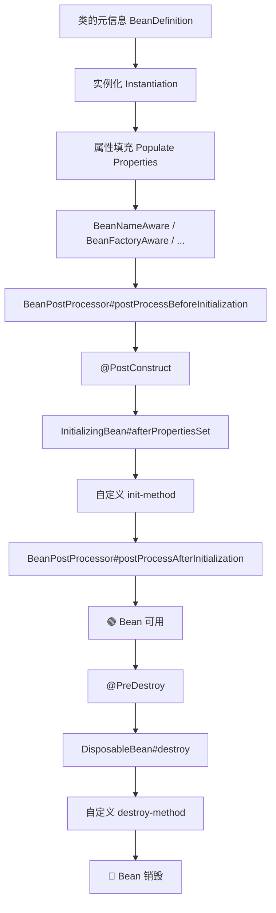
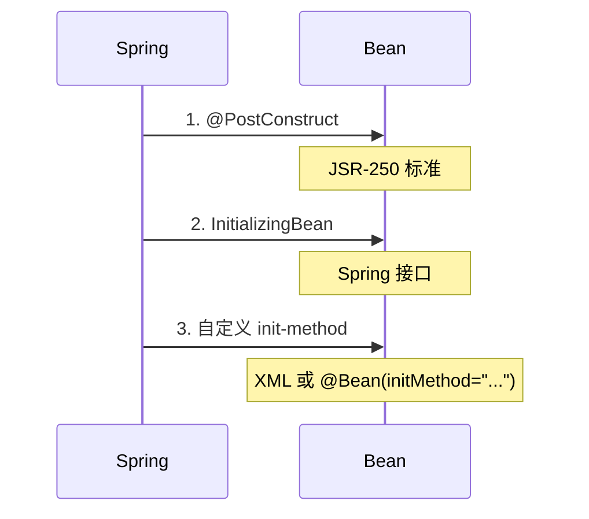
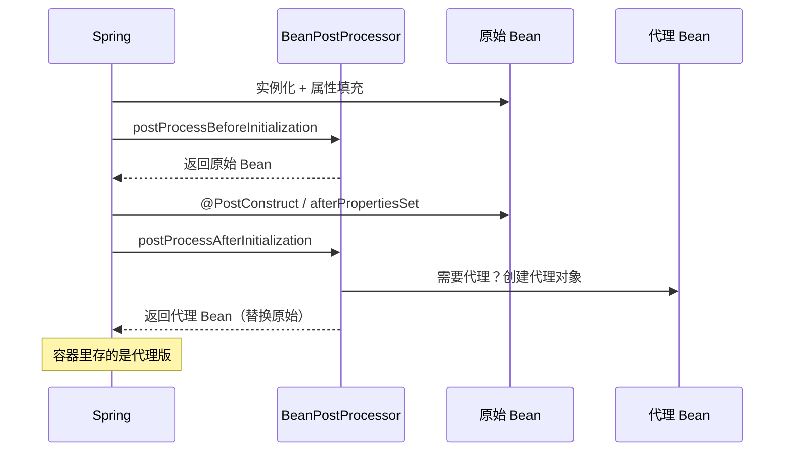

# Bean 生命周期

## 一个 Bean 的一生

你有没有想过，当你写下 `@Service public class UserService { ... }` 之后，Spring 到底对这个类做了什么？

它不只是"帮你 new 了一下"。从一个普通的 Java 类变成容器里活生生的 Bean，中间经历了很多步骤。理解这些步骤，你才能在正确的时机做正确的事情——比如初始化资源、注册回调、做一些自定义逻辑。

我们先从头走一遍完整流程，然后逐个拆解关键环节。



这个流程看着长，但大部分时候你只需要关心其中几个点。下面逐个讲。

---

## 实例化：Bean 的出生

实例化就是 `new`，但 Spring 做的比你想象的多。

### 构造器推断

Spring 创建 Bean 时，需要决定用哪个构造函数。规则如下：

1. **只有一个构造函数** → 直接用这个，不管有没有 `@Autowired`
2. **有多个构造函数，其中一个标注了 `@Autowired`** → 用标注的那个
3. **有多个构造函数，都没有 `@Autowired`** → 用无参构造函数（如果有的话）
4. **有多个构造函数，都没有 `@Autowired`，也没有无参构造** → 报错

```java
@Service
public class UserService {
    // Spring 会自动用这个构造函数（唯一的）
    private final UserRepository repo;
    private final EmailService emailService;

    public UserService(UserRepository repo, EmailService emailService) {
        this.repo = repo;
        this.emailService = emailService;
    }
}
```

注意：Spring 4.3 之后，如果类只有一个构造函数，可以省略 `@Autowired`。这是一个很好的简化——你的依赖关系已经通过构造函数参数声明了，不需要额外标注。

### 实例化策略

Spring 不是直接调 `new`，而是通过 `InstantiationStrategy` 策略接口来创建对象。默认使用 `CglibSubclassingInstantiationStrategy`，它能处理：

- 普通构造函数调用
- 带默认参数的构造函数
- 需要 CGLIB 子类化的场景（比如 `@Lookup` 方法注入）

这一步完成后，对象在内存中存在了，但它的字段都是默认值（null、0、false），还没有被"填上"。

---

## 属性填充：把依赖塞进去

实例化之后，Spring 会处理所有依赖注入：

1. 解析 `@Autowired`、`@Resource`、`@Value` 等标注的依赖
2. 从容器中找到对应的 Bean
3. 通过反射设置到字段中（或调用 setter 方法）

这一步结束之后，Bean 就有了完整的依赖关系，不再是"半成品"了。

但有一个重要的细节：**属性填充发生在初始化之前**。这意味着在 `@PostConstruct` 或 `InitializingBean` 里，你可以安全地使用注入的依赖。

---

## Aware 接口：让 Bean 感知容器

有些时候，Bean 需要了解自己所处的环境——比如想知道自己的名字是什么、运行在哪个 ApplicationContext 里。Spring 通过 Aware 接口来实现这一点。

```java
@Component
public class MyBean implements BeanNameAware, ApplicationContextAware {

    private String beanName;
    private ApplicationContext ctx;

    @Override
    public void setBeanName(String name) {
        // Spring 会把 Bean 的名字告诉你
        this.beanName = name;
    }

    @Override
    public void setApplicationContext(ApplicationContext ctx) {
        // Spring 会把容器本身告诉你
        this.ctx = ctx;
    }
}
```

常用的 Aware 接口：

| Aware 接口 | 获得什么 | 典型场景 |
|-----------|---------|---------|
| `BeanNameAware` | Bean 在容器中的名字 | 日志、动态注册 |
| `BeanFactoryAware` | BeanFactory 引用 | 编程式获取 Bean |
| `ApplicationContextAware` | ApplicationContext 引用 | 需要容器功能时 |
| `EnvironmentAware` | Environment 引用 | 读取配置 |
| `ResourceLoaderAware` | ResourceLoader 引用 | 加载资源文件 |

**什么时候用 Aware？** 大部分时候你不需要。如果你发现自己频繁实现 Aware 接口，说明你在"手动"做 Spring 本来可以帮你做的事情。

真正需要的场景：
- 写框架/中间件代码，需要和容器深度交互
- 需要动态获取 Bean（编程式，而非声明式）
- 需要监听容器事件

普通业务代码里，基本不需要碰 Aware。

---

## 初始化：Bean 的"觉醒"

属性填充完成后，Spring 会依次执行初始化逻辑。这是你做"准备工作"的地方——打开数据库连接、初始化缓存、校验配置等。

### 四种初始化方式

Spring 提供了四种方式来定义初始化逻辑，它们的执行顺序是固定的：



看一个例子：

```java
@Component
public class DatabasePool implements InitializingBean, DisposableBean {

    private ConnectionPool pool;

    // 方式一：@PostConstruct（JSR-250 标准）
    @PostConstruct
    public void postConstruct() {
        System.out.println("1. @PostConstruct - 配置校验");
        // 这时候依赖已经注入，但 pool 还没初始化
    }

    // 方式二：InitializingBean 接口
    @Override
    public void afterPropertiesSet() {
        System.out.println("2. afterPropertiesSet - 初始化连接池");
        this.pool = new ConnectionPool(maxSize);
    }

    // 方式三：自定义 init-method（通过 @Bean 指定）
    // @Bean(initMethod = "customInit")
    public void customInit() {
        System.out.println("3. customInit - 预热连接池");
        pool.warmUp();
    }
}
```

### 怎么选？

| 方式 | 优点 | 缺点 |
|------|------|------|
| `@PostConstruct` | Java 标准，不依赖 Spring | 不能指定顺序（多个时） |
| `InitializingBean` | 类型安全，编译期检查 | 侵入性强，耦合 Spring API |
| `initMethod` | 不侵入代码 | 方法名是字符串，容易写错 |

**推荐用 `@PostConstruct`。** 它是 Java 标准，跟 Spring 耦合最小。除非你有特殊需求（比如需要控制多个初始化方法的执行顺序），否则没必要用其他方式。

### BeanPostProcessor：最强大的扩展点

在初始化方法执行的前后，Spring 会调用所有注册的 `BeanPostProcessor`。这是 Spring 最强大、最灵活的扩展机制。

```java
@Component
public class MyBeanPostProcessor implements BeanPostProcessor {

    @Override
    public Object postProcessBeforeInitialization(Object bean, String beanName) {
        // 在 @PostConstruct 之前执行
        if (bean instanceof DataSource) {
            System.out.println("数据源即将初始化: " + beanName);
        }
        return bean;  // 可以返回原始对象，也可以返回包装后的对象
    }

    @Override
    public Object postProcessAfterInitialization(Object bean, String beanName) {
        // 在所有初始化方法之后执行
        // AOP 代理就是在这里创建的！
        return bean;
    }
}
```

`BeanPostProcessor` 的威力在于：

1. **可以拦截所有 Bean 的创建过程**——不只是某一个 Bean
2. **可以替换 Bean**——`return` 的对象不一定是传入的那个
3. **Spring 自己的很多功能就是靠它实现的**——AOP 代理、`@Transactional`、`@Async` 等

AOP 代理的创建时机就是 `postProcessAfterInitialization`。当你在类上标注 `@Transactional` 时，Spring 的 `InfrastructureAdvisorAutoProxyCreator`（一个 BeanPostProcessor）会在这个阶段创建代理对象，替换掉原始 Bean。



这就是为什么你在 `@PostConstruct` 里拿到的 `this` 是原始对象，但注入时拿到的是代理对象——代理是在 `@PostConstruct` 之后才创建的。

---

## 销毁：Bean 的"善后"

容器关闭时，Bean 需要释放资源。和初始化类似，也有四种方式：

```java
@Component
public class DatabasePool {

    // 方式一：@PreDestroy（推荐）
    @PreDestroy
    public void preDestroy() {
        System.out.println("1. @PreDestroy");
        pool.drain();
    }

    // 方式二：DisposableBean 接口
    @Override
    public void destroy() {
        System.out.println("2. DisposableBean#destroy");
        pool.close();
    }

    // 方式三：自定义 destroy-method
    public void customDestroy() {
        System.out.println("3. customDestroy");
    }
}
```

执行顺序：`@PreDestroy` → `DisposableBean#destroy` → 自定义 `destroy-method`。

**注意：** 销毁方法只在容器正常关闭时才会调用。如果你直接杀进程（`kill -9`），销毁方法不会执行。所以不要把"数据一致性"这种关键逻辑放在销毁方法里，它只适合做"优雅关闭"——关闭连接池、停止后台线程、清理临时文件等。

还有一个坑：**prototype 作用域的 Bean 不会调用销毁方法**。因为 prototype 的 Bean 不归容器管理生命周期，容器创建完就交给使用者了，不管销毁。

---

## 完整生命周期代码验证

把上面的知识串起来，写一个验证程序：

```java
@Component
public class LifecycleDemo implements BeanNameAware,
        ApplicationContextAware, InitializingBean, DisposableBean {

    private String beanName;

    @PostConstruct
    public void postConstruct() {
        System.out.println("① @PostConstruct");
    }

    @Override
    public void setBeanName(String name) {
        this.beanName = name;
        System.out.println("② BeanNameAware: " + name);
    }

    @Override
    public void setApplicationContext(ApplicationContext ctx) {
        System.out.println("③ ApplicationContextAware");
    }

    @Override
    public void afterPropertiesSet() {
        System.out.println("④ InitializingBean#afterPropertiesSet");
    }

    @PreDestroy
    public void preDestroy() {
        System.out.println("⑤ @PreDestroy");
    }

    @Override
    public void destroy() {
        System.out.println("⑥ DisposableBean#destroy");
    }
}
```

运行结果：

```
② BeanNameAware: lifecycleDemo
③ ApplicationContextAware
① @PostConstruct
④ InitializingBean#afterPropertiesSet
// ... 应用运行中 ...
⑤ @PreDestroy
⑥ DisposableBean#destroy
```

**注意 Aware 接口在 `@PostConstruct` 之前执行**——这是有道理的，因为你可能需要在 `@PostConstruct` 里使用容器信息。

---

## 回到核心问题

现在你应该清楚了：

1. **Bean 的创建不是一步完成的**，而是经历了实例化 → 属性填充 → 初始化 → 可用 → 销毁的过程
2. **BeanPostProcessor 是 Spring 最强大的扩展机制**，AOP、事务、异步等功能都靠它
3. **Aware 接口是"逃生通道"**，让你能拿到容器的内部信息，但大多数时候不需要
4. **初始化和销毁都有四种方式**，推荐用 `@PostConstruct` / `@PreDestroy`，因为它们是 Java 标准

理解生命周期的真正价值不是背诵执行顺序，而是知道 **"在什么时候能做什么事"**。当你需要在 Bean 创建后做一些初始化工作时，你知道该用 `@PostConstruct`；当你需要拦截所有 Bean 的创建过程时，你知道该用 `BeanPostProcessor`；当你需要提前暴露代理对象时，你知道它发生在 `postProcessAfterInitialization` 阶段。

这才是理解生命周期的意义。
