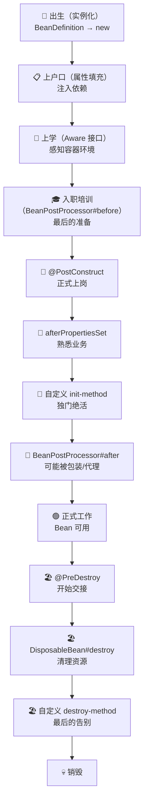
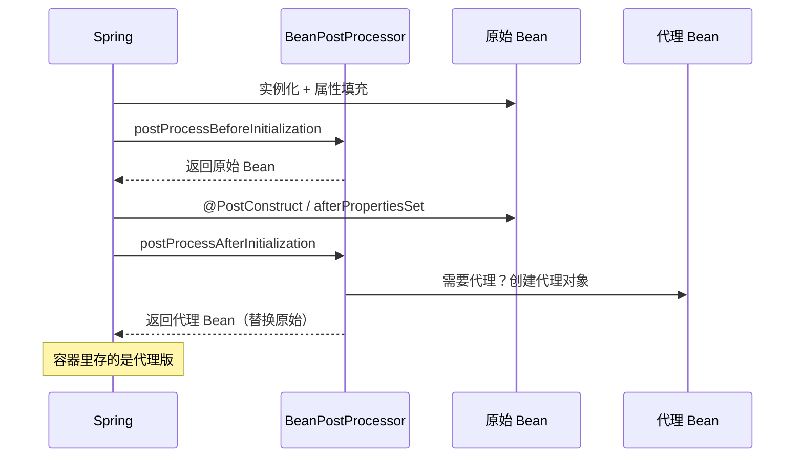

# Bean 生命周期

你有没有想过，当你写下 `@Service public class UserService { ... }` 之后，Spring 到底对这个类做了什么？

它不只是"帮你 new 了一下"。从一个普通的 Java 类变成容器里活生生的 Bean，中间经历了很多步骤。理解这些步骤，你才能在正确的时机做正确的事情——比如初始化资源、注册回调、做一些自定义逻辑。

## Bean 的一生：从出生到退休

Bean 的生命周期像人的一生。这个类比不是随便说说——贯穿整章，你会发现每一步都能对应上。



这张图就是全章的"地图"。下面我们一步步走。

## 出生：实例化

人出生时，医生接生。Bean 出生时，Spring 实例化。

但 Spring 不是简单地调 `new`——它需要决定 **用哪个构造函数**。就像医生接生要看是顺产还是剖腹产，Spring 要看你的类有几个构造函数。

**规则很简单：**

1. **只有一个构造函数** → 直接用（Spring 4.3+ 可以省略 `@Autowired`）
2. **多个构造函数，其中一个标了 `@Autowired`** → 用标了注解的那个
3. **多个构造函数，都没标 `@Autowired`** → 用无参构造函数
4. **多个构造函数，没有无参构造，也没有 `@Autowired`** → 报错

```java
@Service
public class UserService {
    // 只有一个构造函数，Spring 自动用它
    private final UserRepository repo;
    private final EmailService emailService;

    public UserService(UserRepository repo, EmailService emailService) {
        this.repo = repo;
        this.emailService = emailService;
    }
}
```

这一步完成后，对象在内存中存在了，但它的字段都是默认值（null、0、false）。就像婴儿出生了，但还没有名字、没有户口、什么都不懂。

## 上户口：属性填充

婴儿出生后要上户口、办身份证。Bean 实例化后，Spring 要给它"注入"所有依赖。

Spring 处理 `@Autowired`、`@Resource`、`@Value` 等标注的依赖，从容器中找到对应的 Bean，通过反射设置到字段中。

这一步结束之后，Bean 就有了完整的依赖关系——不再是"半成品"了。就像你上了户口，有了身份证，社会知道你是谁了。

**重要细节：属性填充发生在初始化之前。** 这意味着在 `@PostConstruct` 里，你可以安全地使用注入的依赖。

## 上学：Aware 接口

人要上学才能了解世界。Bean 通过 Aware 接口来"感知"自己所处的容器环境。

```java
@Component
public class MyBean implements BeanNameAware, ApplicationContextAware {

    private String beanName;
    private ApplicationContext ctx;

    @Override
    public void setBeanName(String name) {
        // "我叫什么名字？"——Spring 告诉你
        this.beanName = name;
    }

    @Override
    public void setApplicationContext(ApplicationContext ctx) {
        // "我在哪个学校？"——Spring 告诉你
        this.ctx = ctx;
    }
}
```

常用的 Aware 接口：

| Aware 接口 | 获得什么 | 类比 |
|-----------|---------|------|
| `BeanNameAware` | Bean 的名字 | 你的姓名 |
| `BeanFactoryAware` | BeanFactory 引用 | 你就读的学校 |
| `ApplicationContextAware` | ApplicationContext 引用 | 你所在的城市 |
| `EnvironmentAware` | Environment 引用 | 当前的天气和气候 |
| `ResourceLoaderAware` | ResourceLoader 引用 | 图书馆卡 |

**什么时候用 Aware？** 大部分时候你不需要。如果你发现自己频繁实现 Aware 接口，说明你在"手动"做 Spring 本来可以帮你做的事情。就像一个人天天自己去派出所查户口——正常人不需要这么做。

真正需要的场景：写框架/中间件代码、需要动态获取 Bean、需要监听容器事件。普通业务代码里，基本不需要碰。

## 入职培训：BeanPostProcessor

人找到工作后，通常有入职培训。BeanPostProcessor 就是 Bean 的"入职培训官"——在 Bean 正式上岗之前，对它做最后的检查和处理。

但 BeanPostProcessor 比入职培训厉害多了。它更像是 **装修队**——房子建好了（Bean 实例化了），但还能改造。你可以加隔断、刷墙、装空调。而且这个装修队 **对所有房子都有效**，不是只装修某一栋。

```java
@Component
public class MyBeanPostProcessor implements BeanPostProcessor {

    @Override
    public Object postProcessBeforeInitialization(Object bean, String beanName) {
        // 入职培训前——最后的检查
        if (bean instanceof DataSource) {
            System.out.println("数据源即将初始化: " + beanName);
        }
        return bean;  // 可以返回原始对象，也可以返回包装后的对象
    }

    @Override
    public Object postProcessAfterInitialization(Object bean, String beanName) {
        // 入职培训后——可能给你穿"制服"（代理）
        // AOP 代理就是在这里创建的！
        return bean;
    }
}
```

**BeanPostProcessor 是 Spring 最强大的扩展机制**，没有之一。Spring 自己的很多功能就是靠它实现的：

- **AOP 代理**：`@Transactional`、`@Async` 背后的代理对象，是在 `postProcessAfterInitialization` 里创建的
- **`@Autowired` 处理**：`AutowiredAnnotationBeanPostProcessor` 负责解析和注入依赖
- **`@Value` 处理**：`CommonAnnotationBeanPostProcessor` 负责解析 `@Value` 和 `@Resource`



这就是为什么你在 `@PostConstruct` 里拿到的 `this` 是原始对象，但注入时拿到的是代理对象——代理是在 `@PostConstruct` 之后才创建的。

## 正式上岗：四种初始化方式

培训完了，正式上岗。Spring 提供了四种方式来定义初始化逻辑。

**先看代码，猜猜执行顺序：**

```java
@Component
public class DatabasePool implements InitializingBean {

    @PostConstruct
    public void postConstruct() {
        System.out.println("① @PostConstruct");
    }

    @Override
    public void afterPropertiesSet() {
        System.out.println("② afterPropertiesSet");
    }

    // @Bean(initMethod = "customInit")
    public void customInit() {
        System.out.println("③ customInit");
    }
}
```

答案：`@PostConstruct` → `afterPropertiesSet` → 自定义 `init-method`。

用类比来理解：

- **`@PostConstruct`**（JSR-250 标准）= **入职第一天**，HR 带你熟悉环境。这是 Java 标准，不依赖 Spring。
- **`afterPropertiesSet`**（Spring 接口）= **入职第一周**，直属领导交代具体工作。依赖 Spring API，但类型安全。
- **自定义 `init-method`** = **入职第一个月**，你自己摸索出一套工作方法。不侵入代码，但方法名是字符串，容易写错。

| 方式 | 优点 | 缺点 |
|------|------|------|
| `@PostConstruct` | Java 标准，不依赖 Spring | 多个时不能指定顺序 |
| `afterPropertiesSet` | 类型安全，编译期检查 | 侵入性强，耦合 Spring API |
| `initMethod` | 不侵入代码 | 方法名是字符串，容易写错 |

**推荐用 `@PostConstruct`。** 除非你有特殊需求，否则没必要用其他方式。

## 销毁：退休与善后

Bean 的销毁就像人的退休——交接工作、清理资源、最后告别。

```java
@Component
public class DatabasePool {

    @PreDestroy
    public void preDestroy() {
        System.out.println("开始交接...");
        pool.drain();  // 排空连接池
    }
}
```

执行顺序：`@PreDestroy` → `DisposableBean#destroy` → 自定义 `destroy-method`。

**两个坑：**

1. **销毁方法只在容器正常关闭时调用。** 如果你 `kill -9` 直接杀进程，销毁方法不会执行。所以不要把"数据一致性"这种关键逻辑放在销毁方法里——它只适合做"优雅关闭"。

2. **prototype 作用域的 Bean 不会调用销毁方法。** 因为 prototype 的 Bean 不归容器管理生命周期——容器创建完就交给使用者了，不管销毁。就像外包员工，公司不负责他的退休。

## 完整验证：把生命周期打印出来

把上面的知识串起来，写一个验证程序：

```java
@Component
public class LifecycleDemo implements BeanNameAware,
        ApplicationContextAware, InitializingBean, DisposableBean {

    @PostConstruct
    public void postConstruct() {
        System.out.println("① @PostConstruct");
    }

    @Override
    public void setBeanName(String name) {
        System.out.println("② BeanNameAware: " + name);
    }

    @Override
    public void setApplicationContext(ApplicationContext ctx) {
        System.out.println("③ ApplicationContextAware");
    }

    @Override
    public void afterPropertiesSet() {
        System.out.println("④ InitializingBean#afterPropertiesSet");
    }

    @PreDestroy
    public void preDestroy() {
        System.out.println("⑤ @PreDestroy");
    }

    @Override
    public void destroy() {
        System.out.println("⑥ DisposableBean#destroy");
    }
}
```

运行结果：

```
② BeanNameAware: lifecycleDemo
③ ApplicationContextAware
① @PostConstruct
④ InitializingBean#afterPropertiesSet
// ... 应用运行中 ...
⑤ @PreDestroy
⑥ DisposableBean#destroy
```

**注意 Aware 接口在 `@PostConstruct` 之前执行。** 这是有道理的——就像你得先知道自己在哪个城市（Aware），才能开始工作（@PostConstruct）。

## 回到核心问题

现在你应该清楚了：

1. **Bean 的创建不是一步完成的**，而是经历了实例化 → 属性填充 → 初始化 → 可用 → 销毁的完整过程
2. **BeanPostProcessor 是 Spring 最强大的扩展机制**，AOP、事务、异步等功能都靠它
3. **Aware 接口是"逃生通道"**，让你能拿到容器的内部信息，但大多数时候不需要
4. **初始化和销毁都有多种方式**，推荐用 `@PostConstruct` / `@PreDestroy`

理解生命周期的真正价值不是背诵执行顺序，而是知道 **"在什么时候能做什么事"**。当你需要在 Bean 创建后做一些初始化工作时，你知道该用 `@PostConstruct`；当你需要拦截所有 Bean 的创建过程时，你知道该用 `BeanPostProcessor`；当你需要提前暴露代理对象时，你知道它发生在 `postProcessAfterInitialization` 阶段。

这才是理解生命周期的意义。
