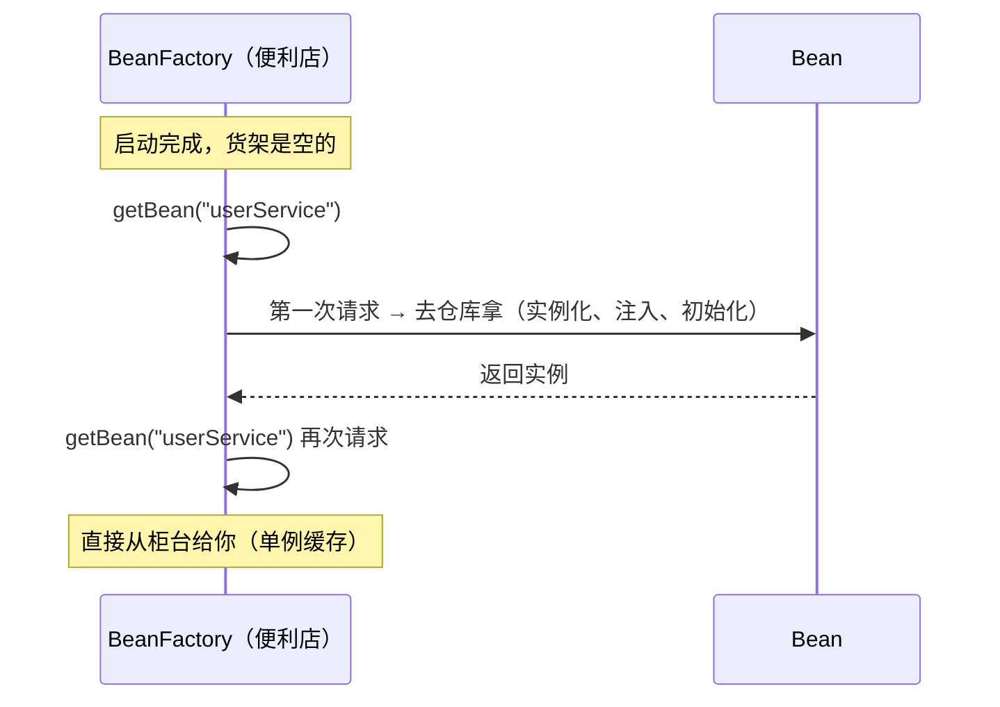
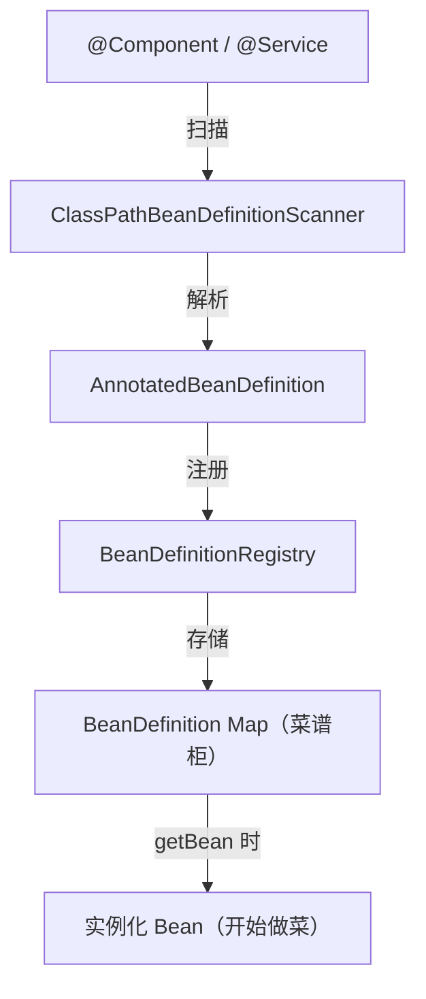
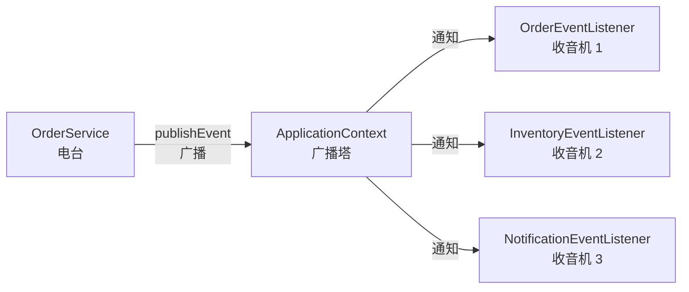
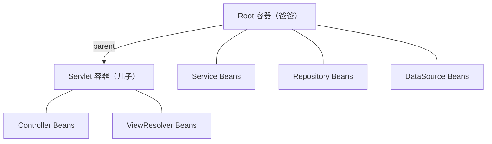

# 容器体系

面试官问你："BeanFactory 和 ApplicationContext 有什么区别？"

你脱口而出："ApplicationContext 是 BeanFactory 的子接口，功能更多。"

面试官追问："多了什么？"

"嗯……国际化？事件？资源加载？"

"为什么日常开发都用 ApplicationContext？"

"因为……功能更多？"

这种回答等于没回答。今天我们把这个问题彻底讲清楚。

## BeanFactory：便利店

BeanFactory 是 Spring 最基础的容器接口。它的职责很单纯——**你告诉它要什么 Bean，它给你**。

```java
// 最原始的用法
BeanFactory factory = new XmlBeanFactory(new ClassPathResource("beans.xml"));
UserService userService = (UserService) factory.getBean("userService");
```

核心方法就那么几个：

```java
public interface BeanFactory {
    Object getBean(String name);
    <T> T getBean(Class<T> requiredType);
    boolean containsBean(String name);
    boolean isSingleton(String name);
    // ...
}
```

**BeanFactory 是一家便利店。** 你需要什么，告诉店员，他从货架上拿给你。没有导购、没有停车场、没有美食广场。纯粹、直接、够用。

关键特性：**懒加载。** 默认情况下，BeanFactory 不会在启动时创建所有 Bean，而是在你第一次 `getBean()` 的时候才创建。就像便利店不会把所有商品都摆出来——你要什么，它去仓库拿。



好处是启动快——不用在一开始就创建几百个 Bean。坏处是第一个请求会慢，因为你触发了 Bean 的创建。

## ApplicationContext：购物中心

你几乎不会直接用 BeanFactory。Spring Boot 项目里，你用的是 ApplicationContext。

**ApplicationContext 是一家购物中心。** 它包含便利店的所有功能（你还是能买东西），但多了很多：

- **美食广场**（国际化 MessageSource）——支持多语言
- **广播电台**（事件机制 ApplicationEvent）——发布/订阅
- **万能充电站**（资源加载 ResourceLoader）——统一的资源访问
- **换装间**（Profile）——多环境切换
- **自动扶梯**（AOP 自动代理）——开箱即用
- **导购系统**（BeanFactoryPostProcessor）——启动时自动优化

直接上对比：

| 能力 | BeanFactory（便利店） | ApplicationContext（购物中心） |
|------|:---:|:---:|
| Bean 管理 | ✅ | ✅ |
| 延迟加载（默认） | ✅ | ❌ 默认启动时创建 |
| 国际化 | ❌ | ✅ |
| 事件发布 | ❌ | ✅ |
| 资源访问 | ❌ | ✅ |
| Environment / Profile | ❌ | ✅ |
| AOP 自动代理 | ❌ | ✅ |
| BeanFactoryPostProcessor | ❌ | ✅ |

### 为什么默认启动时创建所有 Bean？

ApplicationContext 默认在启动时就创建所有单例 Bean。这看起来"浪费"，但实际上是个好设计：

- **启动时就暴露问题** —— 某个 Bean 创建失败（依赖缺失、配置错误），启动直接报错。不会等到用户下单时才发现数据库连不上。
- **运行时性能好** —— 所有 Bean 都准备好了，请求来了直接用。
- **启动慢 2 秒，用户无感；第一个请求慢 2 秒，用户骂人。**

你可以在 Bean 上加 `@Lazy` 让它延迟创建，但大部分情况下不需要。

## BeanDefinition：菜谱

在厨师做菜之前，他需要一份菜谱——用什么食材、怎么处理、什么火候、多久出锅。

BeanDefinition 就是 Bean 的 **菜谱**。它描述了 Bean 的一切，但 Bean 本身还没创建：

```java
// BeanDefinition 里存的关键信息
public interface BeanDefinition {
    String getBeanClassName();          // 用什么食材（类名）
    String getScope();                  // 做几人份（singleton/prototype）
    boolean isLazyInit();               // 是不是现点现做（懒加载）
    String[] getDependsOn();            // 先备好哪些配菜（依赖）
    ConstructorArgumentValues getConstructorArgumentValues();  // 构造函数参数
    MutablePropertyValues getPropertyValues();                  // 属性值
    String getInitMethodName();         // 出锅前做什么处理
    String getDestroyMethodName();      // 收摊时怎么清理
}
```

### 从注解到 BeanDefinition

当你写 `@Service` 时，Spring 做了什么？



1. **扫描**：Spring 扫描指定包下带 `@Component` 的类（`@Service`、`@Repository`、`@Controller` 都是它的派生注解）
2. **解析**：把类的信息解析成 BeanDefinition——类名、作用域、依赖、初始化方法
3. **注册**：把 BeanDefinition 存到 BeanDefinitionRegistry
4. **实例化**：真正创建 Bean 时，根据 BeanDefinition 的信息来创建

**菜谱先写好，做菜是后面的事。** 这就是 BeanDefinition 的意义——把"描述"和"创建"分离。

### @Configuration 与 CGLIB 代理

`@Configuration` 类本身是一个 Bean，它里面的 `@Bean` 方法也会被解析成 BeanDefinition。但有个特殊之处——`@Configuration` 类会被 CGLIB 代理。

为什么要代理？看这个例子：

```java
@Configuration
public class AppConfig {

    @Bean
    public DataSource dataSource() {
        return new HikariDataSource(config());  // 调用了 config()
    }

    @Bean
    public Config config() {
        return new Config("jdbc:mysql://...");
    }
}
```

`dataSource()` 调用了 `config()`。如果没有代理，这就是普通的 Java 方法调用，`config()` 会创建一个 **新的** Config 对象。但 Spring 的语义是 `config()` 对应的 Bean 应该是 **单例** 的。

CGLIB 代理解决了这个问题：当 `config()` 被调用时，代理先检查容器里是否已经有这个 Bean，有就直接返回。

如果你用 `@Component` 而不是 `@Configuration`，就不会有 CGLIB 代理。这是 **"Lite 模式"**，`config()` 的多次调用会返回不同对象——容易踩坑。

## FactoryBean：工厂 vs 产品

面试常考题：`BeanFactory` 和 `FactoryBean` 有什么区别？

BeanFactory 是容器（便利店），FactoryBean 是一种特殊的 Bean——它本身是一个 **工厂**，用来创建另一个对象。

### 为什么需要 FactoryBean？

有些 Bean 的创建过程很复杂，不是简单的 `new` 就行的。比如 MyBatis 的 Mapper 接口——你定义的是一个接口，Spring 需要为它创建代理实现。这种复杂的创建逻辑，就封装在 FactoryBean 里。

用类比来说：**BeanFactory 是购物中心，FactoryBean 是购物中心里的"定制店"**。普通店铺直接卖成品（普通 Bean），定制店先帮你做再卖（FactoryBean 先调 `getObject()` 再给你）。

```java
public class MySessionFactoryBean implements FactoryBean<SqlSessionFactory> {

    private String configLocation;

    @Override
    public SqlSessionFactory getObject() throws Exception {
        // 复杂的创建逻辑——不是简单的 new
        SqlSessionFactoryBuilder builder = new SqlSessionFactoryBuilder();
        InputStream is = Resources.getResourceAsStream(configLocation);
        return builder.build(is);
    }

    @Override
    public Class<?> getObjectType() {
        return SqlSessionFactory.class;  // 返回的是产品类型，不是工厂类型
    }

    @Override
    public boolean isSingleton() {
        return true;
    }
}
```

当你 `getBean("mySessionFactory")` 时，Spring 调用 `getObject()`，返回的是 `SqlSessionFactory`（产品），而不是 `MySessionFactoryBean`（工厂）。

### 怎么拿到 FactoryBean 本身？

用 `&` 前缀：

```java
// 获取产品（FactoryBean 创建的对象）
SqlSessionFactory factory = context.getBean("mySessionFactory");

// 获取工厂本身
MySessionFactoryBean factoryBean = context.getBean("&mySessionFactory");
```

这个 `&` 约定来自 Java 的 RMI（RMI 里 `&` 表示获取对象的引用/存根）。

## 事件机制：广播电台

ApplicationContext 支持发布/订阅事件，实现组件间的解耦。

**类比：广播电台。** 电台（发布者）播节目，不知道谁在听。收音机（监听者）调到对应频道就能收听。电台加一个新节目，不需要通知所有听众；听众换台，也不需要告诉电台。

```java
// 1. 定义事件——"节目内容"
public class OrderCreatedEvent extends ApplicationEvent {
    private final String orderId;

    public OrderCreatedEvent(Object source, String orderId) {
        super(source);
        this.orderId = orderId;
    }

    public String getOrderId() { return orderId; }
}

// 2. 发布事件——"电台广播"
@Service
public class OrderService {
    @Autowired
    private ApplicationEventPublisher publisher;

    public void createOrder(Order order) {
        // 创建订单逻辑...
        publisher.publishEvent(new OrderCreatedEvent(this, order.getId()));
    }
}

// 3. 监听事件——"收音机收听"
@Component
public class OrderEventListener {

    @EventListener
    public void onOrderCreated(OrderCreatedEvent event) {
        System.out.println("订单创建: " + event.getOrderId());
    }
}
```

为什么用事件而不是直接调用？**解耦。** `OrderService` 不需要知道谁在监听。以后加新的监听逻辑（发短信、更新推荐系统），只需要加一个 `@EventListener`，`OrderService` 完全不用改。



### 同步 vs 异步

默认情况下，事件是 **同步** 的——发布事件后，所有监听者执行完毕才返回。如果某个监听者执行很慢，会阻塞发布者。

```java
@Async
@EventListener
public void onOrderCreated(OrderCreatedEvent event) {
    // 异步执行，不阻塞 OrderService
    sendEmail(event.getOrderId());
}
```

### 事务事件

有些操作需要在事务提交后才执行。Spring 提供了 `@TransactionalEventListener`：

```java
@TransactionalEventListener(phase = TransactionPhase.AFTER_COMMIT)
public void onOrderCreated(OrderCreatedEvent event) {
    // 只在事务提交后才执行——如果事务回滚，这个方法不会被调用
    sendNotification(event.getOrderId());
}
```

### 事件的局限性

事件适合做 **"做完之后通知一声"** 的事情：发邮件、更新缓存、记录日志。不适合做 **"必须成功"** 的事情——订单创建、支付这种核心流程，不应该依赖事件来做关键逻辑。

## 层次容器：父子关系

Spring 支持容器的层次结构——一个容器可以有父容器。

### 典型场景：Spring MVC

在传统的 Spring MVC 项目里，存在两个容器：



- **Root 容器**：存放 Service、Repository 等业务 Bean
- **Servlet 容器**：存放 Controller、ViewResolver 等 Web 相关 Bean

Servlet 容器的 parent 是 Root 容器。这意味着：

- **Controller 可以注入 Service**（儿子可以找爸爸要东西）
- **Service 不能注入 Controller**（爸爸看不到儿子的东西）

这种设计的目的是 **隔离**。Web 层的 Bean 不应该被业务层看到，但业务层的 Bean 应该对 Web 层透明。

### Bean 的覆盖

子容器可以定义一个和父容器同名的 Bean，这会 **覆盖** 父容器的定义。这个能力在测试时很有用——你可以在测试的子容器里替换掉某些 Bean，而不影响父容器。

**注意：** Spring Boot 默认禁止 Bean 定义覆盖，需要显式开启 `spring.main.allow-bean-definition-overriding=true`。这是一个好的默认值——覆盖容易导致难以排查的问题。

## 内置事件

Spring 自身会在容器生命周期的关键节点发布事件：

| 事件 | 触发时机 | 类比 |
|------|---------|------|
| `ContextRefreshedEvent` | 容器刷新完成 | 购物中心开门营业 |
| `ContextStartedEvent` | 容器启动 | 开始营业 |
| `ContextStoppedEvent` | 容器停止 | 暂停营业 |
| `ContextClosedEvent` | 容器关闭 | 关门歇业 |

最常用的是 `ContextRefreshedEvent`——在所有 Bean 都准备好之后做一些初始化工作：

```java
@Component
public class AppInitializer {

    @EventListener
    public void onApplicationReady(ContextRefreshedEvent event) {
        // 所有 Bean 都已就绪，可以做全局初始化
        System.out.println("应用启动完成，开始预热缓存...");
    }
}
```

## 一句话总结

BeanFactory 是便利店——纯粹、够用、懒加载。ApplicationContext 是购物中心——在便利店的基础上，加了事件、国际化、资源加载、Profile 等能力。BeanDefinition 是菜谱——Bean 还没做，但做法已经写好了。FactoryBean 是定制店——封装复杂的创建逻辑。事件机制是广播电台——发布者不知道谁在听。

理解这些，你就不会再把 BeanFactory 和 ApplicationContext 混为一谈，也能看懂 Spring 源码里那些 "BFPP"、"BD"、"FB" 的缩写到底在说什么了。
