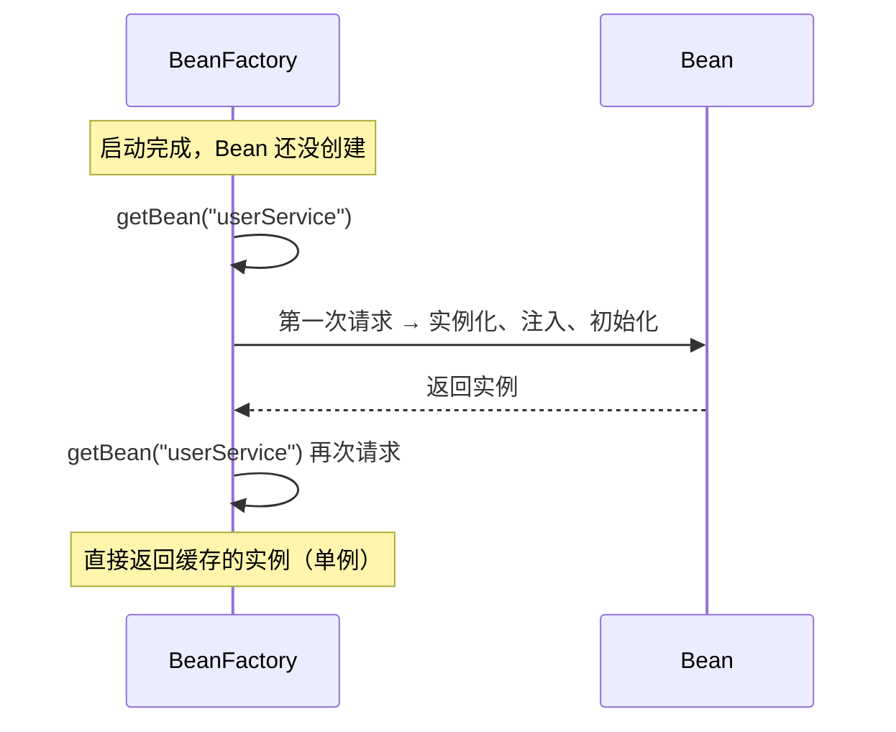
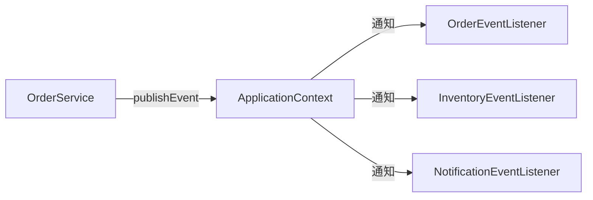
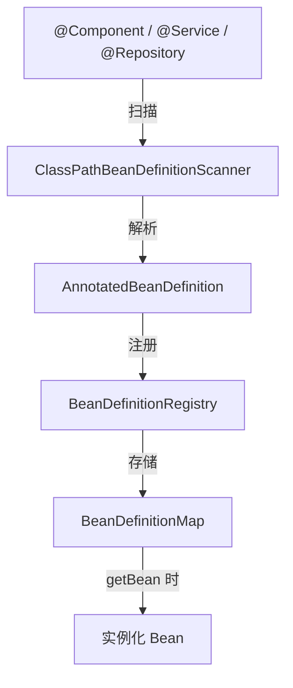
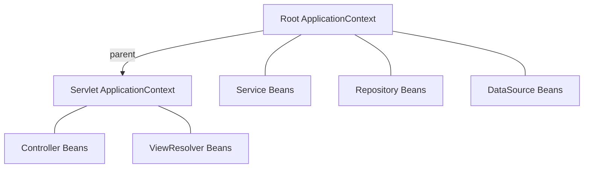

# 容器体系

## BeanFactory：最朴素的容器

你写的 Bean 不会凭空变出一个实例来。得有人来创建它们、管理它们、在你需要的时候给你。这个"人"就是容器。

Spring 里最基础的容器接口叫 `BeanFactory`。名字很直白——Bean 的工厂。它的职责也很单纯：你告诉它要什么 Bean，它给你。

```java
// 最原始的用法
BeanFactory factory = new XmlBeanFactory(new ClassPathResource("beans.xml"));
UserService userService = (UserService) factory.getBean("userService");
```

`BeanFactory` 的核心方法就那么几个：

```java
public interface BeanFactory {
    Object getBean(String name);
    <T> T getBean(Class<T> requiredType);
    <T> T getBean(String name, Class<T> requiredType);
    boolean containsBean(String name);
    boolean isSingleton(String name);
    boolean isPrototype(String name);
    // ...
}
```

**它是一个懒加载容器。** 什么意思？默认情况下，`BeanFactory` 不会在启动时创建所有 Bean，而是在你第一次 `getBean()` 的时候才创建。这叫 **延迟初始化（lazy initialization）**。



这种设计的好处是启动快——不用在一开始就创建几百个 Bean。坏处是第一个请求会慢，因为你触发了 Bean 的创建。

**BeanFactory 就是一个纯粹的"Bean 获取器"**。它不做多余的事情。

---

## ApplicationContext：不只是"功能更多"

你几乎不会直接用 `BeanFactory`。Spring Boot 项目里，你用的是 `ApplicationContext`。

很多人知道 `ApplicationContext` 是 `BeanFactory` 的子接口，知道它"功能更多"。但到底多了什么？为什么几乎所有人都用 `ApplicationContext`？

直接上对比：

| 能力 | BeanFactory | ApplicationContext |
|------|-----------|-------------------|
| Bean 管理（创建、注入、生命周期） | ✅ | ✅ |
| 延迟加载（默认） | ✅ | ❌（默认启动时创建所有单例） |
| 国际化（MessageSource） | ❌ | ✅ |
| 事件发布（ApplicationEvent） | ❌ | ✅ |
| 资源访问（ResourceLoader） | ❌ | ✅ |
| Environment / Profile | ❌ | ✅ |
| AOP 自动代理 | ❌ | ✅ |
| BeanFactoryPostProcessor | ❌ | ✅ |

这些多出来的能力，才是 Spring 真正好用的原因。

### 启动时创建 vs 懒加载

`ApplicationContext` 默认在启动时就创建所有单例 Bean（非 lazy 的）。这看起来"浪费"，但实际上是个好设计：

- **启动时就暴露问题**——如果某个 Bean 创建失败（依赖缺失、配置错误），启动直接报错，不会等到运行时才发现
- **运行时性能好**——所有 Bean 都准备好了，请求来了直接用，没有创建延迟
- **启动慢一点没关系**——服务启动慢 2 秒，用户无感；但第一个请求慢 2 秒，用户会骂人

你可以在 Bean 上加 `@Lazy` 让它延迟创建，但大部分情况下不需要。

### 国际化：MessageSource

如果你的应用需要支持多语言，`ApplicationContext` 内置了 `MessageSource`：

```java
// messages_zh_CN.properties
greeting=你好，{0}！

// messages_en.properties
greeting=Hello, {0}!

// 使用
@Autowired
private MessageSource messageSource;

public String greet(String name) {
    return messageSource.getMessage("greeting",
        new Object[]{name}, Locale.CHINA);
    // 输出：你好，张三！
}
```

`BeanFactory` 不支持这个。你可以自己实现，但为什么要重新造轮子？

### 事件机制：ApplicationEvent

`ApplicationContext` 支持发布/订阅事件，实现组件间的解耦：

```java
// 1. 定义事件
public class OrderCreatedEvent extends ApplicationEvent {
    private final String orderId;

    public OrderCreatedEvent(Object source, String orderId) {
        super(source);
        this.orderId = orderId;
    }

    public String getOrderId() { return orderId; }
}

// 2. 发布事件
@Service
public class OrderService {
    @Autowired
    private ApplicationEventPublisher publisher;

    public void createOrder(Order order) {
        // 创建订单逻辑...
        publisher.publishEvent(new OrderCreatedEvent(this, order.getId()));
    }
}

// 3. 监听事件
@Component
public class OrderEventListener {

    @EventListener
    public void onOrderCreated(OrderCreatedEvent event) {
        // 发送通知、更新统计、记录日志...
        System.out.println("订单创建: " + event.getOrderId());
    }
}
```

为什么用事件而不是直接调用？**解耦。** `OrderService` 不需要知道谁在监听，也不关心有多少个监听者。以后加新的监听逻辑（比如发短信、更新推荐系统），只需要加一个新的 `@EventListener`，`OrderService` 完全不用改。



### 资源访问

```java
@Autowired
private ResourceLoader resourceLoader;

public void loadConfig() {
    // 统一的资源访问接口，不管是文件、classpath 还是 URL
    Resource resource = resourceLoader.getResource("classpath:config.json");
    InputStream is = resource.getInputStream();
    // ...
}
```

这个在第四章会详细讲，这里知道 `ApplicationContext` 本身就是一个 `ResourceLoader` 就行。

---

## BeanDefinition：Bean 的"身份证"

在容器创建 Bean 之前，它需要知道"要创建什么样的 Bean"。这个信息就存在 `BeanDefinition` 里。

你可以把 `BeanDefinition` 理解为 **Bean 的配方**——它描述了 Bean 的一切：

```java
// BeanDefinition 里存的关键信息
public interface BeanDefinition {
    String getBeanClassName();          // 类名
    String getScope();                  // 作用域（singleton/prototype）
    boolean isLazyInit();               // 是否懒加载
    String[] getDependsOn();            // 依赖哪些 Bean（先创建）
    ConstructorArgumentValues getConstructorArgumentValues();  // 构造函数参数
    MutablePropertyValues getPropertyValues();                  // 属性值
    String getInitMethodName();         // 初始化方法
    String getDestroyMethodName();      // 销毁方法
    String getFactoryBeanName();        // 工厂 Bean
    String getFactoryMethodName();      // 工厂方法
    // ...
}
```

### 从注解到 BeanDefinition

当你写 `@Service` 或 `@Component` 时，Spring 做了什么？



1. **扫描**：Spring 扫描指定包下带 `@Component`（`@Service`、`@Repository`、`@Controller` 都是它的派生注解）的类
2. **解析**：把类的信息解析成 `BeanDefinition`——类名、作用域、依赖、初始化方法等
3. **注册**：把 `BeanDefinition` 存到 `BeanDefinitionRegistry`（本质是一个 Map）
4. **实例化**：真正创建 Bean 时，根据 `BeanDefinition` 的信息来创建

你也可以手动注册 `BeanDefinition`：

```java
@Configuration
public class ManualBeanConfig {

    @Autowired
    private BeanDefinitionRegistry registry;

    public void registerDynamicBean() {
        GenericBeanDefinition bd = new GenericBeanDefinition();
        bd.setBeanClassName("com.example.MyService");
        bd.setScope("singleton");
        bd.getPropertyValues().add("timeout", 3000);
        registry.registerBeanDefinition("myService", bd);
    }
}
```

这种手动注册的场景不多，但在写框架、做动态注册时很有用。

### @Configuration 与 @Bean 的 BeanDefinition

`@Configuration` 类本身是一个 Bean，它里面的 `@Bean` 方法也会被解析成 `BeanDefinition`。但有个特殊之处——`@Configuration` 类会被 CGLIB 代理。

为什么要代理？看这个例子：

```java
@Configuration
public class AppConfig {

    @Bean
    public DataSource dataSource() {
        return new HikariDataSource(config());
    }

    @Bean
    public Config config() {
        return new Config("jdbc:mysql://...");
    }
}
```

`dataSource()` 方法内部调用了 `config()`。如果没有代理，这就是一个普通的 Java 方法调用，`config()` 会创建一个新的 `Config` 对象。但 Spring 的语义是 `config()` 对应的 Bean 应该是单例的——多次调用应该返回同一个对象。

CGLIB 代理解决了这个问题：当 `config()` 被调用时，代理会先检查容器里是否已经有这个 Bean，有就直接返回，没有才创建。这就是所谓的 **"Full 模式"**。

如果你用 `@Component` 而不是 `@Configuration`，就不会有 CGLIB 代理，`config()` 的多次调用会返回不同对象。这是 **"Lite 模式"**，容易踩坑。

---

## FactoryBean：不是普通 Bean

面试常考题：`BeanFactory` 和 `FactoryBean` 有什么区别？

`BeanFactory` 是容器，这个已经讲了。`FactoryBean` 是一种特殊的 Bean——它本身是一个工厂，用来创建另一个对象。

### 为什么要 FactoryBean？

有些 Bean 的创建过程很复杂，不是简单的 `new` 就行的。比如：

- **MyBatis 的 Mapper 接口**——你定义的是一个接口，Spring 需要为它创建代理实现
- **复杂的第三方库集成**——创建过程涉及多个步骤，需要封装
- **动态代理对象**——需要在运行时才知道具体类型

用 `FactoryBean` 可以把这些复杂的创建逻辑封装起来：

```java
public class MySessionFactoryBean implements FactoryBean<SqlSessionFactory> {

    private String configLocation;

    public void setConfigLocation(String configLocation) {
        this.configLocation = configLocation;
    }

    @Override
    public SqlSessionFactory getObject() throws Exception {
        // 复杂的创建逻辑
        SqlSessionFactoryBuilder builder = new SqlSessionFactoryBuilder();
        InputStream is = Resources.getResourceAsStream(configLocation);
        return builder.build(is);
    }

    @Override
    public Class<?> getObjectType() {
        return SqlSessionFactory.class;
    }

    @Override
    public boolean isSingleton() {
        return true;
    }
}
```

注册到容器后，当你 `getBean("mySessionFactory")` 时，Spring 会调用 `getObject()` 方法，返回的是 `SqlSessionFactory`，而不是 `MySessionFactoryBean` 本身。

### 怎么拿到 FactoryBean 本身？

如果你确实需要拿到 `FactoryBean` 本身（而不是它创建的对象），用 `&` 前缀：

```java
// 获取 FactoryBean 创建的对象
SqlSessionFactory factory = context.getBean("mySessionFactory");

// 获取 FactoryBean 本身
MySessionFactoryBean factoryBean = (MySessionFactoryBean) context.getBean("&mySessionFactory");
```

这个 `&` 约定是从 Java 的 RMI 来的（RMI 里 `&` 表示获取对象的引用/存根）。

### 工程价值

FactoryBean 的核心价值是 **封装复杂的对象创建过程**。它让你可以用 Spring 的方式（配置化、依赖注入）来管理那些"不是直接 new 出来的"对象。

你不需要自己写 FactoryBean 的场景很多——MyBatis、Shiro、很多第三方库的 Spring 集成都帮你写好了。但理解它的工作原理，能帮你看懂这些框架的源码。

---

## 层次容器：父子关系

Spring 支持容器的层次结构——一个容器可以有父容器。

### 典型场景：Spring MVC

在传统的 Spring MVC 项目里，存在两个容器：



- **Root 容器**（由 `ContextLoaderListener` 创建）：存放 Service、Repository、DataSource 等业务 Bean
- **Servlet 容器**（由 `DispatcherServlet` 创建）：存放 Controller、ViewResolver 等 Web 相关 Bean

Servlet 容器的 parent 是 Root 容器。这意味着：

- Controller 可以注入 Service（子容器可以访问父容器的 Bean）
- Service 不能注入 Controller（父容器看不到子容器的 Bean）

这种设计的目的是 **隔离**。Web 层的 Bean（Controller、HandlerMapping 等）不应该被业务层看到，但业务层的 Bean 应该对 Web 层透明。

### 编程式创建父子容器

```java
// 父容器
ApplicationContext parent = new AnnotationConfigApplicationContext(ParentConfig.class);

// 子容器
GenericApplicationContext child = new GenericApplicationContext(parent);
child.registerBean(ChildConfig.class);
child.refresh();

// 子容器可以获取父容器的 Bean
UserService userService = child.getBean(UserService.class);  // 来自父容器

// 父容器拿不到子容器的 Bean
// parent.getBean(SomeController.class);  // BeanNotFoundException
```

### Bean 的覆盖

子容器可以定义一个和父容器同名的 Bean，这会 **覆盖** 父容器的定义。这个能力在测试时很有用——你可以在测试的子容器里替换掉某些 Bean，而不影响父容器。

```java
// 父容器有一个 DataSource
@Bean
public DataSource dataSource() {
    return new HikariDataSource(realConfig);
}

// 测试子容器里覆盖为内存数据库
@Bean
public DataSource dataSource() {
    return new EmbeddedDatabaseBuilder().build();
}
```

**注意：** Spring Boot 默认禁止 Bean 定义覆盖，需要显式开启 `spring.main.allow-bean-definition-overriding=true`。这是一个好的默认值——覆盖容易导致难以排查的问题。

---

## 事件机制深入

前面简单提了事件发布/订阅，这里再深入一些。

### 内置事件

Spring 自身会在容器生命周期的关键节点发布事件：

| 事件 | 触发时机 |
|------|---------|
| `ContextRefreshedEvent` | 容器刷新完成（所有 Bean 初始化完成） |
| `ContextStartedEvent` | 容器启动（调用 `start()`） |
| `ContextStoppedEvent` | 容器停止（调用 `stop()`） |
| `ContextClosedEvent` | 容器关闭 |
| `RequestHandledEvent` | HTTP 请求处理完成（Web 应用） |

最常用的是 `ContextRefreshedEvent`——在所有 Bean 都准备好之后做一些初始化工作：

```java
@Component
public class AppInitializer {

    @EventListener
    public void onApplicationReady(ContextRefreshedEvent event) {
        // 所有 Bean 都已就绪，可以做全局初始化
        System.out.println("应用启动完成，开始预热缓存...");
    }
}
```

### 异步事件

默认情况下，事件是 **同步** 的——发布事件后，所有监听者执行完毕才返回。如果某个监听者执行很慢，会阻塞发布者。

```java
// 让事件异步执行
@Configuration
@EnableAsync
public class AsyncConfig {
}

@Component
public class OrderEventListener {

    @Async
    @EventListener
    public void onOrderCreated(OrderCreatedEvent event) {
        // 异步执行，不阻塞 OrderService
        sendEmail(event.getOrderId());
    }
}
```

### 事务事件（Spring 4.2+）

有些操作需要在事务提交后才执行（比如发送通知）。Spring 提供了 `@TransactionalEventListener`：

```java
@Component
public class OrderEventListener {

    @TransactionalEventListener(phase = TransactionPhase.AFTER_COMMIT)
    public void onOrderCreated(OrderCreatedEvent event) {
        // 只在事务提交后才执行
        // 如果事务回滚，这个方法不会被调用
        sendNotification(event.getOrderId());
    }
}
```

这比在代码里手动判断事务状态优雅得多。

### 事件的局限性

事件机制很好用，但要注意：

1. **同步事件会阻塞**——除非明确标注 `@Async`
2. **异常处理**——监听者抛异常会导致发布者也失败（同步模式下）
3. **调试困难**——事件是间接调用，出了问题不好追踪调用链
4. **不适合关键路径**——订单创建、支付这种核心流程，不应该依赖事件来做关键逻辑

事件适合做 **"做完之后通知一声"** 的事情：发邮件、更新缓存、记录日志。不适合做 **"必须成功"** 的事情。

---

## 一句话总结

`BeanFactory` 是骨架，`ApplicationContext` 是血肉。日常开发你用的都是 `ApplicationContext`，它的事件、国际化、资源访问、Profile 等能力，让你不用自己造轮子。`BeanDefinition` 是 Bean 的配方，`FactoryBean` 是复杂对象的创建器，层次容器实现了模块间的隔离。

理解这些，你就不会再把 `BeanFactory` 和 `ApplicationContext` 混为一谈，也能看懂 Spring 源码里那些 "BFPP"、"BD"、"FB" 的缩写到底在说什么了。
