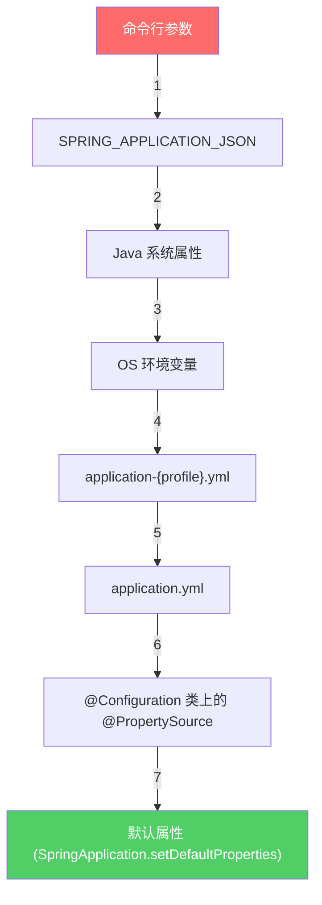

## 配置文件怎么加载？

你一定写过这样的代码：

```java
InputStream is = new FileInputStream("/opt/app/config.properties");
Properties props = new Properties();
props.load(is);
```

或者这样：

```java
InputStream is = getClass().getClassLoader().getResourceAsStream("config.properties");
```

这两种方式都能读取配置文件，但它们的 API 完全不同。`FileInputStream` 用文件路径，`ClassLoader` 用 classpath 资源名。如果你的配置文件可能在文件系统里，也可能在 JAR 包里，可能在远程服务器上，你得写一堆 `if-else` 来处理不同的情况。

这就是 Spring 的 `Resource` 抽象要解决的问题。

---

## Resource：统一资源访问

Spring 定义了一个 `Resource` 接口，对所有类型的资源提供统一的访问方式：

```java
public interface Resource extends InputStreamSource {
    boolean exists();           // 资源是否存在
    boolean isReadable();       // 是否可读
    boolean isOpen();           // 是否已打开
    URL getURL();               // 获取 URL
    URI getURI();               // 获取 URI
    File getFile();             // 获取 File 对象
    long contentLength();       // 资源大小
    long lastModified();        // 最后修改时间
    String getFilename();       // 文件名
    String getDescription();    // 资源描述（用于日志）
    Resource createRelative(String relativePath);  // 创建相对路径资源
}
```

Spring 内置了多种 `Resource` 实现：

| 实现类 | 前缀 | 说明 |
|-------|------|------|
| `ClassPathResource` | `classpath:` | 从 classpath 加载 |
| `FileSystemResource` | `file:` | 从文件系统加载 |
| `UrlResource` | `http:`, `ftp:` 等 | 从 URL 加载 |
| `ByteArrayResource` | 无 | 从字节数组加载 |
| `InputStreamResource` | 无 | 从 InputStream 加载 |
| `ServletContextResource` | 无 | 从 Web 应用根目录加载 |

不管资源在哪里，你都用同样的方式读取：

```java
// 这三行代码读取不同来源的资源，但接口完全一样
Resource res1 = new ClassPathResource("config.properties");
Resource res2 = new FileSystemResource("/opt/app/config.properties");
Resource res3 = new UrlResource("https://example.com/config.properties");

// 读取方式相同
InputStream is = res.getInputStream();
```

### ResourceLoader：自动识别前缀

手动创建 `Resource` 对象还是有点麻烦。Spring 提供了 `ResourceLoader`，它能根据路径前缀自动选择合适的 `Resource` 实现：

```java
@Component
public class ConfigLoader {

    @Autowired
    private ResourceLoader resourceLoader;

    public void loadConfig() throws IOException {
        // 自动识别前缀，创建对应的 Resource
        Resource classpathRes = resourceLoader.getResource("classpath:config.properties");
        Resource fileRes = resourceLoader.getResource("file:/opt/app/config.properties");
        Resource urlRes = resourceLoader.getResource("https://example.com/config.properties");

        // 统一的读取方式
        try (InputStream is = classpathRes.getInputStream()) {
            Properties props = new Properties();
            props.load(is);
        }
    }
}
```

`ApplicationContext` 本身就是 `ResourceLoader`，所以你可以直接注入 `ApplicationContext` 来加载资源。但更好的做法是注入 `ResourceLoader`——依赖更小，语义更明确。

### ResourcePatternResolver：批量加载

有时候你需要一次加载多个资源，比如"加载 classpath 下所有 `sql/*.xml` 文件"：

```java
@Component
public class SqlLoader {

    @Autowired
    private ResourcePatternResolver resolver;

    public void loadAllSql() throws IOException {
        // 通配符匹配
        Resource[] resources = resolver.getResources("classpath:sql/*.sql");

        for (Resource resource : resources) {
            System.out.println("加载: " + resource.getFilename());
            // 读取并执行 SQL...
        }
    }
}
```

`ApplicationContext` 也实现了 `ResourcePatternResolver`，所以它能同时处理单个资源和通配符匹配。

### 实际应用：@Value 注入资源

在 Spring 中，你可以直接把资源注入到 Bean 中：

```java
@Component
public class TemplateProcessor {

    // 注入一个 Resource 对象
    @Value("classpath:templates/email.html")
    private Resource emailTemplate;

    public String process(Map<String, Object> model) throws IOException {
        try (InputStream is = emailTemplate.getInputStream()) {
            String template = new String(is.readAllBytes(), StandardCharsets.UTF_8);
            // 替换模板变量...
            return template;
        }
    }
}
```

这比手动写 `getResourceAsStream()` 优雅多了，而且支持测试时替换（通过 `@TestPropertySource` 或 Profile）。

---

## Environment：配置的层次体系

读取配置文件只是第一步。实际应用中，配置的来源五花八门：

- `application.properties` / `application.yml` 文件
- 系统环境变量（`DB_HOST=localhost`）
- JVM 系统属性（`-Dapp.port=8080`）
- 命令行参数（`--server.port=9090`）
- 代码里硬编码的默认值

问题来了：同一个配置项在多个地方都定义了，到底用哪个？

这就是 `Environment` 要解决的问题。

### PropertySource：配置的来源

每个配置来源都是一个 `PropertySource`：

```java
// 系统环境变量
SystemEnvironmentPropertySource: {DB_HOST=localhost, JAVA_HOME=/usr/lib/jvm/...}

// JVM 系统属性
SystemPropertiesPropertySource: {app.port=8080, user.timezone=Asia/Shanghai}

// 配置文件
MapPropertySource: {server.port=8080, spring.datasource.url=jdbc:mysql://...}
```

`Environment` 把所有 `PropertySource` 组织成一个有序列表。查找配置时，**从前往后找，第一个匹配的就返回**。

### 属性源的优先级

```mermaid
graph TD
    A[命令行参数] -->|最高优先级| B[JVM 系统属性]
    B --> C[系统环境变量]
    C --> D["application-{profile}.properties"]
    D --> E["application.properties"]
    E --> F["@PropertySource 注解]
    F --> G[代码默认值]
    style A fill:#ff6b6b,color:#fff
    style G fill:#51cf66,color:#fff
```

**命令行参数优先级最高**，代码里的默认值优先级最低。这意味着你可以通过命令行参数覆盖任何配置：

```bash
# 覆盖 application.properties 里的 server.port
java -jar app.jar --server.port=9090

# 覆盖数据源配置
java -jar app.jar --spring.datasource.url=jdbc:mysql://prod-server:3306/db
```

这个设计非常实用——同一份代码，通过不同的启动参数来适配不同环境。

### Environment API

```java
@Component
public class ConfigReader {

    @Autowired
    private Environment env;

    public void readConfig() {
        // 读取配置，可以指定默认值
        String dbUrl = env.getProperty("spring.datasource.url");
        int port = env.getProperty("server.port", Integer.class, 8080);
        boolean debug = env.getProperty("app.debug", Boolean.class, false);

        // 检查配置是否存在
        boolean hasConfig = env.containsProperty("app.feature-flag");

        // 获取活跃的 Profile
        String[] activeProfiles = env.getActiveProfiles();
    }
}
```

### @Value 与 @ConfigurationProperties

直接用 `Environment.getProperty()` 有点原始。Spring 提供了更方便的方式：

```java
// @Value：逐个注入
@Component
public class MailConfig {

    @Value("${mail.host:localhost}")     // :localhost 是默认值
    private String host;

    @Value("${mail.port:25}")
    private int port;

    @Value("${mail.username}")
    private String username;
}

// @ConfigurationProperties：批量绑定
@Component
@ConfigurationProperties(prefix = "mail")
public class MailProperties {
    private String host = "localhost";   // 默认值写在字段里
    private int port = 25;
    private String username;
    private String password;

    // getter / setter
}
```

`@ConfigurationProperties` 更强大——它支持嵌套结构、松散绑定（`mail-host` 和 `mailHost` 都能绑定）、数据校验（`@Validated`）。

```yaml
# application.yml
mail:
  host: smtp.example.com
  port: 587
  username: user@example.com
  password: secret
  properties:
    mail.smtp.auth: true
    mail.smtp.starttls.enable: true
```

```java
@Component
@ConfigurationProperties(prefix = "mail")
@Validated
public class MailProperties {

    @NotBlank
    private String host;

    @Min(1)
    @Max(65535)
    private int port;

    @Email
    private String username;

    private Properties properties = new Properties();

    // getter / setter
}
```

**选择建议：** 简单的单个配置用 `@Value`，复杂的、有结构的配置用 `@ConfigurationProperties`。`@ConfigurationProperties` 更类型安全，更适合做配置的集中管理。

### @PropertySource：自定义配置文件

默认情况下，Spring Boot 只加载 `application.properties` 和 `application.yml`。如果你有额外的配置文件：

```java
@Configuration
@PropertySource("classpath:custom-config.properties")
@PropertySource("classpath:extra-config.properties")
public class CustomConfig {
}
```

注意 `@PropertySource` 默认不支持 YAML 文件，只支持 `.properties`。如果需要加载 YAML，要自定义 `PropertySourceFactory`。

---

## Profile：多环境切换

几乎每个项目都有多个环境：开发（dev）、测试（test）、生产（prod）。每个环境的配置不同——数据库地址、缓存配置、日志级别等。

最原始的做法是注释代码：

```java
// String dbUrl = "jdbc:mysql://dev-server:3306/dev_db";
String dbUrl = "jdbc:mysql://prod-server:3306/prod_db";  // 上线前手动切换
```

这种方式充满了灾难的气息。

### Profile 基本用法

Spring 的 Profile 机制让你 **声明式地** 管理多环境配置：

```properties
# application.properties（公共配置）
app.name=MyApp
spring.profiles.active=${SPRING_PROFILES_ACTIVE:dev}

# application-dev.properties（开发环境）
spring.datasource.url=jdbc:mysql://localhost:3306/dev_db
logging.level.root=DEBUG

# application-prod.properties（生产环境）
spring.datasource.url=jdbc:mysql://prod-server:3306/prod_db
logging.level.root=WARN
```

激活 Profile 的方式：

```bash
# 方式一：配置文件
spring.profiles.active=dev

# 方式二：环境变量
export SPRING_PROFILES_ACTIVE=prod

# 方式三：命令行参数
java -jar app.jar --spring.profiles.active=prod

# 方式四：JVM 参数
java -Dspring.profiles.active=prod -jar app.jar
```

### Profile 条件化 Bean

不只是配置文件，Bean 也可以按 Profile 来条件化创建：

```java
@Configuration
public class DataSourceConfig {

    @Bean
    @Profile("dev")
    public DataSource devDataSource() {
        // 开发环境：内存数据库
        return new EmbeddedDatabaseBuilder()
            .setType(EmbeddedDatabaseType.H2)
            .build();
    }

    @Bean
    @Profile("prod")
    public DataSource prodDataSource() {
        // 生产环境：连接池
        HikariConfig config = new HikariConfig();
        config.setJdbcUrl("jdbc:mysql://prod-server:3306/db");
        return new HikariDataSource(config);
    }
}
```

当 `dev` Profile 激活时，只有 `devDataSource()` 会被执行；`prod` 激活时，只有 `prodDataSource()` 会被执行。

### 多 Profile 组合

Profile 可以组合使用：

```bash
# 同时激活多个 Profile
spring.profiles.active=prod,us-east,high-availability
```

```java
@Profile("prod & us-east")    // 必须同时满足
@Profile("prod | staging")    // 满足其一即可
@Profile("!dev")              // 非 dev
```

### Profile Group（Spring Boot 2.4+）

可以把多个 Profile 组合成一个组：

```properties
# application.properties
spring.profiles.group.production=proddb,prodmq,prodcache
spring.profiles.group.staging=stagingdb,stagingmq
```

激活 `production` 就等于同时激活 `proddb`、`prodmq`、`prodcache`。

### 配置文件的加载顺序

Spring Boot 的配置文件加载有严格的优先级：



同一个配置项，位置越靠前优先级越高。这保证了"同一份代码，不同环境只需改启动参数"的原则。

### 实际工程实践

一个典型的多环境配置结构：

```
src/main/resources/
├── application.yml              # 公共配置
├── application-dev.yml          # 开发环境
├── application-test.yml         # 测试环境
├── application-prod.yml         # 生产环境
└── application-local.yml        # 本地开发（不提交到 Git）
```

`application-local.yml` 用来存放本地独有的配置（比如你本地的数据库密码），加入 `.gitignore` 避免提交。

**敏感配置不要提交到代码仓库。** 数据库密码、API Key 等敏感信息，应该通过环境变量或外部配置文件注入：

```yaml
# application-prod.yml
spring:
  datasource:
    url: ${DB_URL}
    username: ${DB_USERNAME}
    password: ${DB_PASSWORD}
```

启动时通过环境变量或配置中心提供这些值，而不是写在配置文件里。

### @Conditional 家族

Profile 只是条件化的一种。Spring 提供了更灵活的条件机制：

```java
// 只在 classpath 中有 Redis 依赖时才创建
@ConditionalOnClass(name = "redis.clients.jedis.Jedis")
@Bean
public RedisTemplate<String, Object> redisTemplate() { ... }

// 只在配置了某个属性时才创建
@ConditionalOnProperty(name = "cache.enabled", havingValue = "true")
@Bean
public CacheManager cacheManager() { ... }

// 只在容器中没有某个 Bean 时才创建
@ConditionalOnMissingBean(DataSource.class)
@Bean
public DataSource defaultDataSource() { ... }
```

这些条件注解（`@ConditionalOnClass`、`@ConditionalOnProperty`、`@ConditionalOnMissingBean` 等）是 Spring Boot 自动配置的核心机制。当你引入 `spring-boot-starter-data-redis` 时，Spring Boot 自动帮你配置好 `RedisTemplate`，就是靠这些条件注解判断的。

---

## 回到核心问题

现在你应该清楚了：

**配置文件怎么加载？** 通过 `Resource` 抽象统一访问，`ResourceLoader` 根据前缀自动识别来源。

**配置值怎么获取？** 通过 `Environment` + `PropertySource` 的层次体系，简单的用 `@Value`，复杂的用 `@ConfigurationProperties`。

**多环境怎么切换？** 通过 Profile 机制，不同环境加载不同的配置文件和 Bean 定义，通过启动参数切换。

这三者构成了 Spring 的配置体系。理解了它们，你就不会再在代码里硬编码配置，也不会再手动注释代码来切换环境了。
