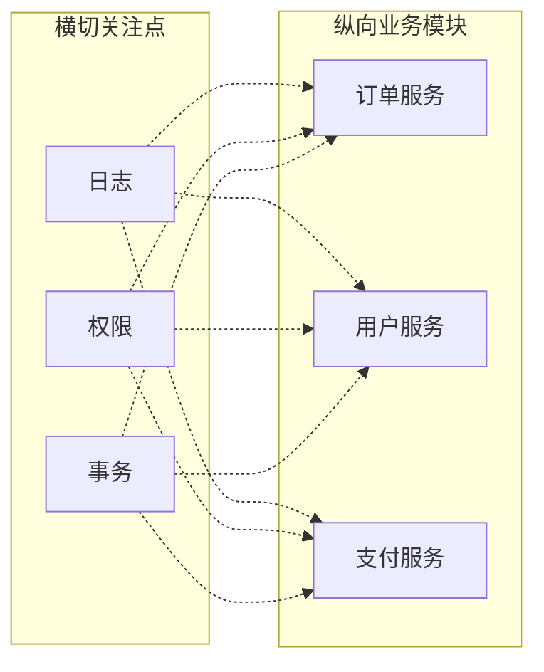
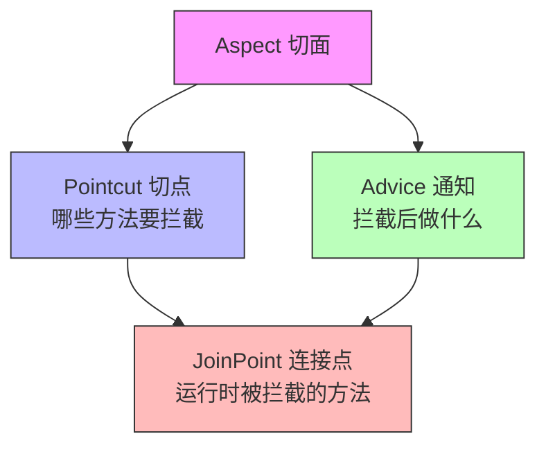

## 横切关注点与代码纠缠

先看一段代码，一个普通的订单 Service：

```java
public class OrderService {

    public Order createOrder(Long userId, List<Item> items) {
        // 日志
        log.info("createOrder called, userId={}, items={}", userId, items);
        long start = System.currentTimeMillis();

        // 权限校验
        if (!permissionService.check(userId, "order:create")) {
            throw new NoPermissionException("无权创建订单");
        }

        // 业务逻辑
        Order order = new Order();
        order.setUserId(userId);
        order.setItems(items);
        order.setTotal(calcTotal(items));
        order.setStatus(OrderStatus.CREATED);
        orderRepo.save(order);

        // 日志
        long elapsed = System.currentTimeMillis() - start;
        log.info("createOrder finished, orderId={}, cost={}ms", order.getId(), elapsed);
        return order;
    }

    public void cancelOrder(Long orderId) {
        log.info("cancelOrder called, orderId={}", orderId);
        long start = System.currentTimeMillis();

        if (!permissionService.check(getCurrentUser(), "order:cancel")) {
            throw new NoPermissionException("无权取消订单");
        }

        Order order = orderRepo.findById(orderId)
            .orElseThrow(() -> new OrderNotFoundException(orderId));
        order.setStatus(OrderStatus.CANCELLED);
        orderRepo.save(order);

        long elapsed = System.currentTimeMillis() - start;
        log.info("cancelOrder finished, orderId={}, cost={}ms", orderId, elapsed);
    }

    public Order getOrder(Long orderId) {
        log.info("getOrder called, orderId={}", orderId);
        long start = System.currentTimeMillis();

        if (!permissionService.check(getCurrentUser(), "order:read")) {
            throw new NoPermissionException("无权查看订单");
        }

        Order order = orderRepo.findById(orderId)
            .orElseThrow(() -> new OrderNotFoundException(orderId));

        long elapsed = System.currentTimeMillis() - start;
        log.info("getOrder finished, orderId={}, cost={}ms", orderId, elapsed);
        return order;
    }
}
```

50 行代码，真正的业务逻辑大概占 40%，剩下 60% 全是日志、权限校验、耗时统计。而且这三段逻辑在每个方法里长得几乎一样，就是**复制粘贴**。

更麻烦的是，如果有一天产品说"日志格式改一下"或者"权限粒度要细化"，你得挨个方法改。三个方法还好，要是三十个呢？

这种散落在各个方法里、跟核心业务无关但又必须做的逻辑，就叫**横切关注点**（Cross-Cutting Concerns）。叫"横切"是因为它们**横着穿过了所有纵向的业务模块**——不管是订单服务、用户服务还是支付服务，都得写一遍日志、做一遍权限校验。



传统做法有几个问题：

1. **代码重复**：每个方法都得写一遍，Copy-Paste 编程
2. **职责混乱**：业务逻辑和基础设施代码混在一起，读代码时很难一眼看出"这个方法到底在干什么"
3. **修改困难**：改一处日志逻辑，得改所有方法，漏一个就是一个 bug

AOP 的核心思想就一句话：**把横切关注点从业务代码里抽出来，放到单独的地方统一管理，然后在运行时自动织入到需要的地方。**

用上面的例子来说，就是把日志、权限、耗时统计从 `OrderService` 里全部删掉，业务代码只剩下纯逻辑：

```java
public class OrderService {

    public Order createOrder(Long userId, List<Item> items) {
        Order order = new Order();
        order.setUserId(userId);
        order.setItems(items);
        order.setTotal(calcTotal(items));
        order.setStatus(OrderStatus.CREATED);
        orderRepo.save(order);
        return order;
    }

    // 其他方法同理，只保留业务逻辑
}
```

日志、权限这些东西放到一个"切面"里统一处理。业务开发只关心业务，横切逻辑只写一次。这就是 AOP 存在的意义。

---

## JoinPoint / Pointcut / Advice / Aspect

学 AOP 最怕的就是被这四个概念绕晕。我用一个生活类比帮你说清楚。

想象你开了一家连锁餐厅：

- **Aspect（切面）**：你雇了一个"品控经理"，他的职责是监控所有餐厅的服务质量。他就是一个切面——一个独立的关注点。
- **JoinPoint（连接点）**：餐厅里的每个可监控的环节——迎客、点菜、上菜、结账、送客。这些都是连接点，理论上品控经理都可以介入。
- **Pointcut（切点）**：品控经理不可能盯着所有环节，你告诉他"只关注上菜环节和结账环节"。这个筛选规则就是切点——**从所有连接点里挑出你真正要介入的那些**。
- **Advice（通知）**：品控经理在选定的环节具体做什么。比如"上菜前检查摆盘"（Before）、"结账后抽查小票"（After）、"上菜时全程旁观并在必要时介入"（Around）。

用代码来对应：

```java
@Aspect  // 这是 Aspect：一个切面类
@Component
public class LoggingAspect {

    // 这是 Pointcut：匹配规则，筛选哪些方法要被拦截
    @Pointcut("execution(* com.example.service.*.*(..))")
    public void serviceMethods() {}

    // 这是 Advice：在匹配的方法执行前后具体做什么
    @Before("serviceMethods()")
    public void logBefore(JoinPoint joinPoint) {
        // JoinPoint：当前被拦截的具体方法信息
        String methodName = joinPoint.getSignature().getName();
        Object[] args = joinPoint.getArgs();
        log.info("调用方法: {}，参数: {}", methodName, args);
    }

    @AfterReturning(pointcut = "serviceMethods()", returning = "result")
    public void logAfter(JoinPoint joinPoint, Object result) {
        log.info("方法 {} 返回: {}", joinPoint.getSignature().getName(), result);
    }
}
```

四个概念的关系用一句话总结：**Aspect 定义了一组 Pointcut 和 Advice，Pointcut 负责"拦谁"，Advice 负责"干什么"，JoinPoint 是运行时被拦截的那个具体方法。**



这里有个容易混淆的点：**JoinPoint 和 Pointcut 不是一回事**。JoinPoint 是所有可能被拦截的点（Spring AOP 里就是所有方法调用），Pointcut 是一个表达式，用来从 JoinPoint 里筛选出你关心的那些。可以说 Pointcut 是 JoinPoint 的过滤器。

还有一个概念叫**织入（Weaving）**——把切面逻辑"织入"到目标方法的过程。织入时机有两种：

- **编译期织入**：在 .java 编译成 .class 的时候就植入代码（AspectJ 支持）
- **运行期织入**：在运行时通过动态代理生成代理对象，调用时走代理逻辑（Spring AOP 用这种）

这个区别直接引出了下一个问题。

---

## Spring AOP vs AspectJ：选哪个

Spring AOP 和 AspectJ 经常被混为一谈，但它们是两个不同的东西。

**AspectJ** 是一个完整的 AOP 框架，有自己的编译器（ajc），支持编译期织入和类加载期织入。它的能力非常强——能拦截任何方法调用、字段访问、对象创建，几乎无所不能。

**Spring AOP** 是 Spring 自己实现的轻量级 AOP，基于动态代理，只支持运行期织入，只能拦截 Spring 容器管理的 Bean 的方法调用。

| 维度 | Spring AOP | AspectJ |
|------|-----------|---------|
| 织入时机 | 运行时（动态代理） | 编译期 / 类加载期 |
| 能拦截什么 | 只能拦截 Bean 的 public 方法 | 任意方法、字段、构造器 |
| 性能 | 每次调用有代理开销 | 编译期就织入了，无运行时代理开销 |
| 复杂度 | 零配置，开箱即用 | 需要引入编译器或 agent |
| 依赖 | Spring 自带 | 需要额外引入 aspectjrt + aspectjweaver |
| 适用场景 | 通用企业开发 | 需要拦截 private 方法、字段访问等高级场景 |

**我的判断：99% 的 Spring 项目用 Spring AOP 就够了。**

原因很简单：你日常要拦截的东西——Service 方法、Controller 方法、Repository 方法——全是 Spring Bean 的 public 方法，Spring AOP 完全够用。只有在以下场景才需要考虑 AspectJ：

1. 需要拦截 `private` 或 `protected` 方法
2. 需要拦截非 Spring 管理的对象（`new` 出来的对象）
3. 需要拦截字段的读写
4. 对性能极度敏感，不能接受代理开销

而且 Spring AOP 和 AspectJ 不是互斥的。Spring AOP 的切点表达式语法就借鉴了 AspectJ 的语法，你写的 `@Pointcut("execution(* com.example..*.*(..))")` 这种表达式，语法就是 AspectJ 的。Spring 只是借了语法，底层实现还是自己那一套动态代理。

还有一个容易踩的坑：**Spring AOP 不能拦截自调用**。什么意思？

```java
@Service
public class UserService {
    public void methodA() {
        this.methodB();  // 自调用，不走代理！
    }

    @Transactional
    public void methodB() {
        // 事务不会生效，因为是 this 调用，没走代理
    }
}
```

`methodA` 内部调用 `methodB`，走的是 `this.methodB()`，直接调了目标对象的方法，绕过了代理。Spring AOP 的代理只能拦截外部调用。这个问题在第四章讲事务失效时会详细展开。

AspectJ 就没这个问题，因为它在编译期就把切面代码织入到了字节码里，不存在"绕过代理"的可能。

总结一句话：**Spring AOP 是"够用主义"，AspectJ 是"完美主义"。绝大多数时候，够用就行。**

---

## 小结

这一章我们搞清楚了三件事：

1. **为什么需要 AOP**：横切关注点散落在业务代码里，导致代码重复、职责混乱、修改困难。AOP 把它们抽出来统一管理。
2. **AOP 的四个核心概念**：Aspect 是切面类，Pointcut 是筛选规则，Advice 是具体动作，JoinPoint 是被拦截的方法。用餐厅品控经理的类比记住它们的关系。
3. **Spring AOP vs AspectJ**：Spring AOP 基于动态代理，够用且零配置；AspectJ 更强大但更复杂。99% 的场景选 Spring AOP。

下一章我们深入底层，看看 Spring AOP 的动态代理到底是怎么实现的。
