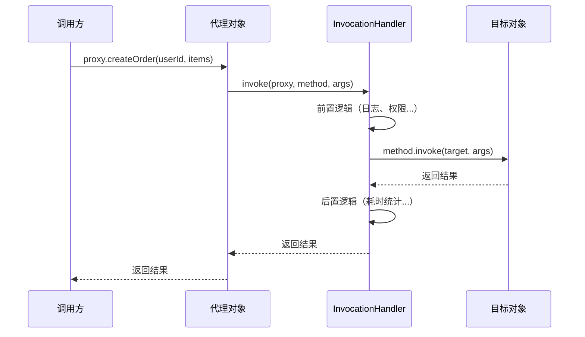

# 动态代理实现

## JDK 动态代理：接口代理的实现

上一章说了 Spring AOP 基于动态代理，这一章我们打开引擎盖看看里面的零件。

先从 JDK 动态代理说起。这是 Java 自带的能力，不需要任何第三方库。核心就两个东西：`java.lang.reflect.Proxy` 和 `java.lang.reflect.InvocationHandler`。

假设我们有一个接口和实现：

```java
public interface OrderService {
    Order createOrder(Long userId, List<Item> items);
    void cancelOrder(Long orderId);
}

public class OrderServiceImpl implements OrderService {
    @Override
    public Order createOrder(Long userId, List<Item> items) {
        Order order = new Order();
        order.setUserId(userId);
        order.setItems(items);
        orderRepo.save(order);
        return order;
    }

    @Override
    public void cancelOrder(Long orderId) {
        Order order = orderRepo.findById(orderId)
            .orElseThrow(() -> new OrderNotFoundException(orderId));
        order.setStatus(OrderStatus.CANCELLED);
        orderRepo.save(order);
    }
}
```

现在我想在不改 `OrderServiceImpl` 的前提下，给每个方法加上日志。用 JDK 动态代理：

```java
public class LoggingHandler implements InvocationHandler {

    private final Object target;  // 被代理的真实对象

    public LoggingHandler(Object target) {
        this.target = target;
    }

    @Override
    public Object invoke(Object proxy, Method method, Object[] args) throws Throwable {
        // 前置逻辑
        log.info(">>> 调用方法: {}，参数: {}", method.getName(), args);

        long start = System.currentTimeMillis();

        // 调用真实对象的方法
        Object result = method.invoke(target, args);

        // 后置逻辑
        long elapsed = System.currentTimeMillis() - start;
        log.info("<<< 方法 {} 返回: {}，耗时: {}ms", method.getName(), result, elapsed);

        return result;
    }
}
```

创建代理对象：

```java
OrderService target = new OrderServiceImpl();
OrderService proxy = (OrderService) Proxy.newProxyInstance(
    target.getClass().getClassLoader(),    // 类加载器
    target.getClass().getInterfaces(),      // 目标对象实现的接口
    new LoggingHandler(target)             // InvocationHandler
);

proxy.createOrder(1L, items);
// 输出:
// >>> 调用方法: createOrder，参数: [1L, [...]]
// <<< 方法 createOrder 返回: Order@xxx，耗时: 23ms
```

`proxy.createOrder()` 被调用时，实际上走的是 `LoggingHandler.invoke()`。在这个方法里，你可以在调用目标方法前后插入任意逻辑，最后再通过 `method.invoke(target, args)` 调用真正的业务方法。

这就是 AOP "不改原代码"的秘密：**你以为你在调用目标对象，其实你调的是一个代理对象。代理对象在中间拦截了调用，在转发给真实对象之前和之后，塞了额外的逻辑。**



但 JDK 动态代理有一个硬性限制：**目标对象必须实现接口**。因为 `Proxy.newProxyInstance()` 的第二个参数就是接口数组，它是在运行时动态生成一个实现了相同接口的代理类。没有接口，它就造不出来。

这在早期 Spring 项目里不是问题，因为那时候流行面向接口编程。但很多开发者写代码不定义接口，直接写一个类就当 Service 用了。这时候 JDK 动态代理就抓瞎了，CGLIB 就是来解决这个问题的。

---

## CGLIB：子类代理

CGLIB（Code Generation Library）的思路完全不同。它不依赖接口，而是在运行时**生成目标类的子类**，通过方法重写来实现拦截。

同样的场景，用 CGLIB 实现：

```java
public class OrderService {  // 注意：没有接口，就是个普通类
    public Order createOrder(Long userId, List<Item> items) {
        Order order = new Order();
        order.setUserId(userId);
        order.setItems(items);
        orderRepo.save(order);
        return order;
    }

    public void cancelOrder(Long orderId) {
        // ...
    }
}
```

```java
Enhancer enhancer = new Enhancer();
enhancer.setSuperclass(OrderService.class);  // 设置父类
enhancer.setCallback(new MethodInterceptor() {
    @Override
    public Object intercept(Object obj, Method method, Object[] args,
                            MethodProxy methodProxy) throws Throwable {
        log.info(">>> 调用方法: {}，参数: {}", method.getName(), args);
        long start = System.currentTimeMillis();

        // 调用父类的方法（注意这里用 methodProxy.invokeSuper 而不是 method.invoke）
        Object result = methodProxy.invokeSuper(obj, args);

        long elapsed = System.currentTimeMillis() - start;
        log.info("<<< 方法 {} 返回，耗时: {}ms", method.getName(), elapsed);
        return result;
    }
});

OrderService proxy = (OrderService) enhancer.create();
proxy.createOrder(1L, items);
```

CGLIB 生成的代理类大致长这样（反编译后简化）：

```java
public class OrderService$$EnhancerByCGLIB extends OrderService {

    @Override
    public Order createOrder(Long userId, List<Item> items) {
        // 走 interceptor，不走 super.createOrder()
        return interceptor.intercept(this, method, args, methodProxy);
    }
}
```

关键点来了：**`methodProxy.invokeSuper(obj, args)` 和 `method.invoke(target, args)` 有什么区别？**

`method.invoke(target, args)` 是通过反射调用，每次都要做方法查找，性能开销大。`methodProxy.invokeSuper(obj, args)` 是 CGLIB 生成的快速调用方式，它在生成子类字节码时就已经生成了直接调用父类方法的代码，跳过了反射，性能好很多。Spring 里的 CGLIB 实现用的就是 `invokeSuper`。

CGLIB 的好处是没有接口也能用，但它也有代价：

1. **不能代理 `final` 类和 `final` 方法**：因为它是通过继承实现的，`final` 类不能被继承，`final` 方法不能被重写
2. **生成代理类有开销**：第一次创建代理时需要生成字节码，比 JDK 动态代理慢一些（但后续调用快）
3. **对象类型不纯粹**：`proxy instanceof OrderService` 返回 `true`，但 `proxy.getClass() == OrderService.class` 返回 `false`，因为代理对象的类是子类

```java
// JDK 代理
proxy instanceof OrderService  // true（实现了接口）
proxy.getClass()               // com.sun.proxy.$Proxy0（不是 OrderService）

// CGLIB 代理
proxy instanceof OrderService  // true（继承了父类）
proxy.getClass()               // OrderService$$EnhancerByCGLIB（也不是 OrderService）
```

---

## 代理选择策略与 Spring Boot 的默认行为

Spring 在创建 AOP 代理时，选择策略的源码在 `DefaultAopProxyFactory` 里：

```java
public class DefaultAopProxyFactory implements AopProxyFactory, Serializable {

    @Override
    public AopProxy createAopProxy(AdvisedSupport config) throws AopConfigException {
        // 条件1：目标类是接口
        // 条件2：目标类是 Proxy 类
        // 条件3：使用了 optimize 选项
        if (config.isOptimize() || config.isProxyTargetClass()
                || hasNoUserSuppliedProxyInterfaces(config)) {
            Class<?> targetClass = config.getTargetClass();
            if (targetClass == null) {
                throw new AopConfigException("TargetSource cannot determine target class");
            }
            if (targetClass.isInterface() || Proxy.isProxyClass(targetClass)) {
                return new JdkDynamicAopProxy(config);
            }
            return new ObjenesisCglibAopProxy(config);
        } else {
            return new JdkDynamicAopProxy(config);
        }
    }
}
```

翻译成人话：

- 如果目标类**实现了接口**，默认用 **JDK 动态代理**
- 如果目标类**没有实现接口**，用 **CGLIB**
- 如果设置了 `proxyTargetClass=true`，强制用 CGLIB（即使有接口）

**但是！Spring Boot 从 2.0 开始，默认 `proxyTargetClass=true`。** 这意味着在 Spring Boot 项目里，**默认全部使用 CGLIB 代理**。

为什么 Spring Boot 做了这个改变？原因很实际：

1. **一致性**：统一用 CGLIB，开发者不用操心"这个 Bean 是用 JDK 代理还是 CGLIB 代理"，行为一致
2. **避免类型转换问题**：JDK 代理生成的对象不能直接强转为目标类型（只能转为接口类型），很多开发者会踩这个坑
3. **性能差距缩小**：现代 JVM 对 CGLIB 生成的字节码优化得很好，性能差距已经很小了

验证一下。在 Spring Boot 项目里注入一个 Bean，打印它的类名：

```java
@Service
public class MyService {
    public void doSomething() { }
}

@RestController
public class TestController {
    @Autowired
    private MyService myService;

    @GetMapping("/test")
    public String test() {
        System.out.println(myService.getClass().getName());
        // 输出: com.example.demo.MyService$$EnhancerBySpringCGLIB$$xxxxx
        return "ok";
    }
}
```

看到了吧，`EnhancerBySpringCGLIB`，确认是 CGLIB 代理。

**性能差异到底有多大？** 做个简单的基准测试：

```java
@BenchmarkMode(Mode.Throughput)
@OutputTimeUnit(TimeUnit.NANOSECONDS)
public class ProxyBenchmark {

    private OrderService jdkProxy;
    private OrderService cglibProxy;

    @Setup
    public void setup() {
        OrderService target = new OrderServiceImpl();
        // JDK 代理
        jdkProxy = (OrderService) Proxy.newProxyInstance(
            target.getClass().getClassLoader(),
            target.getClass().getInterfaces(),
            (proxy, method, args) -> method.invoke(target, args)
        );
        // CGLIB 代理
        Enhancer enhancer = new Enhancer();
        enhancer.setSuperclass(OrderServiceImpl.class);
        enhancer.setCallback((MethodInterceptor) (obj, method, args, proxy) ->
            proxy.invokeSuper(obj, args));
        cglibProxy = (OrderService) enhancer.create();
    }

    @Benchmark
    public Order testJdkProxy() {
        return jdkProxy.createOrder(1L, Collections.emptyList());
    }

    @Benchmark
    public Order testCglibProxy() {
        return cglibProxy.createOrder(1L, Collections.emptyList());
    }
}
```

实测下来，CGLIB 的 `invokeSuper` 和 JDK 的 `invoke` 性能在同一个数量级，差距通常在 10% 以内。在真实业务场景里，这点差距被 IO、数据库操作完全淹没，根本不值得关心。

---

## 代理模式的局限性

不管是 JDK 动态代理还是 CGLIB，都有一些共同的局限性，了解这些能帮你少踩坑：

**1. 自调用问题**

代理只能拦截从外部进入的调用。同一个对象内部的方法互调，不走代理：

```java
@Service
public class UserService {
    public void methodA() {
        this.methodB();  // 不走代理！切面逻辑不会执行
    }

    public void methodB() {
        // 想在这里加 @Transactional 或其他切面？没用
    }
}
```

解决方案有几种：
- 注入自身：`@Autowired private UserService self;` 然后 `self.methodB()`
- 使用 `AopContext.currentProxy()`（需要开启 `exposeProxy=true`）
- 把 `methodB` 拆到另一个 Bean 里

**2. private / protected / static 方法无法拦截**

Spring AOP 的代理机制决定了它只能拦截通过代理对象调用的方法。private 方法外部无法访问，static 方法不属于对象实例，都拦不住。如果你需要拦截这些方法，得用 AspectJ。

**3. 对象创建过程不可控**

CGLIB 代理需要通过反射（或 Objenesis）来创建目标对象的子类实例。如果目标类的构造器有复杂的初始化逻辑，可能会出问题。Spring 用 Objenesis 来绕过构造器创建实例，大部分情况下没问题，但极端场景下还是可能踩坑。

---

## 小结

这一章我们深入了 Spring AOP 的底层实现：

1. **JDK 动态代理**：基于接口，在运行时生成实现相同接口的代理类，通过 `InvocationHandler` 拦截方法调用
2. **CGLIB**：基于继承，在运行时生成目标类的子类，通过方法重写拦截调用，用 `MethodInterceptor` 处理逻辑
3. **Spring Boot 默认用 CGLIB**：从 2.0 开始默认 `proxyTargetClass=true`，统一用 CGLIB 代理，避免类型转换坑
4. **共同局限**：自调用不走代理、不能拦截 private/static 方法

理解了代理机制，下一章我们进入实战——用 `@Aspect` 注解驱动的切面编程来解决真实问题。
