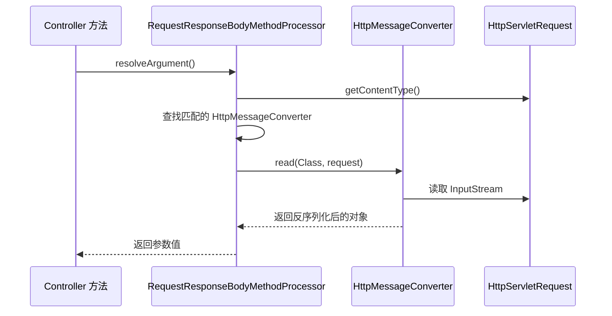

# 参数解析与绑定

## HandlerMethodArgumentResolver：参数解析的核心接口

上一章我们看到了 Controller 方法被调用的完整流程。但有一个关键步骤被一笔带过了：**参数是怎么从 HTTP 请求中解析出来的？**

```java
@GetMapping("/users/{id}")
public User detail(@PathVariable Long id,
                   @RequestParam(defaultValue = "1") int page,
                   @RequestHeader("X-Request-Id") String traceId,
                   HttpServletRequest request) {
    // 这四个参数，来自请求的不同位置，类型也各不相同
    // Spring MVC 是怎么知道怎么解析的？
}
```

答案是 `HandlerMethodArgumentResolver`——参数解析器。每个参数都会找一个对应的解析器来处理。

```java
public interface HandlerMethodArgumentResolver {
    // 这个解析器能不能处理这个参数？
    boolean supportsParameter(MethodParameter parameter);

    // 从请求中解析出参数值
    Object resolveArgument(MethodParameter parameter,
                          ModelAndViewContainer mavContainer,
                          NativeWebRequest webRequest,
                          WebDataBinderFactory binderFactory) throws Exception;
}
```

Spring MVC 内置了几十个参数解析器，覆盖了你能想到的几乎所有场景：

| 解析器 | 处理的注解/类型 |
|--------|---------------|
| `PathVariableMethodArgumentResolver` | `@PathVariable` |
| `RequestParamMethodArgumentResolver` | `@RequestParam`、`MultipartFile`、`@RequestPart` |
| `RequestHeaderMethodArgumentResolver` | `@RequestHeader` |
| `RequestResponseBodyMethodProcessor` | `@RequestBody` |
| `ServletRequestMethodArgumentResolver` | `HttpServletRequest`、`HttpServletResponse` |
| `ModelMethodProcessor` | `Model` 参数 |
| `PrincipalMethodArgumentResolver` | `Principal`（当前用户） |

参数解析器的选择逻辑跟 HandlerAdapter 一样——遍历所有解析器，找第一个 `supportsParameter` 返回 true 的。顺序很重要，Spring MVC 的默认顺序经过精心设计，大多数情况下不需要自定义。

---

## @RequestParam：查询参数与表单数据

`@RequestParam` 是最常用的参数绑定注解，它从 URL 查询参数或表单数据中取值。

```java
// 查询参数：GET /users?page=1&size=20&keyword=spring
@GetMapping("/users")
public Page<User> search(@RequestParam int page,
                         @RequestParam int size,
                         @RequestParam(required = false) String keyword) {
    return userService.search(keyword, PageRequest.of(page, size));
}
```

几个实用特性：

**默认值：**

```java
@RequestParam(defaultValue = "1") int page,
@RequestParam(defaultValue = "20") int size
```

当请求中没有这个参数时使用默认值。注意：`defaultValue` 会把 `required` 隐式设为 false。

**参数名映射：**

```java
@RequestParam("user_name") String userName
```

当请求参数名和变量名不一致时，用 `value` 指定。

**接收多个值：**

```java
// 请求：GET /users?ids=1&ids=2&ids=3
@GetMapping("/users/batch")
public List<User> batchGet(@RequestParam List<Long> ids) {
    return userService.findByIds(ids);
}
```

Spring MVC 会自动把多个同名参数收集到 List 里。这个在前端传多选值时很有用。

**不加 @RequestParam 也能工作：**

```java
// 简单类型参数，不加 @RequestParam 也能绑定
@GetMapping("/users")
public Page<User> list(int page, int size) { ... }
```

只要参数是简单类型（基本类型、String、BigDecimal 等），Spring MVC 会默认把它当作 `@RequestParam` 处理。但加上注解更明确，也更容易设置默认值和 required，建议加上。

---

## @PathVariable：路径变量

`@PathVariable` 从 URL 路径中提取变量，是 RESTful 风格的核心。

```java
@GetMapping("/users/{id}")
public User detail(@PathVariable Long id) {
    return userService.findById(id);
}

// 路径中可以有多个变量
@GetMapping("/departments/{deptId}/users/{userId}")
public User detail(@PathVariable Long deptId,
                   @PathVariable Long userId) {
    return userService.findByDeptAndId(deptId, userId);
}
```

**路径变量名和方法参数名不一致时：**

```java
@GetMapping("/users/{userId}")
public User detail(@PathVariable("userId") Long id) { ... }
```

**正则约束：**

```java
// 只匹配数字 id
@GetMapping("/users/{id:\\d+}")
public User detail(@PathVariable Long id) { ... }
```

`@PathVariable` 的解析器是 `PathVariableMethodArgumentResolver`，它的工作原理很直接：从 `RequestMappingInfo` 中匹配到的路径模板变量里取值。模板变量在 HandlerMapping 匹配阶段就已经解析好了，参数解析器只是把值拿出来做类型转换。

### @PathVariable vs @RequestParam 选哪个

这是一个很常见的困惑。我的判断标准是：

**@PathVariable 用于标识资源：**
```
GET /users/42          → @PathVariable Long id   （42 是某个用户的标识）
GET /users/42/orders   → @PathVariable Long userId （42 标识某个用户）
```

**@RequestParam 用于过滤、分页、排序等非标识性参数：**
```
GET /users?keyword=john&page=1  → @RequestParam
GET /orders?status=PAID&sort=created  → @RequestParam
```

简单说：如果参数是 URL 的一部分（标识"哪个资源"），用 `@PathVariable`；如果是查询条件（描述"什么条件"），用 `@RequestParam`。

---

## @RequestBody：请求体绑定

`@RequestBody` 从请求体中读取数据并绑定到 Java 对象，是 REST API 中处理 POST/PUT 请求的核心注解。

```java
@PostMapping("/users")
public User create(@RequestBody @Valid UserDTO dto) {
    return userService.create(dto);
}
```

请求体：
```json
{
    "name": "张三",
    "email": "zhangsan@example.com",
    "age": 28
}
```

`@RequestBody` 背后的解析器是 `RequestResponseBodyMethodProcessor`，它的工作流程是：

1. 读取请求的 `Content-Type` 头，确定媒体类型（如 `application/json`）
2. 找到支持该媒体类型的 `HttpMessageConverter`（如 `MappingJackson2HttpMessageConverter`）
3. 调用 Converter 的 `read` 方法，把请求体反序列化为 Java 对象



### HttpMessageConverter

`@RequestBody` 的核心是 `HttpMessageConverter`——它负责在 Java 对象和 HTTP 请求/响应体之间做转换。

Spring Boot 默认注册了这些 Converter：

| Converter | 支持的媒体类型 | 用途 |
|-----------|-------------|------|
| `MappingJackson2HttpMessageConverter` | `application/json` | JSON 序列化/反序列化 |
| `StringHttpMessageConverter` | `text/plain` | 纯文本 |
| `ByteArrayHttpMessageConverter` | `application/octet-stream` | 字节数组 |
| `Jaxb2RootElementHttpMessageConverter` | `application/xml` | XML（需要 JAXB） |

只要有 Jackson 在 classpath 上（Spring Boot 默认带），`MappingJackson2HttpMessageConverter` 就会自动注册。所以你引入 `spring-boot-starter-web` 就能直接用 `@RequestBody` 接收 JSON。

### @Valid 参数校验

`@RequestBody` 经常和 `@Valid` 搭配使用：

```java
public class UserDTO {
    @NotBlank(message = "用户名不能为空")
    private String name;

    @Email(message = "邮箱格式不正确")
    private String email;

    @Min(value = 0, message = "年龄不能为负数")
    @Max(value = 150, message = "年龄不合法")
    private Integer age;
}

@PostMapping("/users")
public User create(@RequestBody @Valid UserDTO dto) {
    // 能到这里，说明校验通过了
    return userService.create(dto);
}
```

校验失败会抛出 `MethodArgumentNotValidException`，可以在全局异常处理中捕获（第四章会讲）。

---

## 数据绑定与类型转换

HTTP 请求传来的一切都是字符串。`String "42"` 要变成 `Long 42`，`String "2024-01-15"` 要变成 `LocalDate`。这就是数据绑定和类型转换的工作。

Spring MVC 的类型转换体系有两套：

**PropertyEditor（JDK 原生）：** 简单但功能有限，主要用于表单绑定。

```java
// 内置的 CustomDateEditor
@InitBinder
public void initBinder(WebDataBinder binder) {
    SimpleDateFormat dateFormat = new SimpleDateFormat("yyyy-MM-dd");
    dateFormat.setLenient(false);
    binder.registerCustomEditor(Date.class,
        new CustomDateEditor(dateFormat, true));
}
```

**ConversionService（Spring 自己的）：** 功能更强，支持泛型，是推荐的方式。

```java
@Configuration
public class WebConfig implements WebMvcConfigurer {
    @Override
    public void addFormatters(FormatterRegistry registry) {
        // String → LocalDate
        registry.addConverter(new Converter<String, LocalDate>() {
            @Override
            public LocalDate convert(String source) {
                return LocalDate.parse(source, DateTimeFormatter.ISO_LOCAL_DATE);
            }
        });

        // String → Enum（通过名称）
        registry.addConverter(new Converter<String, UserStatus>() {
            @Override
            public UserStatus convert(String source) {
                return UserStatus.valueOf(source.toUpperCase());
            }
        });
    }
}
```

### 常见类型转换场景

**String → Date/LocalDate：**

```java
// Spring Boot 默认支持 ISO 格式
@GetMapping("/users")
public Page<User> search(@RequestParam LocalDate startDate,
                         @RequestParam LocalDate endDate) {
    // GET /users?startDate=2024-01-01&endDate=2024-12-31
    // 自动转换为 LocalDate
}

// 如果格式不是 ISO，需要自定义
@DateTimeFormat(pattern = "yyyy/MM/dd")
@RequestParam LocalDate startDate
```

**String → Enum：**

```java
public enum UserStatus {
    ACTIVE, INACTIVE, BANNED
}

// 直接用，Spring 自动通过 valueOf 转换
@GetMapping("/users")
public Page<User> search(@RequestParam UserStatus status) {
    // GET /users?status=ACTIVE
}
```

**嵌套对象绑定：**

```java
public class OrderDTO {
    private String orderNo;
    private UserDTO user;      // 嵌套对象
    private List<ItemDTO> items; // 嵌套集合
}

// @RequestBody 配合 Jackson，JSON 嵌套结构自动映射
@PostMapping("/orders")
public Order create(@RequestBody @Valid OrderDTO dto) { ... }
```

### WebDataBinder：数据绑定的执行者

所有参数绑定最终都经过 `WebDataBinder`。它做了三件事：

1. **类型转换**——把字符串转成目标类型
2. **数据绑定**——把值设置到目标对象的字段上
3. **校验**——执行 `@Valid` 触发的 Bean Validation

```java
// @InitBinder 可以自定义绑定行为
@InitBinder
public void initBinder(WebDataBinder binder) {
    // 禁止绑定某些字段（安全考虑）
    binder.setDisallowedFields("id", "createdAt", "updatedAt");

    // 设置字段前缀
    binder.setFieldMarkerPrefix("_");

    // 自定义属性编辑器
    binder.registerCustomEditor(BigDecimal.class,
        new CustomNumberEditor(BigDecimal.class, true));
}
```

`@InitBinder` 的作用范围是当前 Controller。如果你想全局生效，可以实现 `WebMvcConfigurer` 的 `addFormatters` 方法。

### 一个容易踩的坑

当 `@RequestParam` 接收的参数类型不匹配时（比如把 `"abc"` 传给 `int page`），Spring 会抛出 `TypeMismatchException`，最终表现为 400 Bad Request。

但这个错误信息对前端不够友好。默认返回的是 Spring 自己的错误格式，不是你统一的错误响应格式。所以需要在全局异常处理中捕获这类异常——又是第四章的内容。

---

## @RequestHeader 与 @CookieValue

除了请求参数，有时候还需要从请求头或 Cookie 中取值：

```java
@GetMapping("/users/me")
public User currentUser(
        @RequestHeader("X-Request-Id") String traceId,
        @RequestHeader(value = "User-Agent", defaultValue = "unknown") String userAgent,
        @CookieValue("sessionId") String sessionId) {
    // traceId 用于链路追踪
    // userAgent 用于设备判断
    // sessionId 用于会话标识
}
```

这些注解的解析器也都是 `HandlerMethodArgumentResolver` 的实现，工作原理和 `@RequestParam` 类似——从请求的特定位置取值，然后做类型转换。

---

## 完整的参数解析流程

把所有内容串起来，看一个复杂方法的参数解析过程：

```java
@PostMapping("/departments/{deptId}/users")
public User createUser(
        @PathVariable Long deptId,
        @RequestParam(defaultValue = "system") String source,
        @RequestHeader("X-Trace-Id") String traceId,
        @RequestBody @Valid UserDTO dto,
        HttpServletRequest request) {
    // ...
}
```

```mermaid
flowchart LR
    A[HTTP 请求] --> B[DispatcherServlet]
    B --> C[HandlerAdapter]
    C --> D[参数解析循环]
    D --> E1[PathVariableResolver<br/>deptId = 42]
    D --> E2[RequestParamResolver<br/>source = "system"]
    D --> E3[RequestHeaderResolver<br/>traceId = "abc-123"]
    D --> E4[RequestBodyResolver<br/>dto = UserDTO对象]
    D --> E5[ServletRequestResolver<br/>request = 原始请求]
    E1 --> F[收集所有参数值]
    E2 --> F
    E3 --> F
    E4 --> F
    E5 --> F
    F --> G[反射调用 Controller 方法]
```

对于每个参数，`RequestMappingHandlerAdapter` 的处理逻辑是：

```java
// 伪代码，简化自源码
for (MethodParameter parameter : method.getParameters()) {
    // 1. 找到支持该参数的解析器
    HandlerMethodArgumentResolver resolver = getArgumentResolver(parameter);

    // 2. 用解析器从请求中解析值
    Object value = resolver.resolveArgument(parameter, mavContainer,
                                             webRequest, binderFactory);

    // 3. 把值加入参数数组
    args[i] = value;
}

// 4. 反射调用方法
method.invoke(controller, args);
```

整个过程自动化程度很高。你只需要在方法签名上加注解，Spring MVC 会自动找到合适的解析器，从请求的正确位置取值，做类型转换，然后注入到参数中。

---

## 小结

参数解析的核心是 `HandlerMethodArgumentResolver` 接口，每种参数来源都有对应的解析器。

三个核心注解的适用场景：

- **@RequestParam**：查询参数、表单数据、简单值
- **@PathVariable**：URL 路径中的资源标识
- **@RequestBody**：请求体中的复杂对象（JSON/XML）

类型转换由 `ConversionService` 和 `PropertyEditor` 两套机制共同完成，Spring Boot 默认已经配置好了常用类型的转换。

记住的关键点：

1. 参数解析器是**可插拔**的——你可以实现自己的解析器来处理特殊需求
2. `@RequestBody` 的核心是 `HttpMessageConverter`，不是参数解析器自己做序列化
3. `@InitBinder` 可以自定义绑定行为，比如限制可绑定字段、注册自定义类型转换
4. 简单类型不加注解也能绑定，但**建议显式加注解**，更清晰也更可控

下一章我们看 Controller 抛异常了怎么办——异常处理和视图渲染。
