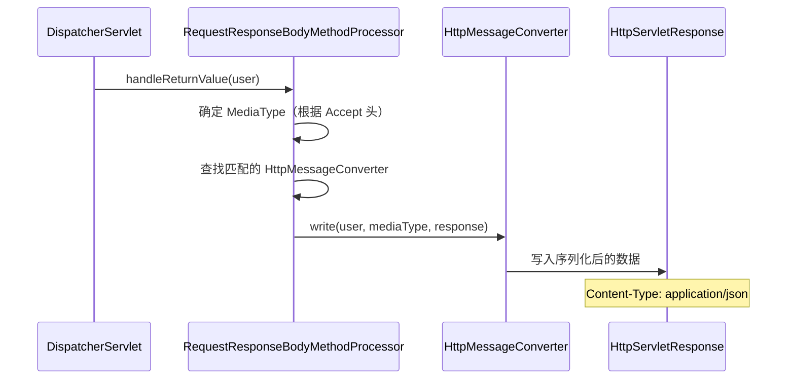

# RESTful 与内容协商

## @RestController 与 HttpMessageConverter

上一章结尾我们提到了 `@RestController` 和 `@Controller` 的区别。这一章我们从根上把它讲透。

先说结论：**`@RestController` = `@Controller` + `@ResponseBody`。** 就这么简单。

但这个简单的等号背后，是两套完全不同的返回值处理机制。

### @Controller 的返回值处理

```java
@Controller
@RequestMapping("/users")
public class UserController {

    @GetMapping("/{id}")
    public String detail(@PathVariable Long id, Model model) {
        User user = userService.findById(id);
        model.addAttribute("user", user);
        return "user/detail";  // 这是视图名
    }
}
```

返回的 `"user/detail"` 会被 `ViewResolver` 解析为一个视图模板，最终渲染成 HTML 返回给客户端。整个过程走的是第二章讲的视图渲染流程。

### @ResponseBody 的返回值处理

```java
@Controller
@RequestMapping("/api/users")
public class UserApiController {

    @ResponseBody  // 加上这个注解
    @GetMapping("/{id}")
    public User detail(@PathVariable Long id) {
        return userService.findById(id);  // 直接返回对象
    }
}
```

`@ResponseBody` 告诉 Spring MVC："不要走视图渲染，直接把返回值写入响应体。" 具体怎么写？交给 `HttpMessageConverter`。

```java
@RestController  // 等价于上面的 @Controller + @ResponseBody
@RequestMapping("/api/users")
public class UserApiController {

    @GetMapping("/{id}")
    public User detail(@PathVariable Long id) {
        return userService.findById(id);
    }
}
```

### HttpMessageConverter 的工作原理

当方法有 `@ResponseBody` 注解时，返回值处理器是 `RequestResponseBodyMethodProcessor`（没错，它同时也是 `@RequestBody` 的解析器，名字里 "Processor" 就是"既能读也能写"的意思）。

它的工作流程：



核心步骤：

1. **确定媒体类型**——看客户端的 `Accept` 头想要什么格式
2. **找 Converter**——遍历所有注册的 `HttpMessageConverter`，找一个能处理该类型和媒体格式的
3. **序列化并写入**——Converter 把 Java 对象序列化后写入响应的 OutputStream

### Spring Boot 默认的 Converter

引入 `spring-boot-starter-web` 后，自动注册的 Converter 包括：

```java
// 可以通过这个接口查看当前注册的所有 Converter
@GetMapping("/debug/converters")
public List<String> listConverters(HttpMessageConverters converters) {
    return converters.getConverters().stream()
            .map(c -> c.getClass().getSimpleName())
            .collect(Collectors.toList());
}
```

最常用的是 `MappingJackson2HttpMessageConverter`，它使用 Jackson 库来做 JSON 序列化。只要 classpath 上有 `jackson-databind`（Spring Boot 默认带），它就会自动注册。

### 自定义 JSON 序列化行为

既然 JSON 序列化走的是 Jackson，那自定义行为也是通过 Jackson 的方式：

```java
// 方式一：注解控制（字段级别）
public class User {
    @JsonIgnore
    private String password;  // 不序列化密码

    @JsonFormat(pattern = "yyyy-MM-dd HH:mm:ss")
    private LocalDateTime createdAt;  // 自定义日期格式

    @JsonProperty("user_name")  // 重命名字段
    private String name;
}

// 方式二：全局配置（推荐）
@Configuration
public class JacksonConfig {

    @Bean
    public ObjectMapper objectMapper() {
        ObjectMapper mapper = new ObjectMapper();
        // 日期格式
        mapper.setDateFormat(new SimpleDateFormat("yyyy-MM-dd HH:mm:ss"));
        // 时区
        mapper.setTimeZone(TimeZone.getTimeZone("Asia/Shanghai"));
        // 不序列化 null 值
        mapper.setSerializationInclusion(JsonInclude.Include.NON_NULL);
        // 遇到未知属性不报错（反序列化时）
        mapper.configure(DeserializationFeature.FAIL_ON_UNKNOWN_PROPERTIES, false);
        return mapper;
    }
}

// 方式三：WebMvcConfigurer（作用于 Spring MVC 层面）
@Configuration
public class WebConfig implements WebMvcConfigurer {

    @Override
    public void configureMessageConverters(List<HttpMessageConverter<?>> converters) {
        // 在列表最前面加一个自定义的 ObjectMapper
        MappingJackson2HttpMessageConverter converter =
            new MappingJackson2HttpMessageConverter();
        converter.setObjectMapper(customObjectMapper());
        converters.add(0, converter);
    }
}
```

方式一最灵活，可以针对不同字段做不同处理。方式二全局生效，适合统一风格。方式三可以完全替换 Converter 的行为。

---

## 内容协商策略

什么是内容协商？就是同一个 URL，根据客户端的需要返回不同格式的数据。

```
GET /api/users/1
Accept: application/json    → 返回 JSON
Accept: application/xml     → 返回 XML
Accept: text/html           → 返回 HTML
```

### Accept 头协商

Spring MVC 默认通过 `Accept` 头来做内容协商。整个过程：

```java
// 1. 客户端发送请求，Accept 头声明想要的格式
// GET /api/users/1
// Accept: application/json

// 2. Spring MVC 解析 Accept 头，得到一个排序后的 MediaType 列表
// [application/json, */*]

// 3. 遍历 HttpMessageConverter，找到能同时处理返回类型和目标 MediaType 的
// MappingJackson2HttpMessageConverter.canWrite(User.class, application/json) → true

// 4. 用找到的 Converter 序列化返回值
```

### 支持多种格式

想让同一个接口同时支持 JSON 和 XML？只需要加上 JAXB 或 Jackson XML 的依赖：

```xml
<!-- Jackson XML 支持 -->
<dependency>
    <groupId>com.fasterxml.jackson.dataformat</groupId>
    <artifactId>jackson-dataformat-xml</artifactId>
</dependency>
```

加了这个依赖后，`MappingJackson2XmlHttpMessageConverter` 会自动注册，接口就同时支持 JSON 和 XML 了。不需要改一行代码。

### 通过 URL 后缀协商

除了 Accept 头，Spring MVC 还支持通过 URL 后缀来协商：

```
GET /api/users/1.json  → JSON
GET /api/users/1.xml   → XML
```

但这种风格在 RESTful 设计中有争议——URL 应该标识资源，不应该包含格式信息。我建议**优先用 Accept 头**，URL 后缀协商作为兼容方案。

### 扩展名协商的配置

Spring Boot 默认关闭了扩展名协商。如果需要，可以这样开启：

```yaml
spring:
  mvc:
    contentnegotiation:
      favor-parameter: true   # 也支持通过查询参数协商
      favor-path-extension: true  # 支持扩展名协商
```

或者通过 Java 配置：

```java
@Configuration
public class WebConfig implements WebMvcConfigurer {

    @Override
    public void configureContentNegotiation(ContentNegotiationConfigurer configurer) {
        configurer
            .favorParameter(true)        // ?format=json
            .parameterName("format")
            .favorPathExtension(true)    // .json
            .defaultContentType(MediaType.APPLICATION_JSON)
            .mediaType("json", MediaType.APPLICATION_JSON)
            .mediaType("xml", MediaType.APPLICATION_XML);
    }
}
```

### 实际项目中的建议

大多数 REST API 项目只需要 JSON 格式。除非你明确需要支持多种格式，否则不需要做任何内容协商配置——Spring Boot 默认就是 JSON。

如果确实需要多格式支持（比如同时给浏览器和 API 客户端提供服务），用 Accept 头是最标准的方式。

---

## CORS 配置

CORS（Cross-Origin Resource Sharing，跨域资源共享）是前后端分离项目中绕不开的问题。

### 为什么会有跨域问题？

浏览器的同源策略（Same-Origin Policy）限制了 JavaScript 只能访问同源（协议 + 域名 + 端口都相同）的资源。当前端在 `localhost:3000`（Vue/React 开发服务器）运行，后端在 `localhost:8080`（Spring Boot）运行时，前端发请求到后端就是跨域。

```
前端：http://localhost:3000
后端：http://localhost:8080

协议相同（http）、域名相同（localhost）、端口不同（3000 vs 8080）
→ 跨域！
```

浏览器发现跨域请求后，会先发一个 OPTIONS 预检请求（preflight），问服务器"我能不能跨域访问你"。服务器需要返回正确的 CORS 响应头，浏览器才会放行实际请求。

### Spring Boot 中配置 CORS

**方式一：@CrossOrigin 注解（细粒度）**

```java
@RestController
@RequestMapping("/api/users")
@CrossOrigin(origins = "http://localhost:3000")
public class UserController {

    @GetMapping("/{id}")
    public User detail(@PathVariable Long id) {
        return userService.findById(id);
    }
}
```

可以加在类上（作用于整个 Controller），也可以加在方法上（只作用于单个接口）。

```java
@CrossOrigin(
    origins = {"http://localhost:3000", "https://example.com"},
    methods = {RequestMethod.GET, RequestMethod.POST},
    allowedHeaders = "*",
    allowCredentials = true,
    maxAge = 3600  // 预检请求缓存时间（秒）
)
```

**方式二：全局配置（推荐）**

```java
@Configuration
public class CorsConfig implements WebMvcConfigurer {

    @Override
    public void addCorsMappings(CorsRegistry registry) {
        registry.addMapping("/api/**")  // 匹配的路径
                .allowedOrigins("http://localhost:3000")
                .allowedMethods("GET", "POST", "PUT", "DELETE", "OPTIONS")
                .allowedHeaders("*")
                .allowCredentials(true)
                .maxAge(3600);
    }
}
```

**方式三：CorsFilter（最灵活）**

```java
@Bean
public CorsFilter corsFilter() {
    CorsConfiguration config = new CorsConfiguration();
    config.addAllowedOrigin("http://localhost:3000");
    config.addAllowedMethod("*");
    config.addAllowedHeader("*");
    config.setAllowCredentials(true);
    config.setMaxAge(3600L);

    UrlBasedCorsConfigurationSource source = new UrlBasedCorsConfigurationSource();
    source.registerCorsConfiguration("/api/**", config);

    return new CorsFilter(source);
}
```

三种方式的区别：

| 方式 | 作用范围 | 优先级 | 灵活性 |
|------|---------|--------|--------|
| `@CrossOrigin` | 方法/类 | 最高 | 低 |
| `WebMvcConfigurer` | 全局 | 中 | 中 |
| `CorsFilter` | 全局 | 最低（但可以调整 Order） | 高 |

### CORS 与 Spring Security 的坑

如果你的项目用了 Spring Security，**CORS 配置必须在 Security 层面也做**，否则 OPTIONS 预检请求会被 Security 拦截，导致跨域失败。

```java
@Configuration
@EnableWebSecurity
public class SecurityConfig {

    @Bean
    public SecurityFilterChain filterChain(HttpSecurity http) throws Exception {
        http
            .cors(cors -> cors.configurationSource(corsConfigurationSource()))
            .csrf(csrf -> csrf.disable())
            .authorizeHttpRequests(auth -> auth
                .requestMatchers("/api/public/**").permitAll()
                .anyRequest().authenticated()
            );
        return http.build();
    }

    @Bean
    public CorsConfigurationSource corsConfigurationSource() {
        CorsConfiguration config = new CorsConfiguration();
        config.setAllowedOrigins(List.of("http://localhost:3000"));
        config.setAllowedMethods(List.of("GET", "POST", "PUT", "DELETE"));
        config.setAllowedHeaders(List.of("*"));
        config.setAllowCredentials(true);

        UrlBasedCorsConfigurationSource source = new UrlBasedCorsConfigurationSource();
        source.registerCorsConfiguration("/api/**", config);
        return source;
    }
}
```

这个坑我见过太多人踩了——WebMvcConfigurer 里配了 CORS，但 Security 没配，调了半天不知道为什么跨域还是失败。记住：**有 Security 时，CORS 必须在 Security 里配。**

### 生产环境的 CORS 策略

开发环境可以配 `allowedOrigins("*")` 图省事，但生产环境一定要限制：

```java
// 开发环境
config.addAllowedOrigin("http://localhost:3000");

// 生产环境
config.addAllowedOrigin("https://www.your-domain.com");
```

不要在生产环境用通配符 `*`，尤其是 `allowCredentials = true` 时——这在某些浏览器上会直接报错，而且存在安全隐患。

---

## RESTful 设计的几个实战建议

既然这一章讲 RESTful，顺便聊聊实际项目中的 REST API 设计。

### URL 设计

```java
// ✅ 好的设计
GET    /api/users           // 查询用户列表
GET    /api/users/42        // 查询单个用户
POST   /api/users           // 创建用户
PUT    /api/users/42        // 更新用户（全量）
PATCH  /api/users/42        // 更新用户（部分）
DELETE /api/users/42        // 删除用户

// ❌ 不好的设计
GET    /api/getUser?id=42
POST   /api/createUser
POST   /api/updateUser
POST   /api/deleteUser?id=42
```

### 状态码的正确使用

```java
// 创建成功 → 201 Created（不是 200）
@PostMapping
public ResponseEntity<User> create(@RequestBody @Valid UserDTO dto) {
    User user = userService.create(dto);
    URI location = URI.create("/api/users/" + user.getId());
    return ResponseEntity.created(location).body(user);
}

// 删除成功 → 204 No Content（不需要返回体）
@DeleteMapping("/{id}")
public ResponseEntity<Void> delete(@PathVariable Long id) {
    userService.delete(id);
    return ResponseEntity.noContent().build();
}

// 资源不存在 → 404
// 参数错误 → 400
// 未认证 → 401
// 无权限 → 403
```

### 分页的通用设计

```java
// 请求
GET /api/users?page=0&size=20&sort=createdAt,desc&keyword=john

// 响应
{
    "content": [...],
    "page": 0,
    "size": 20,
    "totalElements": 156,
    "totalPages": 8
}
```

Spring Data 的 `Page<T>` 默认序列化出来的字段就是这个格式，可以直接用。

---

## 小结

这一章讲了三个核心主题：

1. **@RestController 与 HttpMessageConverter**——`@RestController` 就是 `@Controller` + `@ResponseBody`，返回值通过 `HttpMessageConverter` 序列化后直接写入响应体。JSON 序列化由 Jackson 的 `MappingJackson2HttpMessageConverter` 完成。

2. **内容协商**——根据客户端的 `Accept` 头选择响应格式。默认只支持 JSON，加依赖可以支持 XML。大多数项目不需要额外配置。

3. **CORS**——前后端分离的标配。开发环境方便配置，生产环境一定要限制来源。用了 Spring Security 必须在 Security 层面也配 CORS。

关键记忆点：

- `HttpMessageConverter` 既能读（`@RequestBody`）也能写（`@ResponseBody`）
- 内容协商通过 `Accept` 头实现，优先级最高
- CORS 的 `OPTIONS` 预检请求是浏览器行为，服务器需要正确响应
- **有 Spring Security 时，CORS 必须在 Security 层面配**

下一章我们看拦截器和文件上传——怎么在请求处理的前后插入自定义逻辑。
