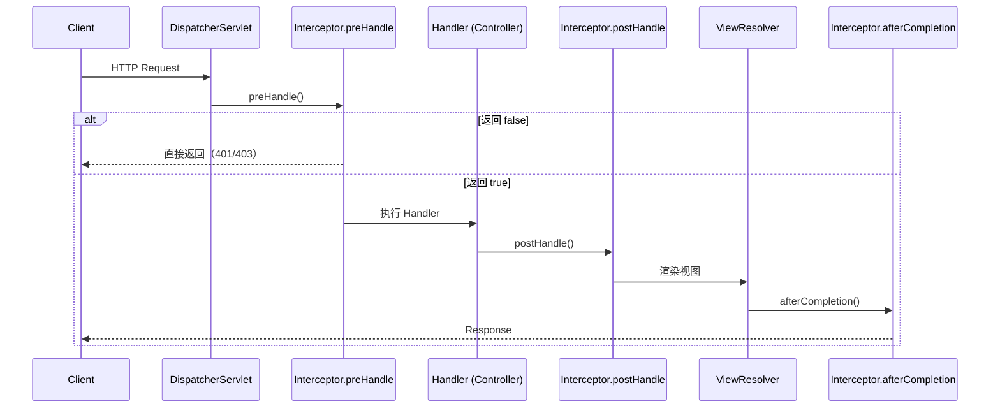
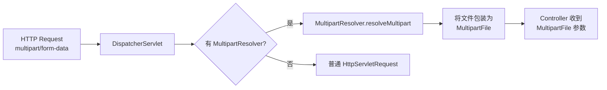

# 拦截器与文件上传

## 拦截器：请求的"安检通道"

你已经知道 DispatcherServlet 收到请求后会找到对应的 Handler 方法执行。但在实际开发中，你经常需要在请求到达 Handler **之前**做一些事情——比如检查用户有没有登录、记录请求日志、设置上下文信息。在 Handler 执行**之后**也需要做一些事情——比如统一处理响应格式、清理资源。

Servlet 的 Filter 能做这些事，但 Filter 太粗了——它工作在 Servlet 层面，不理解 Spring MVC 的概念（不知道你调的是哪个 Controller、哪个方法）。Spring MVC 提供了更精细的机制：**HandlerInterceptor**。

### HandlerInterceptor 的三个回调

```java
public interface HandlerInterceptor {
    // Handler 执行之前
    default boolean preHandle(HttpServletRequest request, 
                              HttpServletResponse response, 
                              Object handler) throws Exception {
        return true;  // 返回 false 就中断了，请求不会到达 Handler
    }
    
    // Handler 执行之后，视图渲染之前
    default void postHandle(HttpServletRequest request,
                            HttpServletResponse response,
                            Object handler,
                            ModelAndView modelAndView) throws Exception {
    }
    
    // 请求完全结束之后（视图渲染完了）
    default void afterCompletion(HttpServletRequest request,
                                 HttpServletResponse response,
                                 Object handler,
                                 Exception ex) throws Exception {
    }
}
```

三个方法的执行时机用一张图说清楚：



一个关键区别：`afterCompletion` **无论 Handler 是否抛异常都会执行**，适合做资源清理。而 `postHandle` 只在正常执行时才会调用，如果 Handler 抛了异常，`postHandle` 不会被调用。

### 链式调用：多个拦截器怎么协作

实际项目中通常有多个拦截器：登录检查、日志记录、权限校验……它们按**注册顺序**形成一条链。

```java
@Configuration
public class WebMvcConfig implements WebMvcConfigurer {
    @Override
    public void addInterceptors(InterceptorRegistry registry) {
        registry.addInterceptor(new LogInterceptor())
                .addPathPatterns("/**")
                .order(1);  // 先执行
        
        registry.addInterceptor(new AuthInterceptor())
                .addPathPatterns("/api/**")
                .excludePathPatterns("/api/login")
                .order(2);  // 后执行
    }
}
```

多个拦截器的执行顺序是：

```
preHandle:  1 → 2 → 3
postHandle: 3 → 2 → 1    （反序）
afterCompletion: 3 → 2 → 1  （反序）
```

就像洋葱一样——先进后出。如果第 2 个拦截器的 `preHandle` 返回了 false，那么第 3 个拦截器不会执行，已经执行过的拦截器的 `afterCompletion` **会倒序执行**（保证资源清理）。

### 实战：登录拦截器

这是最经典的拦截器使用场景。几乎所有需要认证的项目都会写一个：

```java
@Component
public class LoginInterceptor implements HandlerInterceptor {
    
    @Autowired
    private TokenService tokenService;
    
    @Override
    public boolean preHandle(HttpServletRequest request,
                             HttpServletResponse response,
                             Object handler) throws Exception {
        // 放行 OPTIONS 请求（CORS 预检）
        if ("OPTIONS".equalsIgnoreCase(request.getMethod())) {
            return true;
        }
        
        String token = request.getHeader("Authorization");
        if (token == null || !tokenService.validate(token)) {
            response.setStatus(HttpServletResponse.SC_UNAUTHORIZED);
            response.setContentType("application/json;charset=UTF-8");
            response.getWriter().write("{\"code\":401,\"msg\":\"未登录\"}");
            return false;
        }
        
        // 把用户信息存到 request 里，后续 Handler 可以用
        UserInfo user = tokenService.parse(token);
        request.setAttribute("currentUser", user);
        return true;
    }
}
```

Handler 里怎么拿到拦截器设置的信息？几种方式：

```java
// 方式 1：直接从 request 取
@GetMapping("/user/info")
public Result getUserInfo(HttpServletRequest request) {
    UserInfo user = (UserInfo) request.getAttribute("currentUser");
    return Result.success(user);
}

// 方式 2：用 @RequestAttribute（更优雅）
@GetMapping("/user/info")
public Result getUserInfo(@RequestAttribute("currentUser") UserInfo user) {
    return Result.success(user);
}

// 方式 3：用方法参数解析器（最优雅，自定义 HandlerMethodArgumentResolver）
@GetMapping("/user/info")
public Result getUserInfo(@CurrentUser UserInfo user) {
    return Result.success(user);
}
```

### 拦截器 vs Filter：到底用哪个？

这个问题被问得很多。简单说：

| 维度 | Filter | HandlerInterceptor |
|------|--------|-------------------|
| 规范 | Servlet 规范 | Spring MVC |
| 作用范围 | 所有请求（包括静态资源） | 只有 Controller 请求 |
| 能拿到 Handler 信息 | 不能 | 能（handler 参数） |
| 能拿到 ModelAndView | 不能 | 能（postHandle） |
| 依赖注入 | 需要额外处理 | 天然支持 |

**选择原则：** 如果你需要操作 Spring MVC 特有的东西（Handler 信息、ModelAndView），用拦截器。如果只是通用的请求/响应处理（编码、CORS、GZIP），用 Filter。

大多数时候，**优先用拦截器**，因为它更贴近 Spring 生态。

### MultipartResolver：文件上传

文件上传是另一个常见需求。Spring MVC 通过 `MultipartResolver` 接口处理 multipart 请求。

#### 基本用法

```java
// 配置（Spring Boot 自动配置了，但你可能需要调整参数）
// application.yml
spring:
  servlet:
    multipart:
      max-file-size: 10MB        # 单文件最大
      max-request-size: 50MB     # 单次请求最大
      enabled: true

// Controller
@PostMapping("/upload")
public Result upload(@RequestParam("file") MultipartFile file) {
    if (file.isEmpty()) {
        return Result.error("文件不能为空");
    }
    
    String originalName = file.getOriginalFilename();
    String ext = originalName.substring(originalName.lastIndexOf("."));
    String newName = UUID.randomUUID() + ext;
    
    // 保存到本地
    file.transferTo(new File("/uploads/" + newName));
    
    return Result.success(newName);
}
```

#### 多文件上传

```java
@PostMapping("/upload/batch")
public Result batchUpload(@RequestParam("files") MultipartFile[] files) {
    List<String> names = new ArrayList<>();
    for (MultipartFile file : files) {
        if (!file.isEmpty()) {
            String name = UUID.randomUUID() + getExt(file);
            file.transferTo(new File("/uploads/" + name));
            names.add(name);
        }
    }
    return Result.success(names);
}
```

#### 背后的原理

当请求的 `Content-Type` 是 `multipart/form-data` 时，DispatcherServlet 会用 `MultipartResolver` 来解析请求。Spring Boot 默认使用 `StandardServletMultipartResolver`（基于 Servlet 3.0 规范）。

解析过程：



一个容易踩的坑：`MultipartFile` 的内容默认存在**临时文件**里，请求结束后会被清理。如果你需要异步处理文件内容，要先把内容读出来或者调用 `transferTo` 保存。

### 异步请求处理

传统的 Servlet 模型是：一个请求占用一个线程，直到响应完成。如果 Handler 里有耗时操作（调远程服务、等消息队列），线程就被白白占住了。

Spring MVC 提供了两种异步处理方式：

#### DeferredResult

```java
@GetMapping("/async/order")
public DeferredResult<Result> asyncOrder() {
    DeferredResult<Result> result = new DeferredResult<>(30000L);  // 超时 30 秒
    
    // 提交到另一个线程处理
    CompletableFuture.runAsync(() -> {
        // 模拟耗时操作
        Order order = orderService.createOrder();
        result.setResult(Result.success(order));  // 处理完了，设置结果
    });
    
    return result;  // 主线程立刻释放
}
```

#### Callable

```java
@GetMapping("/async/data")
public Callable<Result> asyncData() {
    return () -> {
        // 这段代码在 Spring 管理的异步线程中执行
        Thread.sleep(5000);
        return Result.success("data");
    };
}
```

两者的区别：`Callable` 的逻辑在 Spring 的 `TaskExecutor` 中执行，比较简单。`DeferredResult` 更灵活，可以在任何线程中设置结果——比如消息队列的回调、WebSocket 的推送。

#### 异步请求的拦截器行为

异步请求的拦截器行为和同步不同：

- `preHandle`：在主线程中调用（请求进入时）
- `afterCompletion`：在异步线程完成后调用（响应结束时）
- `postHandle`：在异步模式下**不被调用**

这是因为异步请求的处理流程和同步不同——`postHandle` 的调用时机是 Handler 返回之后、视图渲染之前，但异步请求的 Handler 立刻就返回了（返回 `DeferredResult` 或 `Callable`），真正的处理在另一个线程。

### 小结

- **拦截器**是 Spring MVC 的"安检通道"，三个回调覆盖了请求的完整生命周期
- 多个拦截器**先进后出**，`preHandle` 返回 false 会中断链路
- **文件上传**通过 `MultipartResolver` 实现，Spring Boot 自动配置
- **异步请求**用 `DeferredResult` 或 `Callable` 释放主线程，但拦截器行为有差异
- 拦截器 vs Filter：**优先用拦截器**，除非你操作的是 Servlet 层面的东西
