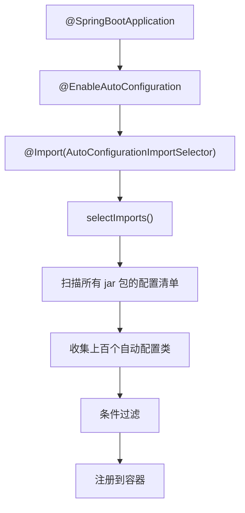
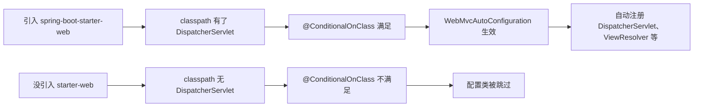

# 自动配置原理

你一定写过这样的启动类：

```java
@SpringBootApplication
public class MyApp {
    public static void main(String[] args) {
        SpringApplication.run(MyApp.class, args);
    }
}
```

三行代码，一个注解，run 一下——内嵌 Tomcat 起来了，DataSource 自动配好了，JSON 序列化也搞定了。我第一次用 Spring Boot 的时候，觉得这简直是魔法。后来我开始想一个问题：**这些配置到底是谁做的？凭什么我加个注解就全好了？**

如果你用了好几年 Spring Boot，但对这件事的理解还停留在"约定大于配置"这五个字上，那这一章值得你认真读完。因为一旦你搞懂了自动配置的原理，很多以前"不知道为什么不生效"的问题，你一眼就能看出来。

## 拆开 @SpringBootApplication

先看这个注解的定义：

```java
@Target(ElementType.TYPE)
@Retention(RetentionPolicy.RUNTIME)
@Documented
@Inherited
@SpringBootConfiguration   // 本质就是 @Configuration
@EnableAutoConfiguration   // 关键！
@ComponentScan             // 扫描当前包及子包
public @interface SpringBootApplication {
}
```

三个注解里，`@ComponentScan` 你熟——扫描 Bean；`@Configuration` 你也熟——声明配置类。真正陌生的是 `@EnableAutoConfiguration`。它才是自动配置的开关。

继续拆：

```java
@Target(ElementType.TYPE)
@Retention(RetentionPolicy.RUNTIME)
@Documented
@Inherited
@AutoConfigurationPackage
@Import(AutoConfigurationImportSelector.class)
public @interface EnableAutoConfiguration {
}
```

两个关键动作：

- `@AutoConfigurationPackage`：把启动类所在的包注册到容器里，后续 ComponentScan 能扫到。
- `@Import(AutoConfigurationImportSelector.class)`：**这才是自动配置的核心入口。**

`AutoConfigurationImportSelector` 实现了 Spring 的 `ImportSelector` 接口。当 Spring 处理 `@Import` 时发现导入的是一个 `ImportSelector`，就会调用它的 `selectImports()` 方法，拿到一组配置类的全限定名，然后把这些类注册到容器里。

所以 `selectImports()` 做了什么？它去读了所有 jar 包里的配置清单。这个清单在哪？往下看。

## 配置类从哪来：spring.factories 的秘密

你打开 `spring-boot-autoconfigure` 这个 jar 包，能找到一个文件：

```
META-INF/spring.factories
```

内容大致是这样的：

```properties
org.springframework.boot.autoconfigure.EnableAutoConfiguration=\
org.springframework.boot.autoconfigure.jdbc.DataSourceAutoConfiguration,\
org.springframework.boot.autoconfigure.orm.jpa.HibernateJpaAutoConfiguration,\
org.springframework.boot.autoconfigure.web.servlet.WebMvcAutoConfiguration,\
org.springframework.boot.autoconfigure.jackson.JacksonAutoConfiguration,\
# ... 几十个上百个
```

这就是一张"自动配置清单"。Spring Boot 启动时扫描所有 jar 包的 `META-INF/spring.factories`，把 `EnableAutoConfiguration` 对应的类名全部收集起来。

Spring Boot 3.x 换了一个更干净的方式——每个自动配置类单独一行，放在 `META-INF/spring/org.springframework.boot.autoconfigure.AutoConfiguration.imports` 里：

```
org.springframework.boot.autoconfigure.jdbc.DataSourceAutoConfiguration
org.springframework.boot.autoconfigure.orm.jpa.HibernateJpaAutoConfiguration
org.springframework.boot.autoconfigure.web.servlet.WebMvcAutoConfiguration
```

为什么要换？因为 `spring.factories` 是个"万能文件"，各种 SPI 机制都往里塞，启动时要把整个文件加载进内存解析。新方式每个类型一个文件，定位更快，也更清晰。

来看整个加载流程：



到这里，你已经知道了自动配置的"进货"环节：`@Import` 触发 `selectImports()`，`selectImports()` 读配置清单，配置清单列出了所有候选的自动配置类。但问题来了——清单里列了上百个配置类，全注册进去那不乱套了？

这就是条件装配的用武之地。

## 条件装配：谁决定配置生效还是不生效

条件装配是自动配置的灵魂。没有它，所有配置类一股脑全注册，系统就废了。

来看一个典型的自动配置类：

```java
@AutoConfiguration
@ConditionalOnClass(DataSource.class)
@EnableConfigurationProperties(DataSourceProperties.class)
@Import(DataSourcePoolMetadataProvidersConfiguration.class)
public class DataSourceAutoConfiguration {

    @Configuration(proxyBeanMethods = false)
    @ConditionalOnMissingBean(DataSource.class)  // 容器里没有 DataSource 才生效
    @ConditionalOnProperty(name = "spring.datasource.type")
    static class Generic {

        @Bean
        DataSource dataSource(DataSourceProperties properties) {
            return properties.initializeDataSourceBuilder().build();
        }
    }
}
```

四个关键注解，每一个都有明确的含义：

- `@AutoConfiguration`：声明这是自动配置类。
- `@ConditionalOnClass(DataSource.class)`：classpath 里有 `DataSource` 这个类才生效。没引入 JDBC 依赖？整个配置类跳过。
- `@ConditionalOnMissingBean(DataSource.class)`：容器里没有用户自定义的 `DataSource` 才生效。你写了自定义的？我退让。
- `@EnableConfigurationProperties`：启用属性绑定，从 `application.yml` 读配置。

Spring Boot 在 `@Conditional`（Spring 4.0 引入）的基础上，扩展出了一整族条件注解：

| 注解 | 含义 |
|------|------|
| `@ConditionalOnClass` | classpath 中存在指定类 |
| `@ConditionalOnMissingClass` | classpath 中不存在指定类 |
| `@ConditionalOnBean` | 容器中存在指定 Bean |
| `@ConditionalOnMissingBean` | 容器中不存在指定 Bean |
| `@ConditionalOnProperty` | 配置属性满足条件 |
| `@ConditionalOnWebApplication` | 当前是 Web 应用 |

来一个实际的例子说明这些条件是怎么配合的。假设你引入了 `spring-boot-starter-web`：

```java
@AutoConfiguration
@ConditionalOnWebApplication(type = Type.SERVLET)
@ConditionalOnClass({ Servlet.class, DispatcherServlet.class, WebMvcConfigurer.class })
@ConditionalOnMissingBean(WebMvcConfigurationSupport.class)
@AutoConfigureOrder(Ordered.HIGHEST_PRECEDENCE + 10)
public class WebMvcAutoConfiguration {
    // 自动配置 DispatcherServlet、ViewResolver、静态资源处理等
}
```

四个条件全部满足，配置生效。但如果你没引入 `spring-boot-starter-web`，classpath 里没有 `DispatcherServlet.class`，第一个 `@ConditionalOnClass` 就不满足，整个配置类被跳过。你甚至不需要知道它的存在。

整个决策过程：



**这就是"引入一个 jar 包就自动配好了一切"的秘密：jar 包带来了类，类满足了条件，条件触发了配置。**

## @ConditionalOnMissingBean：自动配置的退让哲学

这个注解我要单独拿出来说，因为它体现了 Spring Boot 最重要的设计哲学：**自动配置是兜底方案，用户自定义永远优先。**

举个例子。你想用自定义的 `ObjectMapper`，比如序列化时忽略 null 值：

```java
@Bean
public ObjectMapper objectMapper() {
    ObjectMapper mapper = new ObjectMapper();
    mapper.setSerializationInclusion(JsonInclude.Include.NON_NULL);
    mapper.disable(DeserializationFeature.FAIL_ON_UNKNOWN_PROPERTIES);
    return mapper;
}
```

你这么一写，`JacksonAutoConfiguration` 里那个 `@ConditionalOnMissingBean(ObjectMapper.class)` 就不满足了——容器里已经有 `ObjectMapper` 了，它自动注册的那个就不会生效。你的自定义配置优先。

大多数人踩坑就踩在这里：**引入了某个 Starter，但功能没生效，或者生效了但行为和预期不一样。** 90% 的情况是你的自定义 Bean 把自动配置"顶掉"了，或者某个条件不满足导致配置被跳过了。

怎么看自动配置的决策结果？加一个 `--debug` 参数启动：

```bash
java -jar myapp.jar --debug
```

或者在 `application.yml` 里：

```yaml
debug: true
```

启动后你会看到一份"条件评估报告"：

```
============================
CONDITIONS EVALUATION REPORT
============================

Positive matches:（条件满足，配置生效）
-----------------
   DataSourceAutoConfiguration:
      Matched:
         - @ConditionalOnClass found required classes

   WebMvcAutoConfiguration:
      Matched:
         - @ConditionalOnWebApplication required type SERVLET matched

Negative matches:（条件不满足，配置未生效）
-----------------
   RabbitAutoConfiguration:
      Did not match:
         - @ConditionalOnClass did not find required class 'com.rabbitmq.client.Channel'
```

**这个调试手段非常实用。** 当你引入了某个 Starter 但功能没生效时，先看这个报告，比翻源码高效十倍。

## 配置类的加载顺序

自动配置类之间也有先后依赖。比如 `HibernateJpaAutoConfiguration` 依赖 `DataSource`，它必须排在 `DataSourceAutoConfiguration` 后面。Spring Boot 用 `@AutoConfigureBefore` 和 `@AutoConfigureAfter` 来控制这个顺序：

```java
@AutoConfiguration(after = DataSourceAutoConfiguration.class)
@ConditionalOnClass(EntityManager.class)
public class HibernateJpaAutoConfiguration {
    // 要在 DataSource 配置之后才能配置 JPA
}
```

启动时 Spring Boot 会做拓扑排序，保证依赖关系正确。你一般不需要关心这个，除非你在写自定义 Starter——这时候要注意声明依赖顺序。

## 回到最初的问题

为什么加个 `@SpringBootApplication` 注解就能跑？

1. `@EnableAutoConfiguration` 通过 `@Import` 导入了 `AutoConfigurationImportSelector`。
2. `selectImports()` 扫描所有 jar 包里的配置清单（`spring.factories` 或 `.imports`），收集了上百个自动配置类。
3. 每个自动配置类都带着 `@Conditional` 条件注解，只有条件满足才生效。
4. 条件检查基于 classpath 有什么类、容器有什么 Bean、配置文件有什么属性。
5. `@ConditionalOnMissingBean` 保证用户自定义永远优先于自动配置。

**自动配置不是魔法，是 `@Import` + `@Conditional` 的巧妙组合。** 你引入了什么依赖，就决定了哪些自动配置生效。理解了这一点，你就能预判一个 Starter 会带来什么行为，也能在出问题时快速定位原因。
