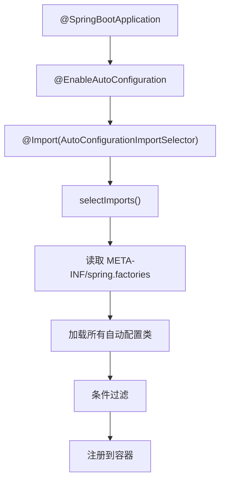
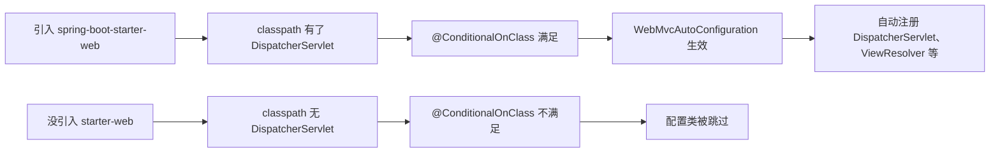

## 1.1 @EnableAutoConfiguration 拆解

你一定写过这样的启动类：

```java
@SpringBootApplication
public class MyApp {
    public static void main(String[] args) {
        SpringApplication.run(MyApp.class, args);
    }
}
```

加一个注解，`main` 方法一跑，内嵌 Tomcat 起来了，DataSource 自动配好了，JSON 序列化也搞定了。很多人用了好几年 Spring Boot，对这件事的理解停留在"约定大于配置"这句话上。但你有没有想过，这些配置到底是谁做的？怎么做的？凭什么我加个注解就全好了？

先拆 `@SpringBootApplication`：

```java
@Target(ElementType.TYPE)
@Retention(RetentionPolicy.RUNTIME)
@Documented
@Inherited
@SpringBootConfiguration   // 本质就是 @Configuration
@EnableAutoConfiguration   // 关键！
@ComponentScan             // 扫描当前包及子包
public @interface SpringBootApplication {
    // ...
}
```

三个注解里，`@ComponentScan` 你熟，`@Configuration` 你也熟，真正陌生的是 `@EnableAutoConfiguration`。它的定义是这样的：

```java
@Target(ElementType.TYPE)
@Retention(RetentionPolicy.RUNTIME)
@Documented
@Inherited
@AutoConfigurationPackage
@Import(AutoConfigurationImportSelector.class)
public @interface EnableAutoConfiguration {
    // ...
}
```

两个关键点：

- `@AutoConfigurationPackage`：把启动类所在的包注册到 Spring 容器里，后续 ComponentScan 能扫到。
- `@Import(AutoConfigurationImportSelector.class)`：这才是自动配置的核心入口。

`AutoConfigurationImportSelector` 实现了 `ImportSelector` 接口。Spring 在处理 `@Import` 注解时，如果发现导入的是一个 `ImportSelector`，就会调用它的 `selectImports` 方法，拿到一组配置类的全限定名，然后把这些类注册到容器里。

`AutoConfigurationImportSelector.selectImports()` 做了什么？它会去读 **META-INF/spring.factories**（Spring Boot 2.x）或 **META-INF/spring/org.springframework.boot.autoconfigure.AutoConfiguration.imports**（Spring Boot 3.x）文件，把里面列出的所有自动配置类的类名加载进来。



所以自动配置不是什么魔法，就是 Spring 的 `@Import` 机制的扩展应用。它帮你加载了一堆配置类，但最终哪些生效、哪些不生效，靠的是条件装配。

## 1.2 spring.factories / AutoConfiguration.imports

自动配置类从哪来？答案是 **spring.factories** 文件。

你在 `spring-boot-autoconfigure` 这个 jar 包里，能找到这个文件：

```
# META-INF/spring.factories
org.springframework.boot.autoconfigure.EnableAutoConfiguration=\
org.springframework.boot.autoconfigure.admin.SpringApplicationAdminJmxAutoConfiguration,\
org.springframework.boot.autoconfigure.aop.AopAutoConfiguration,\
org.springframework.boot.autoconfigure.amqp.RabbitAutoConfiguration,\
org.springframework.boot.autoconfigure.jdbc.DataSourceAutoConfiguration,\
org.springframework.boot.autoconfigure.orm.jpa.HibernateJpaAutoConfiguration,\
org.springframework.boot.autoconfigure.web.servlet.WebMvcAutoConfiguration,\
org.springframework.boot.autoconfigure.jackson.JacksonAutoConfiguration,\
# ... 几十上百个
```

这就是一张"自动配置清单"。Spring Boot 启动时会扫描所有 jar 包的 `META-INF/spring.factories`，把 `EnableAutoConfiguration` 对应的值全部收集起来。

Spring Boot 3.x 换了一个更清晰的方式：每个自动配置类单独一行放在 `META-INF/spring/org.springframework.boot.autoconfigure.AutoConfiguration.imports` 里：

```
org.springframework.boot.autoconfigure.jdbc.DataSourceAutoConfiguration
org.springframework.boot.autoconfigure.orm.jpa.HibernateJpaAutoConfiguration
org.springframework.boot.autoconfigure.web.servlet.WebMvcAutoConfiguration
```

为什么换了？因为 `spring.factories` 是一个"万能"文件，各种 SPI 机制都往里塞，读的时候要把整个文件加载进内存，解析效率低。新方式每个类型单独一个文件，定位更快。

来看看一个典型的自动配置类长什么样：

```java
@AutoConfiguration
@ConditionalOnClass(DataSource.class)
@EnableConfigurationProperties(DataSourceProperties.class)
@Import(DataSourcePoolMetadataProvidersConfiguration.class)
public class DataSourceAutoConfiguration {

    @Configuration(proxyBeanMethods = false)
    @ConditionalOnMissingBean(DataSource.class)  // 容器里没有 DataSource 才生效
    @ConditionalOnProperty(name = "spring.datasource.type")
    static class Generic {

        @Bean
        DataSource dataSource(DataSourceProperties properties) {
            // 根据 spring.datasource.type 创建对应的数据源
            return properties.initializeDataSourceBuilder().build();
        }
    }
}
```

几个关键注解：
- `@AutoConfiguration`：声明这是一个自动配置类（替代了原来的 `@Configuration`）。
- `@ConditionalOnClass(DataSource.class)`：classpath 里有 `DataSource` 类才生效。
- `@ConditionalOnMissingBean(DataSource.class)`：容器里没有用户自定义的 `DataSource` Bean 才生效。
- `@EnableConfigurationProperties`：启用 `DataSourceProperties` 这个属性绑定类。

这就是 Spring Boot 自动配置的套路：**先检查条件，满足就配，用户自定义了就退让**。

## 1.3 条件装配：@Conditional 族

条件装配是自动配置的灵魂。没有它，所有配置类一股脑全注册进去，那系统就乱了。

`@Conditional` 是 Spring 4.0 引入的注解，Spring Boot 在它基础上扩展出了一族条件注解：

| 注解 | 含义 |
|------|------|
| `@ConditionalOnClass` | classpath 中存在指定类 |
| `@ConditionalOnMissingClass` | classpath 中不存在指定类 |
| `@ConditionalOnBean` | 容器中存在指定 Bean |
| `@ConditionalOnMissingBean` | 容器中不存在指定 Bean |
| `@ConditionalOnProperty` | 配置属性满足条件 |
| `@ConditionalOnResource` | 存在指定资源文件 |
| `@ConditionalOnWebApplication` | 当前是 Web 应用 |
| `@ConditionalOnNotWebApplication` | 当前不是 Web 应用 |
| `@ConditionalOnExpression` | SpEL 表达式为 true |

来一个实际的例子。假设你在 classpath 里引入了 `spring-boot-starter-web`，那 `WebMvcAutoConfiguration` 就会生效，因为：

```java
@AutoConfiguration
@ConditionalOnWebApplication(type = Type.SERVLET)      // 是 Servlet Web 应用
@ConditionalOnClass({ Servlet.class, DispatcherServlet.class, WebMvcConfigurer.class })
@ConditionalOnMissingBean(WebMvcConfigurationSupport.class)  // 用户没自定义 MVC 配置
@AutoConfigureOrder(Ordered.HIGHEST_PRECEDENCE + 10)
public class WebMvcAutoConfiguration {
    // 自动配置 DispatcherServlet、ViewResolver、静态资源处理等
}
```

如果你没引入 `spring-boot-starter-web`，classpath 里没有 `DispatcherServlet.class`，`@ConditionalOnClass` 不满足，这个配置类整个就被跳过了。你甚至不需要知道它的存在。

这就是"引入一个 jar 包就自动配好了一切"的秘密：**jar 包带来了类，类满足了条件，条件触发了配置**。

来一个更直观的流程：



`@ConditionalOnMissingBean` 这个注解特别重要，它体现了 Spring Boot 的设计哲学：**自动配置是兜底方案，用户自定义永远优先**。

比如你想用自定义的 `ObjectMapper`：

```java
@Bean
public ObjectMapper objectMapper() {
    ObjectMapper mapper = new ObjectMapper();
    mapper.setSerializationInclusion(JsonInclude.Include.NON_NULL);
    mapper.disable(DeserializationFeature.FAIL_ON_UNKNOWN_PROPERTIES);
    return mapper;
}
```

你这么一配，`JacksonAutoConfiguration` 里的 `@ConditionalOnMissingBean(ObjectMapper.class)` 就不满足了，它自动注册的那个 `ObjectMapper` 就不会生效。这就是"退让"。

## 1.4 自动配置的加载顺序

自动配置类之间也有先后关系。Spring Boot 用 `@AutoConfigureBefore` 和 `@AutoConfigureAfter` 控制：

```java
@AutoConfiguration(after = DataSourceAutoConfiguration.class)
@ConditionalOnClass(EntityManager.class)
public class HibernateJpaAutoConfiguration {
    // 要在 DataSource 配置之后才能配置 JPA
}
```

比如 `HibernateJpaAutoConfiguration` 依赖 `DataSource`，所以它要排在 `DataSourceAutoConfiguration` 后面。这种顺序控制通过 `@AutoConfigureAfter` 注解声明，Spring Boot 启动时会进行拓扑排序，保证依赖关系正确。

## 1.5 动手实验：观察自动配置

纸上得来终觉浅，来看实际的自动配置报告。启动 Spring Boot 应用时加一个参数：

```bash
java -jar myapp.jar --debug
```

或者在 `application.yml` 里：

```yaml
debug: true
```

启动后你会看到类似这样的输出：

```
============================
CONDITIONS EVALUATION REPORT
============================

Positive matches:（条件满足，配置生效）
-----------------
   DataSourceAutoConfiguration:
      Did not match:
         - @ConditionalOnClass did not find required class 'javax.sql.DataSource'
      Matched:
         - @ConditionalOnClass found required classes 'javax.sql.DataSource', 'org.springframework.jdbc.datasource.embedded.EmbeddedDatabaseType'

   WebMvcAutoConfiguration:
      Did not match:
         - not a servlet web application
      Matched:
         - @ConditionalOnWebApplication required type SERVLET matched

Negative matches:（条件不满足，配置未生效）
-----------------
   RabbitAutoConfiguration:
      Did not match:
         - @ConditionalOnClass did not find required class 'com.rabbitmq.client.Channel'
```

这段报告告诉你：
- `DataSourceAutoConfiguration` 为什么生效了（classpath 里找到了需要的类）。
- `RabbitAutoConfiguration` 为什么没生效（classpath 里没有 RabbitMQ 的客户端类）。

这个调试手段非常实用。当你引入了一个 Starter 但功能没生效时，先看这个报告，90% 的问题都能定位到。

## 1.6 总结

回到最初的问题：为什么加个 `@SpringBootApplication` 注解就能跑？

1. `@EnableAutoConfiguration` 通过 `@Import` 导入了 `AutoConfigurationImportSelector`。
2. `AutoConfigurationImportSelector` 读取所有 jar 包里的 `spring.factories`（或 `.imports` 文件），收集了上百个自动配置类。
3. 每个自动配置类都带着 `@Conditional` 条件注解，只有条件满足才生效。
4. 条件检查基于 classpath 里有什么类、容器里有什么 Bean、配置文件里有什么属性。
5. `@ConditionalOnMissingBean` 保证用户自定义优先于自动配置。

**自动配置不是魔法，是 Spring `@Import` + `@Conditional` 的巧妙组合。** 你引入了什么依赖，就决定了哪些自动配置生效。这比 XML 时代手动声明每一个 Bean 优雅太多。
