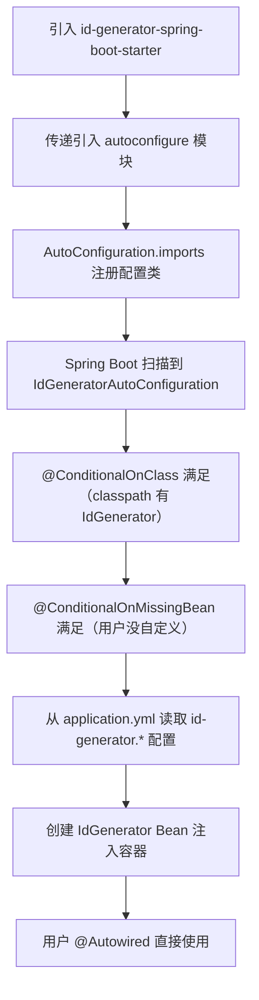

# Starter 机制

## 2.1 Starter 的命名规范

在 Maven 仓库里搜 Spring Boot 相关的包，你会发现两类命名：

- `spring-boot-starter-web` —— 官方 Starter
- `mybatis-spring-boot-starter` —— 第三方 Starter

这不是随便起的。Spring Boot 官方有一套明确的命名规范：

| 类型 | 命名格式 | 示例 |
|------|---------|------|
| 官方 Starter | `spring-boot-starter-{功能}` | `spring-boot-starter-web`、`spring-boot-starter-data-jpa` |
| 第三方 Starter | `{项目名}-spring-boot-starter` | `mybatis-spring-boot-starter`、`druid-spring-boot-starter` |

为什么这么规定？因为 `spring-boot-starter-*` 是 Spring Boot 官方的命名空间。如果你的第三方库也用这个前缀，会和官方的冲突，也给使用者造成混淆。第三方库把自己的名字放前面，一眼就能看出是谁提供的。

Spring Boot 官方提供了几十个 Starter，常用的有：

```
spring-boot-starter-web          # Web 应用（内嵌 Tomcat + Spring MVC）
spring-boot-starter-data-jpa     # JPA + Hibernate
spring-boot-starter-data-redis   # Redis
spring-boot-starter-security     # Spring Security
spring-boot-starter-test         # 测试（JUnit + Mockito + AssertJ）
spring-boot-starter-actuator     # 生产监控
spring-boot-starter-amqp         # RabbitMQ
spring-boot-starter-mail         # 邮件发送
```

一个 Starter 本质上是什么？**它是一个空 jar 包，唯一的作用是声明依赖。** 对，你没看错，Starter 本身不写任何代码。它就是一个"依赖收集器"，把某个功能需要的所有依赖打包在一起，你引入一个 Starter，就等于引入了一整套相关依赖。

来看 `spring-boot-starter-web` 的 `pom.xml`：

```xml
<dependencies>
    <dependency>
        <groupId>org.springframework.boot</groupId>
        <artifactId>spring-boot-starter</artifactId>   <!-- 核心 Starter -->
    </dependency>
    <dependency>
        <groupId>org.springframework.boot</groupId>
        <artifactId>spring-boot-starter-json</artifactId>  <!-- JSON 支持 -->
    </dependency>
    <dependency>
        <groupId>org.springframework.boot</groupId>
        <artifactId>spring-boot-starter-tomcat</artifactId> <!-- 内嵌 Tomcat -->
    </dependency>
    <dependency>
        <groupId>org.springframework</groupId>
        <artifactId>spring-web</artifactId>
    </dependency>
    <dependency>
        <groupId>org.springframework</groupId>
        <artifactId>spring-webmvc</artifactId>
    </dependency>
</dependencies>
```

没有任何 Java 代码。它就是把 `spring-web`、`spring-webmvc`、内嵌 Tomcat、JSON 支持这些依赖打包在一起。你不用自己一个一个去声明，也不用担心版本冲突。

## 2.2 自定义 Starter 开发

理解了 Starter 的本质，我们来从零写一个。假设你要做一个"分布式 ID 生成器"的 Starter，用户引入后，直接注入 `IdGenerator` 就能用。

### 项目结构

一个完整的 Starter 需要两个模块：

```
id-generator-spring-boot-starter/          # Starter 模块（空壳，只声明依赖）
├── pom.xml

id-generator-spring-boot-autoconfigure/    # 自动配置模块（真正的代码）
├── pom.xml
├── src/main/java/com/example/
│   ├── IdGeneratorProperties.java         # 配置属性
│   ├── IdGenerator.java                   # 核心功能类
│   ├── IdGeneratorAutoConfiguration.java  # 自动配置类
└── src/main/resources/
    └── META-INF/
        └── spring/
            └── org.springframework.boot.autoconfigure.AutoConfiguration.imports
```

为什么分两个模块？这是最佳实践。自动配置模块可以单独使用（直接引入 `autoconfigure` 依赖），Starter 模块只负责把自动配置模块 + 相关依赖打包在一起。当然，对于简单场景，合成一个模块也行。

### 第一步：配置属性类

```java
@ConfigurationProperties(prefix = "id-generator")
public class IdGeneratorProperties {

    /**
     * 机器 ID（0-31）
     */
    private long workerId = 1;

    /**
     * 数据中心 ID（0-31）
     */
    private long datacenterId = 1;

    // getter / setter
    public long getWorkerId() { return workerId; }
    public void setWorkerId(long workerId) { this.workerId = workerId; }
    public long getDatacenterId() { return datacenterId; }
    public void setDatacenterId(long datacenterId) { this.datacenterId = datacenterId; }
}
```

### 第二步：核心功能类

```java
public class IdGenerator {

    private final long workerId;
    private final long datacenterId;
    private long sequence = 0L;
    private long lastTimestamp = -1L;

    public IdGenerator(long workerId, long datacenterId) {
        this.workerId = workerId;
        this.datacenterId = datacenterId;
    }

    public synchronized long nextId() {
        long timestamp = System.currentTimeMillis();
        if (timestamp == lastTimestamp) {
            sequence = (sequence + 1) & 4095;
            if (sequence == 0) {
                timestamp = waitNextMillis(lastTimestamp);
            }
        } else {
            sequence = 0L;
        }
        lastTimestamp = timestamp;
        return ((timestamp - 1288834974657L) << 22)
             | (datacenterId << 17)
             | (workerId << 12)
             | sequence;
    }

    private long waitNextMillis(long lastTimestamp) {
        long timestamp = System.currentTimeMillis();
        while (timestamp <= lastTimestamp) {
            timestamp = System.currentTimeMillis();
        }
        return timestamp;
    }
}
```

### 第三步：自动配置类

```java
@AutoConfiguration
@EnableConfigurationProperties(IdGeneratorProperties.class)
@ConditionalOnClass(IdGenerator.class)  // 有这个类就生效
public class IdGeneratorAutoConfiguration {

    @Bean
    @ConditionalOnMissingBean  // 用户没自定义才用默认的
    public IdGenerator idGenerator(IdGeneratorProperties properties) {
        return new IdGenerator(properties.getWorkerId(), properties.getDatacenterId());
    }
}
```

### 第四步：注册自动配置类

在 `META-INF/spring/org.springframework.boot.autoconfigure.AutoConfiguration.imports` 文件里写上：

```
com.example.IdGeneratorAutoConfiguration
```

Spring Boot 2.x 的话，在 `META-INF/spring.factories` 里写：

```
org.springframework.boot.autoconfigure.EnableAutoConfiguration=\
com.example.IdGeneratorAutoConfiguration
```

### 第五步：Starter 的 pom.xml

```xml
<dependencies>
    <dependency>
        <groupId>com.example</groupId>
        <artifactId>id-generator-spring-boot-autoconfigure</artifactId>
        <version>1.0.0</version>
    </dependency>
</dependencies>
```

### 使用

用户引入 Starter 后：

```xml
<dependency>
    <groupId>com.example</groupId>
    <artifactId>id-generator-spring-boot-starter</artifactId>
    <version>1.0.0</version>
</dependency>
```

直接注入使用：

```java
@RestController
public class OrderController {

    @Autowired
    private IdGenerator idGenerator;

    @GetMapping("/order/id")
    public long generateId() {
        return idGenerator.nextId();
    }
}
```

在 `application.yml` 里配置：

```yaml
id-generator:
  worker-id: 1
  datacenter-id: 2
```

到这里你应该理解了 Starter 的完整工作流程：



整个过程，用户只需要做两件事：引入依赖、写配置。这就是 Starter 的价值。

## 2.3 依赖管理与版本仲裁

你有没有好奇过：为什么你引入 `spring-boot-starter-web` 时不用指定 `spring-web` 的版本？为什么 `spring-boot-starter-data-jpa` 里 `hibernate-core` 的版本你也不用管？

答案是 **parent POM 的版本仲裁**。

```xml
<parent>
    <groupId>org.springframework.boot</groupId>
    <artifactId>spring-boot-starter-parent</artifactId>
    <version>3.2.0</version>
</parent>
```

`spring-boot-starter-parent` 继承自 `spring-boot-dependencies`，后者定义了 **几百个常用第三方库的版本号**：

```xml
<properties>
    <jackson.version>2.15.3</jackson.version>
    <slf4j.version>2.0.9</slf4j.version>
    <logback.version>1.4.11</logback.version>
    <hibernate.version>6.4.0.Final</hibernate.version>
    <mysql.version>8.0.33</mysql.version>
    <druid.version>1.2.20</druid.version>
    <mybatis.version>3.0.3</mybatis.version>
    <netty.version>4.1.101.Final</netty.version>
    <!-- 几百个... -->
</properties>
```

这意味着：

1. **你不需要手动指定版本**：引入 `jackson-databind` 时不用写 `<version>`，Spring Boot 帮你选好了兼容的版本。
2. **版本冲突被消除了**：Spring Boot 团队测试过这些版本的组合，确保它们能一起工作。
3. **升级很简单**：只需要改 Spring Boot 的版本号，所有子依赖的版本一起升级。

如果你想覆盖某个库的版本怎么办？

```xml
<properties>
    <mysql.version>8.0.34</mysql.version>  <!-- 覆盖默认的 MySQL 驱动版本 -->
</properties>
```

但要注意：**覆盖版本有风险**。Spring Boot 选的版本是经过兼容性测试的，你换了一个版本，可能和框架其他部分不兼容。除非你有充分理由（比如修复了一个安全漏洞），否则不建议手动覆盖。

来对比一下没有 Starter 时代你需要做的事：

```xml
<!-- 没有 Spring Boot 之前，你要自己管这些 -->
<dependency>
    <groupId>org.springframework</groupId>
    <artifactId>spring-webmvc</artifactId>
    <version>6.1.1</version>  <!-- 你自己选版本 -->
</dependency>
<dependency>
    <groupId>com.fasterxml.jackson.core</groupId>
    <artifactId>jackson-databind</artifactId>
    <version>2.15.3</version>  <!-- 你自己选版本 -->
</dependency>
<dependency>
    <groupId>org.apache.tomcat.embed</groupId>
    <artifactId>tomcat-embed-core</artifactId>
    <version>10.1.16</version>  <!-- 你自己选版本 -->
</dependency>
<!-- 还有十几个... -->
```

每次升级都要一个个查兼容性，改版本号，祈祷别出问题。Spring Boot 的 Starter + 版本仲裁把这件事做掉了，让你专注于业务代码。

## 2.4 Starter 的本质：约定大于配置

回头看整个 Starter 机制，其实就三层约定：

1. **依赖约定**：一个 Starter 收集了一组相关依赖，你不用自己拼。
2. **配置约定**：自动配置类定义了合理的默认值，你不用自己写 `@Configuration`。
3. **覆盖约定**：`@ConditionalOnMissingBean` 保证你的自定义永远优先。

这三层约定叠加在一起，就是 Spring Boot "开箱即用"的全部秘密。不是什么魔法，是精心设计的模块化和条件化。
