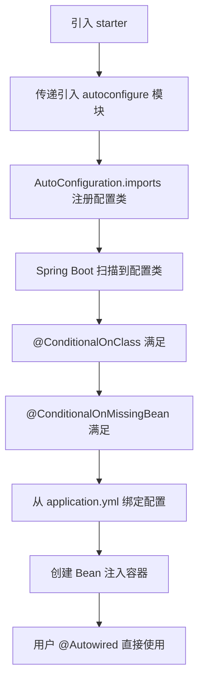

# Starter 机制

想象一个场景：你刚加入一个新项目，老大让你搭一个 Spring Boot Web 服务。你打开 `pom.xml`，加了一个依赖：

```xml
<dependency>
    <groupId>org.springframework.boot</groupId>
    <artifactId>spring-boot-starter-web</artifactId>
</dependency>
```

然后写了一个 `@RestController`，run 一下——服务跑起来了，能接收 HTTP 请求，能返回 JSON，内嵌 Tomcat 也启了。你从零到能跑，只加了一个依赖。

但你有没有想过：这一个依赖背后，到底引入了多少东西？`spring-web`、`spring-webmvc`、`tomcat-embed`、`jackson-databind`……这些库的版本你一个都没管，它们怎么就能和平共处？

这就是 Starter 机制要回答的问题。

## Starter 的命名不是随便起的

在 Maven 仓库里搜 Spring Boot 相关的包，你会发现两类命名：

- `spring-boot-starter-web` —— 官方 Starter
- `mybatis-spring-boot-starter` —— 第三方 Starter

这不是巧合，是规范。Spring Boot 官方有一套明确的命名规则：

| 类型 | 命名格式 | 示例 |
|------|---------|------|
| 官方 Starter | `spring-boot-starter-{功能}` | `spring-boot-starter-web`、`spring-boot-starter-data-jpa` |
| 第三方 Starter | `{项目名}-spring-boot-starter` | `mybatis-spring-boot-starter`、`druid-spring-boot-starter` |

为什么这么规定？因为 `spring-boot-starter-*` 是 Spring Boot 官方的命名空间。第三方库也用这个前缀，会和官方的冲突，也给使用者造成混淆。第三方库把自己的名字放前面，一眼就能看出是谁提供的——**这是一个很小的约定，但省了很多沟通成本。**

## Starter 的本质：一个空壳子

理解 Starter 的关键在于一个认知：**Starter 本身不写任何代码。它就是一个"依赖收集器"。**

来看 `spring-boot-starter-web` 的 `pom.xml`：

```xml
<dependencies>
    <dependency>
        <groupId>org.springframework.boot</groupId>
        <artifactId>spring-boot-starter</artifactId>   <!-- 核心 Starter -->
    </dependency>
    <dependency>
        <groupId>org.springframework.boot</groupId>
        <artifactId>spring-boot-starter-json</artifactId>  <!-- JSON 支持 -->
    </dependency>
    <dependency>
        <groupId>org.springframework.boot</groupId>
        <artifactId>spring-boot-starter-tomcat</artifactId> <!-- 内嵌 Tomcat -->
    </dependency>
    <dependency>
        <groupId>org.springframework</groupId>
        <artifactId>spring-web</artifactId>
    </dependency>
    <dependency>
        <groupId>org.springframework</groupId>
        <artifactId>spring-webmvc</artifactId>
    </dependency>
</dependencies>
```

没有任何 Java 代码。它做的事只有一件：把 Web 开发需要的所有依赖打包在一起，你引入一个 Starter，就等于引入了一整套。不用自己一个一个声明，不用担心版本冲突。

**Starter 负责"带什么东西来"，自动配置负责"来了之后怎么配"。** 这两件事是分开的，但配合得天衣无缝。

## 从零写一个自定义 Starter

光看别人写的不过瘾，我们自己来一个。假设你要做一个"分布式 ID 生成器"的 Starter，用户引入后，直接注入 `IdGenerator` 就能用。

### 为什么分两个模块

一个完整的 Starter 按最佳实践要分两个模块：

```
id-generator-spring-boot-starter/          # Starter 模块（空壳，只声明依赖）
├── pom.xml

id-generator-spring-boot-autoconfigure/    # 自动配置模块（真正的代码）
├── pom.xml
├── src/main/java/com/example/
│   ├── IdGeneratorProperties.java
│   ├── IdGenerator.java
│   ├── IdGeneratorAutoConfiguration.java
└── src/main/resources/
    └── META-INF/
        └── spring/
            └── org.springframework.boot.autoconfigure.AutoConfiguration.imports
```

为什么分？因为自动配置模块可以单独使用——有些高级用户不想用你的 Starter 全家桶，只想引入自动配置模块然后自己挑依赖。Starter 模块只负责把自动配置模块 + 相关依赖打包在一起，给"懒人"用。当然，简单场景合成一个模块也行，不影响功能。

### 第一步：配置属性类

```java
@ConfigurationProperties(prefix = "id-generator")
public class IdGeneratorProperties {

    /** 机器 ID（0-31） */
    private long workerId = 1;

    /** 数据中心 ID（0-31） */
    private long datacenterId = 1;

    // getter / setter
}
```

这个类的作用是把 `application.yml` 里的 `id-generator.*` 配置映射成 Java 对象。用户可以这样配置：

```yaml
id-generator:
  worker-id: 1
  datacenter-id: 2
```

### 第二步：核心功能类

```java
public class IdGenerator {

    private final long workerId;
    private final long datacenterId;
    private long sequence = 0L;
    private long lastTimestamp = -1L;

    public IdGenerator(long workerId, long datacenterId) {
        this.workerId = workerId;
        this.datacenterId = datacenterId;
    }

    public synchronized long nextId() {
        long timestamp = System.currentTimeMillis();
        if (timestamp == lastTimestamp) {
            sequence = (sequence + 1) & 4095;
            if (sequence == 0) {
                timestamp = waitNextMillis(lastTimestamp);
            }
        } else {
            sequence = 0L;
        }
        lastTimestamp = timestamp;
        // Snowflake 算法：时间戳 + 数据中心 + 机器 + 序列号
        return ((timestamp - 1288834974657L) << 22)
             | (datacenterId << 17)
             | (workerId << 12)
             | sequence;
    }

    private long waitNextMillis(long lastTimestamp) {
        long timestamp = System.currentTimeMillis();
        while (timestamp <= lastTimestamp) {
            timestamp = System.currentTimeMillis();
        }
        return timestamp;
    }
}
```

这是一个简化版的 Snowflake ID 生成器。核心逻辑不用深究，关键是它需要 `workerId` 和 `datacenterId` 两个参数——这些参数从哪来？从配置文件来，通过 `IdGeneratorProperties` 传入。

### 第三步：自动配置类——这是重点

```java
@AutoConfiguration
@EnableConfigurationProperties(IdGeneratorProperties.class)
@ConditionalOnClass(IdGenerator.class)
public class IdGeneratorAutoConfiguration {

    @Bean
    @ConditionalOnMissingBean
    public IdGenerator idGenerator(IdGeneratorProperties properties) {
        return new IdGenerator(properties.getWorkerId(), properties.getDatacenterId());
    }
}
```

三个注解，三个设计决策：

1. `@ConditionalOnClass(IdGenerator.class)`：classpath 里有 `IdGenerator` 这个类才生效。如果用户排除了核心依赖，配置自动跳过。
2. `@ConditionalOnMissingBean`：**用户没自定义 `IdGenerator` Bean 才用默认的。** 这就是上一章说的"退让哲学"——用户自定义永远优先。
3. `@EnableConfigurationProperties`：把 `IdGeneratorProperties` 注册为 Bean，从 `application.yml` 绑定配置。

### 第四步：注册

在 `META-INF/spring/org.springframework.boot.autoconfigure.AutoConfiguration.imports` 里写上：

```
com.example.IdGeneratorAutoConfiguration
```

Spring Boot 2.x 的话写在 `META-INF/spring.factories` 里：

```properties
org.springframework.boot.autoconfigure.EnableAutoConfiguration=\
com.example.IdGeneratorAutoConfiguration
```

### 第五步：Starter 的 pom.xml

```xml
<dependencies>
    <dependency>
        <groupId>com.example</groupId>
        <artifactId>id-generator-spring-boot-autoconfigure</artifactId>
        <version>1.0.0</version>
    </dependency>
</dependencies>
```

### 用户怎么用

```xml
<dependency>
    <groupId>com.example</groupId>
    <artifactId>id-generator-spring-boot-starter</artifactId>
    <version>1.0.0</version>
</dependency>
```

直接注入：

```java
@RestController
public class OrderController {

    @Autowired
    private IdGenerator idGenerator;

    @GetMapping("/order/id")
    public long generateId() {
        return idGenerator.nextId();
    }
}
```

整个过程，用户只做了两件事：**引入依赖、写配置。** 没有 `@Configuration`，没有 `new`，没有手动注册 Bean。这就是 Starter 的价值。

来一张完整的流程图：



## 版本仲裁：为什么你不用管版本号

你有没有好奇过：为什么引入 `spring-boot-starter-web` 时不用指定 `spring-web` 的版本？为什么 `jackson-databind` 的版本你也不用管？

答案在 parent POM 里：

```xml
<parent>
    <groupId>org.springframework.boot</groupId>
    <artifactId>spring-boot-starter-parent</artifactId>
    <version>3.2.0</version>
</parent>
```

`spring-boot-starter-parent` 继承自 `spring-boot-dependencies`，后者定义了几百个常用第三方库的版本号：

```xml
<properties>
    <jackson.version>2.15.3</jackson.version>
    <slf4j.version>2.0.9</slf4j.version>
    <logback.version>1.4.11</logback.version>
    <hibernate.version>6.4.0.Final</hibernate.version>
    <mysql.version>8.0.33</mysql.version>
    <!-- 几百个... -->
</properties>
```

这意味着三件事：

1. **你不需要手动指定版本**：引入 `jackson-databind` 时不用写 `<version>`，Spring Boot 帮你选好了。
2. **版本冲突被消除了**：Spring Boot 团队测试过这些版本的组合，确保它们能一起工作。
3. **升级很简单**：只改 Spring Boot 的版本号，所有子依赖一起升级。

对比一下没有 Starter 的年代：

```xml
<!-- 以前你要自己管这些 -->
<dependency>
    <groupId>org.springframework</groupId>
    <artifactId>spring-webmvc</artifactId>
    <version>6.1.1</version>  <!-- 自己选 -->
</dependency>
<dependency>
    <groupId>com.fasterxml.jackson.core</groupId>
    <artifactId>jackson-databind</artifactId>
    <version>2.15.3</version>  <!-- 自己选 -->
</dependency>
<dependency>
    <groupId>org.apache.tomcat.embed</groupId>
    <artifactId>tomcat-embed-core</artifactId>
    <version>10.1.16</version>  <!-- 自己选 -->
</dependency>
```

每次升级都要一个个查兼容性，改版本号，祈祷别出问题。Spring Boot 的 Starter + 版本仲裁把这件事做掉了——**让你专注于业务代码，而不是依赖管理。**

如果你非要覆盖某个库的版本：

```xml
<properties>
    <mysql.version>8.0.34</mysql.version>
</properties>
```

但我要提醒你：**覆盖版本有风险。** Spring Boot 选的版本是经过兼容性测试的，你换了一个，可能和框架其他部分不兼容。除非你有充分理由（比如修复安全漏洞），否则别手动覆盖。

## Starter 的三层约定

回头看整个 Starter 机制，本质就是三层约定：

1. **依赖约定**：一个 Starter 收集了一组相关依赖，你不用自己拼。
2. **配置约定**：自动配置类定义了合理的默认值，你不用自己写 `@Configuration`。
3. **覆盖约定**：`@ConditionalOnMissingBean` 保证你的自定义永远优先。

这三层叠加在一起，就是 Spring Boot "开箱即用"的全部秘密。不是魔法，是精心设计的模块化和条件化。
