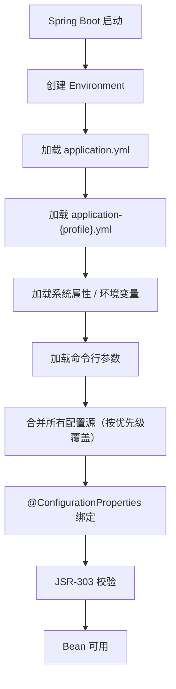

## 3.1 application.yml 优先级

Spring Boot 支持多种配置文件格式：`application.properties`、`application.yml`、`application.yaml`。它们本质上是一样的，只是写法不同。推荐用 `yml`，层级更清晰。

但更让人困惑的问题是：**当有多个配置文件时，谁说了算？**

Spring Boot 的配置来源多达 17 种，按优先级从高到低排列（摘最重要的几种）：

| 优先级 | 来源 | 说明 |
|--------|------|------|
| 1（最高） | 命令行参数 | `--server.port=9090` |
| 2 | 系统属性 | `-Dserver.port=9090` |
| 3 | 环境变量 | `SERVER_PORT=9090` |
| 4 | `application-{profile}.yml` | 对应 profile 的配置文件 |
| 5 | `application.yml` | 主配置文件 |
| 6 | `@PropertySource` | 代码中指定的配置文件 |
| 7（最低） | 默认值 | 代码中写的默认值 |

**核心规则：优先级高的覆盖优先级低的，不是替换，是合并。**

举个例子，你有一个 `application.yml`：

```yaml
server:
  port: 8080
  servlet:
    context-path: /api
app:
  name: my-service
  debug: false
```

然后启动时加了命令行参数：

```bash
java -jar myapp.jar --server.port=9090 --app.debug=true
```

最终生效的配置是：

```yaml
server:
  port: 9090         # 命令行覆盖了 yml
  servlet:
    context-path: /api  # yml 的值保留
app:
  name: my-service   # yml 的值保留
  debug: true        # 命令行覆盖了 yml
```

**不会因为命令行参数覆盖了 `server.port`，就把整个 `server` 节点都替换成只有 `port` 的子集。** 每个配置项独立比较优先级。

环境变量的映射规则需要知道：Spring Boot 会把 `.` 替换成 `_`，把 `-` 去掉，全大写。所以：

- `server.port` → `SERVER_PORT`
- `spring.datasource.url` → `SPRING_DATASOURCE_URL`
- `app.my-config` → `APPMYCONFIG`（注意 `-` 被去掉了）

这在 Docker 和 Kubernetes 环境里特别常用，因为环境变量是容器注入配置的标准方式。

### 多 profile 配置文件

除了 `application.yml`，你还可以创建 profile 专属的配置文件：

```
application.yml          # 公共配置
application-dev.yml      # 开发环境
application-test.yml     # 测试环境
application-prod.yml     # 生产环境
```

**`application.yml` 和 `application-{profile}.yml` 是合并关系，不是替换关系。** profile 配置文件会覆盖 `application.yml` 中的同名配置项，没有冲突的部分保留 `application.yml` 的值。

一个典型的用法：

```yaml
# application.yml — 公共配置
app:
  name: my-service
spring:
  jpa:
    show-sql: false
logging:
  level:
    root: INFO
```

```yaml
# application-dev.yml — 开发环境
spring:
  jpa:
    show-sql: true
  datasource:
    url: jdbc:mysql://localhost:3306/dev_db
    username: root
    password: root
logging:
  level:
    root: DEBUG
    com.example: DEBUG
```

```yaml
# application-prod.yml — 生产环境
spring:
  jpa:
    show-sql: false
  datasource:
    url: jdbc:mysql://prod-db:3306/prod_db
    username: ${DB_USER}
    password: ${DB_PASSWORD}
logging:
  level:
    root: WARN
    com.example: INFO
```

这样公共配置只写一次，环境差异部分各自独立，清晰又不重复。

## 3.2 @ConfigurationProperties

在 `application.yml` 里写了配置，怎么在代码里用？两种方式：

### 方式一：@Value（简单但有限）

```java
@Value("${app.name}")
private String appName;

@Value("${server.port}")
private int port;
```

能用，但有几个问题：
- 配置项多了，到处写 `@Value`，维护困难。
- 没有 IDE 自动提示（不知道有哪些配置项可以用）。
- 不支持复杂结构（嵌套对象、列表）。
- 默认值写在注解里，和配置文件割裂。

### 方式二：@ConfigurationProperties（推荐）

```java
@ConfigurationProperties(prefix = "app")
public class AppProperties {

    private String name;
    private String version = "1.0.0";  // 默认值
    private boolean debug;
    private List<String> servers = new ArrayList<>();
    private Map<String, String> metadata = new HashMap<>();

    // 内嵌对象
    private Security security = new Security();

    public static class Security {
        private boolean enabled = true;
        private long timeout = 3000;
        // getter / setter
    }

    // getter / setter
}
```

对应的 `application.yml`：

```yaml
app:
  name: my-service
  version: 2.0.0
  debug: true
  servers:
    - server1.example.com
    - server2.example.com
  metadata:
    team: backend
    env: production
  security:
    enabled: true
    timeout: 5000
```

注册方式：

```java
@EnableConfigurationProperties(AppProperties.class)
@Configuration
public class AppConfig {
    // ...
}
```

或者直接在属性类上加 `@Component`：

```java
@Component
@ConfigurationProperties(prefix = "app")
public class AppProperties {
    // ...
}
```

`@ConfigurationProperties` 的优势：

1. **类型安全**：`name` 就是 `String`，`debug` 就是 `boolean`，编译期就能检查。
2. **IDE 支持**：引入 `spring-boot-configuration-processor` 依赖后，IDE 能自动提示 `app.*` 下有哪些配置项。
3. **支持复杂结构**：嵌套对象、List、Map 都能自动绑定。
4. **支持 JSR-303 校验**：

```java
@ConfigurationProperties(prefix = "app")
@Validated
public class AppProperties {

    @NotBlank(message = "app.name 不能为空")
    private String name;

    @Min(value = 1, message = "端口号必须大于 0")
    private int port = 8080;

    @Pattern(regexp = "^(dev|test|prod)$", message = "环境必须是 dev/test/prod")
    private String env;
}
```

启动时如果配置不合法，直接抛异常，不会带着错误配置跑起来。这在生产环境非常有用——**fail-fast 比 fail-silent 好一万倍**。

来看一个完整的使用流程：


## 3.3 配置加密与敏感信息

数据库密码、API Key、第三方服务密钥——这些敏感信息放在 `application.yml` 里是明文的，代码一提交到 Git，所有人都能看到。这是安全隐患。

### 方案一：环境变量（最简单）

```yaml
spring:
  datasource:
    username: ${DB_USER}
    password: ${DB_PASSWORD}
```

启动时注入：

```bash
export DB_USER=admin
export DB_PASSWORD=s3cret!@#
java -jar myapp.jar
```

优点：简单直接，密码不出现在代码里。缺点：环境变量在某些场景下也容易泄露（`/proc/1/environ`、日志、调试工具）。

### 方案二：Jasypt 加密（推荐）

[Jasypt](http://www.jasypt.org/)（Java Simplified Encryption）是 Java 世界里最常用的配置加密方案。Spring Boot 有对应的集成库。

引入依赖：

```xml
<dependency>
    <groupId>com.github.ulisesbocchio</groupId>
    <artifactId>jasypt-spring-boot-starter</artifactId>
    <version>3.0.5</version>
</dependency>
```

先用工具加密你的密码：

```bash
java -cp jasypt-1.9.3.jar org.jasypt.intf.cli.JasyptPBEStringEncryptionCLI \
    input="s3cret!@#" \
    password="my-encryption-key" \
    algorithm=PBEWithMD5AndDES
```

输出类似：`ENC(G6N718/uNv2p8VzYkPL0hQ==)`

然后在 `application.yml` 里这样写：

```yaml
spring:
  datasource:
    password: ENC(G6N718/uNv2p8VzYkPL0hQ==)

jasypt:
  encryptor:
    password: ${JASYPT_KEY}  # 加密密钥通过环境变量传入
```

应用启动时，Jasypt 会自动识别 `ENC(...)` 格式的值，用加密密钥解密后注入。对业务代码完全透明，你拿到的 `password` 属性就是解密后的明文。

加密密钥本身怎么传？**绝对不要写在配置文件里**，通过环境变量或启动参数传入：

```bash
java -DJASYPT_KEY=my-encryption-key -jar myapp.jar
```

### 方案三：Vault（企业级）

如果你的团队使用 HashiCorp Vault 这样的密钥管理服务，Spring Cloud Vault 可以直接从 Vault 拉取密钥：

```yaml
spring:
  cloud:
    vault:
      uri: https://vault.example.com:8200
      token: ${VAULT_TOKEN}
      kv:
        enabled: true
```

代码里直接用 `@Value("${database.password}")`，值来自 Vault，本地配置文件里根本没有密码。

### 我的建议

| 场景 | 推荐方案 |
|------|---------|
| 个人项目 / 小团队 | 环境变量，够用 |
| 中型项目 | Jasypt 加密 + 环境变量传密钥 |
| 大型企业 / 合规要求高 | Vault 或 KMS |

不管用哪种方案，有一个原则：**密码永远不要以明文形式出现在代码仓库里。** 这不是建议，是底线。

## 3.4 配置加载的整体流程

最后用一张图总结 Spring Boot 配置体系的加载流程：



**配置体系不是什么黑魔法，本质就是一个多源的 PropertySource 合并机制。** 理解了优先级规则和绑定方式，你就能灵活应对各种配置场景。
