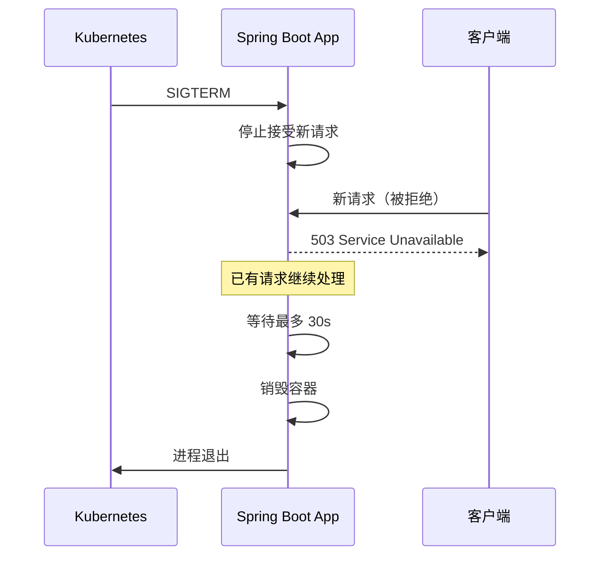

# 内嵌容器与 Actuator

## 4.1 内嵌容器的原理

用过传统 Spring MVC 的人都知道这个流程：把项目打成 war 包，丢到 Tomcat 的 `webapps` 目录下，启动 Tomcat。Tomcat 是一个独立安装的 Web 服务器，你的应用只是它里面的一个"租户"。

Spring Boot 换了一个思路：**把 Tomcat 塞进你的应用里，而不是把你的应用丢进 Tomcat 里。**

怎么做到的？来看 `spring-boot-starter-web` 的依赖链：

```
spring-boot-starter-web
  └── spring-boot-starter-tomcat
        ├── tomcat-embed-core
        ├── tomcat-embed-el
        └── tomcat-embed-websocket
```

`tomcat-embed-core` 这个 jar 包里包含了完整的 Tomcat 内嵌 API。Spring Boot 启动时，会创建一个内嵌的 Tomcat 实例，把你的 Spring MVC DispatcherServlet 注册上去，然后启动 Tomcat。

核心代码在 `ServletWebServerApplicationContext` 里：

```java
// 简化后的逻辑
private void createWebServer() {
    // 1. 从容器里找 WebServerFactory（Tomcat/Jetty/Undertow）
    WebServerFactory factory = getWebServerFactory();
    // 2. 创建 WebServer（内嵌 Tomcat 实例）
    this.webServer = factory.getWebServer(getSelfInitializer());
    // 3. 启动
    this.webServer.start();
}
```

这段代码的关键在于 `getWebServerFactory()`——它会根据 classpath 里有什么来决定用哪个容器。如果你引入了 `tomcat-embed`，就用 Tomcat；引入了 `jetty-server`，就用 Jetty。

来看一个典型的启动日志：

```
Tomcat initialized with port(s): 8080 (http)
Starting service [Tomcat]
Starting Servlet engine: [Apache Tomcat/10.1.16]
Initializing Spring embedded WebApplicationContext
Root WebApplicationContext: initialization completed in 1234 ms
Tomcat started on port(s): 8080 (http) with context path ''
```

**内嵌容器的好处是显而易见的：**

1. **部署简单**：一个 fat jar 就行，`java -jar myapp.jar` 直接跑。
2. **环境可控**：不用担心运维装的 Tomcat 版本和你开发用的不一样。
3. **适合容器化**：Docker 镜像里只需要一个 JRE，不需要装 Tomcat。
4. **适合微服务**：每个服务独立运行，不共享 Tomcat。

## 4.2 Tomcat / Jetty / Undertow 切换

Spring Boot 默认用 Tomcat，但你完全可以换成 Jetty 或 Undertow。换容器的操作非常简单——排除默认依赖，引入新的：

### 从 Tomcat 切换到 Jetty

```xml
<dependency>
    <groupId>org.springframework.boot</groupId>
    <artifactId>spring-boot-starter-web</artifactId>
    <exclusions>
        <!-- 排除默认的 Tomcat -->
        <exclusion>
            <groupId>org.springframework.boot</groupId>
            <artifactId>spring-boot-starter-tomcat</artifactId>
        </exclusion>
    </exclusions>
</dependency>

<!-- 引入 Jetty -->
<dependency>
    <groupId>org.springframework.boot</groupId>
    <artifactId>spring-boot-starter-jetty</artifactId>
</dependency>
```

### 从 Tomcat 切换到 Undertow

```xml
<dependency>
    <groupId>org.springframework.boot</groupId>
    <artifactId>spring-boot-starter-web</artifactId>
    <exclusions>
        <exclusion>
            <groupId>org.springframework.boot</groupId>
            <artifactId>spring-boot-starter-tomcat</artifactId>
        </exclusion>
    </exclusions>
</dependency>

<dependency>
    <groupId>org.springframework.boot</groupId>
    <artifactId>spring-boot-starter-undertow</artifactId>
</dependency>
```

代码层面零改动。启动时日志会变成对应容器的信息。

**怎么选？说说我的看法：**

| 容器 | 特点 | 适合场景 |
|------|------|---------|
| **Tomcat** | 社区最大，文档最全，Spring Boot 默认 | 绝大多数场景，不用纠结 |
| **Jetty** | 更轻量，长连接友好 | WebSocket 重度使用、资源敏感场景 |
| **Undertow** | 性能最好，内存占用最低 | 高并发、对性能有极致追求 |

实际项目里，90% 用 Tomcat 就够了。换 Undertow 能提升 10-20% 的吞吐量，但代价是社区资源少、出了问题排查更难。除非你有明确的性能基准测试证明 Tomcat 是瓶颈，否则别折腾。

## 4.3 Actuator 端点与健康检查

应用上线之后，你怎么知道它是否健康？数据库连接还正常吗？磁盘空间够不够？JVM 内存用了多少？

这就是 Actuator 的用武之地。引入依赖：

```xml
<dependency>
    <groupId>org.springframework.boot</groupId>
    <artifactId>spring-boot-starter-actuator</artifactId>
</dependency>
```

启动后访问 `http://localhost:8080/actuator`，你会看到所有可用端点的列表。

### 常用端点

| 端点 | 用途 | 默认暴露 |
|------|------|---------|
| `/actuator/health` | 健康检查 | ✅ 是 |
| `/actuator/info` | 应用信息 | ✅ 是 |
| `/actuator/metrics` | 性能指标 | ❌ 否 |
| `/actuator/env` | 环境变量和配置 | ❌ 否 |
| `/actuator/beans` | 所有 Spring Bean | ❌ 否 |
| `/actuator/mappings` | URL 映射 | ❌ 否 |
| `/actuator/loggers` | 日志级别管理 | ❌ 否 |
| `/actuator/threaddump` | 线程 dump | ❌ 否 |
| `/actuator/heapdump` | 堆 dump | ❌ 否 |

默认只暴露 `health` 和 `info`，其他端点需要手动开启：

```yaml
management:
  endpoints:
    web:
      exposure:
        include: health,info,metrics,env,loggers
  endpoint:
    health:
      show-details: always  # 显示详细健康信息
```

### 健康检查

`/actuator/health` 是最重要的端点。Kubernetes 的 liveness probe 和 readiness probe 通常就指向它。

```json
{
    "status": "UP",
    "components": {
        "db": {
            "status": "UP",
            "details": {
                "database": "MySQL",
                "validationQuery": "isValid()"
            }
        },
        "diskSpace": {
            "status": "UP",
            "details": {
                "total": 500107862016,
                "free": 234567890123,
                "threshold": 10485760
            }
        },
        "redis": {
            "status": "UP",
            "details": {
                "version": "7.2.3"
            }
        }
    }
}
```

`status` 的值：
- `UP`：健康
- `DOWN`：不健康
- `OUT_OF_SERVICE`：暂停服务
- `UNKNOWN`：未知

Spring Boot 会自动检测你引入了哪些依赖，自动注册对应的 HealthIndicator。引入了 `spring-boot-starter-data-redis`，就有 Redis 健康检查；引入了 `spring-boot-starter-data-jpa`，就有数据库健康检查。

你也可以自定义：

```java
@Component
public class CustomHealthIndicator implements HealthIndicator {

    @Override
    public Health health() {
        // 比如检查外部 API 是否可达
        if (isExternalApiReachable()) {
            return Health.up()
                    .withDetail("external-api", "reachable")
                    .build();
        }
        return Health.down()
                .withDetail("external-api", "unreachable")
                .withDetail("reason", "connection timeout")
                .build();
    }

    private boolean isExternalApiReachable() {
        // 实际的检查逻辑
        return true;
    }
}
```

### 安全：不能谁都能访问

Actuator 端点暴露了大量应用内部信息，在生产环境必须保护。几种做法：

```yaml
# 只监听管理端口，和业务端口分开
management:
  server:
    port: 9090
  endpoints:
    web:
      exposure:
        include: "*"
```

这样业务请求走 8080，Actuator 走 9090，防火墙只对内部网络开放 9090 端口。

配合 Spring Security：

```java
@Configuration
public class ActuatorSecurityConfig {

    @Bean
    public SecurityFilterChain actuatorSecurity(HttpSecurity http) throws Exception {
        http
            .securityMatcher("/actuator/**")
            .authorizeHttpRequests(auth -> auth
                .requestMatchers("/actuator/health").permitAll()  // 健康检查不需要认证
                .requestMatchers("/actuator/**").hasRole("ADMIN")
            )
            .httpBasic(Customizer.withDefaults());
        return http.build();
    }
}
```

## 4.4 优雅停机

你有没有遇到过这种情况：应用重启时，正在处理的请求突然断了，用户看到 502 错误？或者正在写数据库的事务被强制中断，数据不一致？

这就是"优雅停机"要解决的问题。

Spring Boot 2.3 开始内置了优雅停机支持：

```yaml
server:
  shutdown: graceful

spring:
  lifecycle:
    timeout-per-shutdown-phase: 30s
```

配置后的效果：

1. 收到停机信号（`SIGTERM` 或 `kill`）。
2. **不再接受新请求**。
3. **等待已有的请求处理完成**，最多等 30 秒。
4. 如果 30 秒后还有请求没处理完，强制关闭。
5. 销毁 Spring 容器（触发 `@PreDestroy`、`DisposableBean` 等回调）。



在 Kubernetes 环境里，这和 `terminationGracePeriodSeconds` 配合使用：

```yaml
apiVersion: v1
kind: Pod
spec:
  terminationGracePeriodSeconds: 60  # K8s 等待 60 秒
  containers:
    - name: myapp
      lifecycle:
        preStop:
          exec:
            command: ["sh", "-c", "sleep 5"]  # 留 5 秒给 K8s 从 Service 摘除
```

**K8s 的 `terminationGracePeriodSeconds` 要大于 Spring Boot 的 `timeout-per-shutdown-phase`**，否则 K8s 可能在你还没处理完请求时就强制 kill 了。

### 配合注册中心的优雅下线

如果你用了 Nacos、Eureka 这样的注册中心，还有一个问题：应用收到 SIGTERM 后，注册中心可能还不知道这个实例要下线，还会继续把流量导过来。

解决办法是监听 `ContextClosedEvent`，在容器销毁前主动从注册中心注销：

```java
@Component
public class GracefulShutdownListener {

    private final Registration registration;
    private final RegistrationService registrationService;

    public GracefulShutdownListener(Registration registration, 
                                     RegistrationService registrationService) {
        this.registration = registration;
        this.registrationService = registrationService;
    }

    @EventListener(ContextClosedEvent.class)
    public void onShutdown() {
        registrationService.deregister(registration);
        // 等一小段时间让负载均衡器更新
        try { Thread.sleep(3000); } catch (InterruptedException ignored) {}
    }
}
```

Spring Boot 的优雅停机不是什么高级特性，而是**生产环境的必需品**。一行配置，避免很多线上事故。
