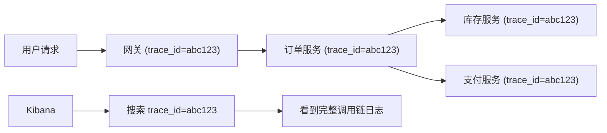

# 日志与多环境

线上出了一个 bug，用户反馈下单失败。你打开日志系统，搜了半天，发现日志级别是 WARN，关键的调试信息根本没打出来。你想临时把日志级别调到 DEBUG，但改配置文件要重新部署，走流程至少半小时。半小时后，bug 可能已经影响了几百个用户。

有没有一种方式，能在不重启服务的情况下动态调整日志级别？

有的。但要理解这个能力从哪来，我们得先把 Spring Boot 的日志体系和多环境配置搞清楚。

## Spring Boot 默认用哪个日志框架

Spring Boot 默认用 **Logback**。你引入 `spring-boot-starter` 时，日志就自动配好了，不需要写任何配置文件。

为什么是 Logback 而不是 Log4j2？历史原因。Logback 的作者 Ceki Gülcü 就是 Log4j 1.x 的作者，Logback 是 Log4j 1.x 的"正统继承者"。Spring Boot 团队选它做默认实现，主要是因为它和 SLF4J 配合最好、配置简单、性能足够。

但这不代表 Log4j2 不好。实际上 **Log4j2 在高并发场景下性能更优**——异步日志用 LMAX Disruptor，比 Logback 的 AsyncAppender 快很多。如果你的项目日志量特别大（每秒几万条），可以考虑切到 Log4j2。

### 用 SLF4J 写日志，不碰具体实现

不管底层用 Logback 还是 Log4j2，你的业务代码都通过 SLF4J 的 API 写：

```java
@RestController
public class OrderController {

    private static final Logger log = LoggerFactory.getLogger(OrderController.class);

    @GetMapping("/order/{id}")
    public Order getOrder(@PathVariable Long id) {
        log.info("查询订单, id={}", id);
        log.debug("订单详情: {}", order);
        log.error("订单不存在, id={}", id);
        return order;
    }
}
```

Spring Boot 默认的日志格式包含了时间、日志级别、进程 ID、线程名、类名、消息——这套格式在开发和生产都够用：

```
2024-01-15 10:30:45.123  INFO 12345 --- [nio-8080-exec-1] c.e.OrderController : 查询订单, id=1001
```

### 配置日志级别

最简单的方式在 `application.yml` 里：

```yaml
logging:
  level:
    root: INFO
    com.example: DEBUG
    org.hibernate.SQL: DEBUG
    org.hibernate.type.descriptor.sql.BasicBinder: TRACE
```

`org.hibernate.SQL: DEBUG` 会显示执行的 SQL，`BasicBinder: TRACE` 会显示 SQL 参数——排查 JPA 问题时这两个配置非常有用。

### 动态调整：不用重启的杀手锏

通过 Actuator 的 `/actuator/loggers` 端点，你可以在**运行时**动态修改日志级别：

```bash
# 查看当前级别
curl http://localhost:8080/actuator/loggers/com.example

# 动态修改为 DEBUG
curl -X POST http://localhost:8080/actuator/loggers/com.example \
  -H 'Content-Type: application/json' \
  -d '{"configuredLevel": "DEBUG"}'
```

改完立刻生效，不用重启。抓完日志再调回 INFO，全程零停机。**这个能力在排查线上问题时价值连城。**

### 切换到 Log4j2

如果你确实需要 Log4j2 的性能优势，两步搞定：

第一步，排除 Logback，引入 Log4j2：

```xml
<dependency>
    <groupId>org.springframework.boot</groupId>
    <artifactId>spring-boot-starter</artifactId>
    <exclusions>
        <exclusion>
            <groupId>org.springframework.boot</groupId>
            <artifactId>spring-boot-starter-logging</artifactId>
        </exclusion>
    </exclusions>
</dependency>

<dependency>
    <groupId>org.springframework.boot</groupId>
    <artifactId>spring-boot-starter-log4j2</artifactId>
</dependency>
```

第二步，创建 `log4j2-spring.xml` 配置文件。

业务代码不需要改——因为都是通过 SLF4J 写的，底层实现换了而已。**这就是门面模式的价值：接口和实现分离，换实现不影响调用方。**

## Profile 激活：dev/test/prod 怎么切换

上一章提到了 profile 配置文件，这里详细说说激活方式和优先级。

### 四种激活方式

**配置文件**（最常见）：

```yaml
# application.yml
spring:
  profiles:
    active: dev
```

**启动参数**（部署脚本推荐）：

```bash
java -jar myapp.jar --spring.profiles.active=prod
```

**环境变量**（Docker/K8s 最常用）：

```bash
export SPRING_PROFILES_ACTIVE=prod
java -jar myapp.jar
```

**JVM 参数**：

```bash
java -Dspring.profiles.active=prod -jar myapp.jar
```

### 优先级

多种方式同时存在时：

```
命令行参数 > 系统属性 > 环境变量 > application-{profile}.yml > application.yml
```

你在 `application.yml` 里写了 `spring.profiles.active: dev`，但部署时传了 `--spring.profiles.active=prod`，最终激活的是 `prod`。**部署参数永远能覆盖代码里的默认值**——这个设计保证了同一份代码可以部署到不同环境。

### 多 Profile 同时激活

你可以同时激活多个 profile：

```bash
java -jar myapp.jar --spring.profiles.active=prod,cloud,encrypt
```

多个 profile 的配置文件按顺序加载，后面的覆盖前面的。同时激活 `prod` 和 `cloud`，`application-cloud.yml` 的优先级高于 `application-prod.yml`。

### Profile 分组（Spring Boot 2.4+）

把多个 profile 打包成一组：

```yaml
spring:
  profiles:
    group:
      production: prod,cloud,encrypt
      staging: test,cloud
```

`--spring.profiles.active=production` 就等于同时激活了 `prod`、`cloud`、`encrypt`。适合环境配置比较复杂的项目。

### Profile 专属 Bean

除了配置文件，你还可以用 `@Profile` 注解让某个 Bean 只在特定环境下注册：

```java
@Configuration
public class DataSourceConfig {

    @Bean
    @Profile("dev")
    public DataSource devDataSource() {
        return new EmbeddedDatabaseBuilder()
                .setType(EmbeddedDatabaseType.H2)
                .build();
    }

    @Bean
    @Profile("prod")
    public DataSource prodDataSource() {
        HikariDataSource ds = new HikariDataSource();
        ds.setJdbcUrl("jdbc:mysql://prod-db:3306/app");
        ds.setUsername("app");
        ds.setPassword("encrypted-password");
        return ds;
    }
}
```

开发环境用 H2 内存数据库，零配置；生产环境用连接池连 MySQL。同一段代码，不同环境不同行为。

## 生产环境日志：不只是打到文件

开发时日志打到控制台就够了，但生产环境需要考虑三个问题：**日志怎么存？存多久？怎么搜索？**

### 日志文件与归档

默认只输出到控制台。要输出到文件：

```yaml
logging:
  file:
    name: /var/log/myapp/application.log
  logback:
    rollingpolicy:
      max-file-size: 100MB
      max-history: 30
      total-size-cap: 3GB
```

Logback 会自动做日志轮转：当天写 `application.log`，昨天的变成 `application.2024-01-14.0.log.gz`，自动压缩。最多保留 30 天，总大小不超过 3GB。

如果你需要更精细的控制（比如不同级别的日志写不同文件），创建 `logback-spring.xml`：

```xml
<?xml version="1.0" encoding="UTF-8"?>
<configuration>

    <include resource="org/springframework/boot/logging/logback/defaults.xml"/>

    <appender name="CONSOLE" class="ch.qos.logback.core.ConsoleAppender">
        <encoder>
            <pattern>%d{yyyy-MM-dd HH:mm:ss.SSS} [%thread] %-5level %logger{36} - %msg%n</pattern>
        </encoder>
    </appender>

    <appender name="FILE" class="ch.qos.logback.core.rolling.RollingFileAppender">
        <file>/var/log/myapp/application.log</file>
        <rollingPolicy class="ch.qos.logback.core.rolling.TimeBasedRollingPolicy">
            <fileNamePattern>/var/log/myapp/application.%d{yyyy-MM-dd}.%i.log.gz</fileNamePattern>
            <timeBasedFileNamingAndTriggeringPolicy class="ch.qos.logback.core.rolling.SizeAndTimeBasedFNATP">
                <maxFileSize>100MB</maxFileSize>
            </timeBasedFileNamingAndTriggeringPolicy>
            <maxHistory>30</maxHistory>
            <totalSizeCap>3GB</totalSizeCap>
        </rollingPolicy>
        <encoder>
            <pattern>%d{yyyy-MM-dd HH:mm:ss.SSS} [%thread] %-5level %logger{36} - %msg%n</pattern>
        </encoder>
    </appender>

    <!-- ERROR 单独一个文件，方便快速定位错误 -->
    <appender name="ERROR_FILE" class="ch.qos.logback.core.rolling.RollingFileAppender">
        <file>/var/log/myapp/error.log</file>
        <filter class="ch.qos.logback.classic.filter.LevelFilter">
            <level>ERROR</level>
            <onMatch>ACCEPT</onMatch>
            <onMismatch>DENY</onMismatch>
        </filter>
        <rollingPolicy class="ch.qos.logback.core.rolling.TimeBasedRollingPolicy">
            <fileNamePattern>/var/log/myapp/error.%d{yyyy-MM-dd}.log.gz</fileNamePattern>
            <maxHistory>60</maxHistory>
        </rollingPolicy>
        <encoder>
            <pattern>%d{yyyy-MM-dd HH:mm:ss.SSS} [%thread] %-5level %logger{36} - %msg%n</pattern>
        </encoder>
    </appender>

    <!-- Profile 专属配置：同一个文件里切换行为 -->
    <springProfile name="dev">
        <root level="DEBUG">
            <appender-ref ref="CONSOLE"/>
        </root>
    </springProfile>

    <springProfile name="prod">
        <root level="INFO">
            <appender-ref ref="CONSOLE"/>
            <appender-ref ref="FILE"/>
            <appender-ref ref="ERROR_FILE"/>
        </root>
    </springProfile>

</configuration>
```

注意 `<springProfile name="prod">`——这是 Spring Boot 对 Logback 的扩展，让你在同一个配置文件里根据 profile 切换日志行为。开发环境只打控制台，生产环境打控制台 + 文件 + 错误文件。

### 结构化日志与 ELK

微服务架构下，日志散落在几十上百台机器上，靠 `ssh + grep` 排查问题不现实。你需要 ELK（Elasticsearch + Logstash + Kibana）或类似的日志平台。

关键一步：**把日志格式改成 JSON**，方便 Filebeat / Logstash 解析。

```xml
<dependency>
    <groupId>net.logstash.logback</groupId>
    <artifactId>logstash-logback-encoder</artifactId>
    <version>7.4</version>
</dependency>
```

```xml
<appender name="JSON_FILE" class="ch.qos.logback.core.rolling.RollingFileAppender">
    <file>/var/log/myapp/application.json</file>
    <rollingPolicy class="ch.qos.logback.core.rolling.TimeBasedRollingPolicy">
        <fileNamePattern>/var/log/myapp/application.%d{yyyy-MM-dd}.json.gz</fileNamePattern>
        <maxHistory>30</maxHistory>
    </rollingPolicy>
    <encoder class="net.logstash.logback.encoder.LogstashEncoder"/>
</appender>
```

输出的 JSON：

```json
{
    "@timestamp": "2024-01-15T10:30:45.123+08:00",
    "level": "INFO",
    "logger_name": "com.example.OrderController",
    "thread_name": "http-nio-8080-exec-1",
    "message": "查询订单, id=1001",
    "trace_id": "abc123def456",
    "span_id": "span789"
}
```

JSON 格式的好处：Filebeat 收集后直接发给 Elasticsearch，不需要 Logstash 做格式解析，性能更好。在 Kibana 里可以按 `level`、`logger_name`、`trace_id` 等字段灵活搜索和过滤。

### 链路追踪：一个请求经过了哪些服务

微服务架构下，一个请求可能经过 5-10 个服务。日志里加上 `trace_id`，就能在 Kibana 里用一个 ID 搜出整个调用链的日志。

Spring Boot + Micrometer Tracing（替代了原来的 Spring Cloud Sleuth）自动注入：

```xml
<dependency>
    <groupId>io.micrometer</groupId>
    <artifactId>micrometer-tracing-bridge-otel</artifactId>
</dependency>
```

加了这个依赖，日志里自动出现 `trace_id` 和 `span_id`，配合 LogstashEncoder 输出到 JSON，就能在 Kibana 里实现跨服务的日志关联查询。



**生产环境的日志管理不是"配个文件就行"的事情。** 结构化日志 + 集中式收集 + 链路追踪，三件套缺一不可。否则服务一多，出了问题你连日志都找不到。
