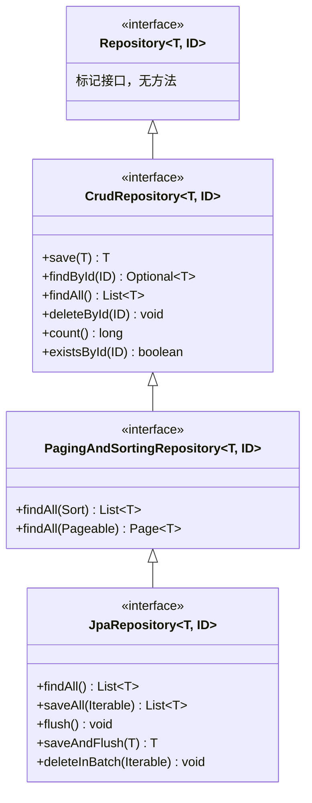
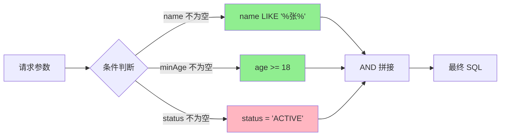

## 第二章 Spring Data JPA

### 2.1 Repository 接口体系：只写接口，自动实现

先看一段传统的 DAO 代码：

```java
public interface UserDao {
    User findById(Long id);
    List<User> findAll();
    User save(User user);
    void deleteById(Long id);
    List<User> findByName(String name);
    Page<User> findAll(Pageable pageable);
}
```

然后你得写一个 `UserDaoImpl`，每个方法都是一段 JdbcTemplate 或 EntityManager 调用。增删改查，每个实体都这么来一遍，代码量翻倍但做的事都差不多。

Spring Data JPA 的思路：**把这些重复的 CRUD 操作抽象成接口，框架自动生成实现。**

```java
public interface UserRepository extends JpaRepository<User, Long> {
    // 不需要写任何方法！
    // findById、findAll、save、deleteById 全部继承自 JpaRepository
}
```

就这？就这。你现在可以这样用：

```java
@Service
public class UserService {

    @Autowired
    private UserRepository userRepository;

    public User getUser(Long id) {
        return userRepository.findById(id)
            .orElseThrow(() -> new RuntimeException("用户不存在"));
    }

    public List<User> getAllUsers() {
        return userRepository.findAll();
    }

    public User createUser(User user) {
        return userRepository.save(user);
    }

    public void deleteUser(Long id) {
        userRepository.deleteById(id);
    }

    public Page<User> getUsersByPage(int page, int size) {
        return userRepository.findAll(PageRequest.of(page, size, Sort.by("id").descending()));
    }
}
```

`UserRepository` 只是一个接口，没有实现类。Spring Data JPA 在启动时扫描到它，自动生成代理对象注入到容器中。这个代理对象包含了所有 CRUD 方法的实现。

来看一下接口继承体系：



实际开发中，**直接用 `JpaRepository` 就行**，它包含了所有常用功能。不用纠结该继承哪个——JpaRepository 是最全的。

实体类需要加上 JPA 注解：

```java
@Entity
@Table(name = "users")
public class User {

    @Id
    @GeneratedValue(strategy = GenerationType.IDENTITY)
    private Long id;

    @Column(nullable = false, length = 50)
    private String name;

    @Column(unique = true)
    private String email;

    @Enumerated(EnumType.STRING)
    private UserStatus status;

    @OneToMany(mappedBy = "user", cascade = CascadeType.ALL)
    private List<Order> orders;

    // getters and setters...
}

public enum UserStatus {
    ACTIVE, INACTIVE, BANNED
}
```

`@Entity` 标记这是一个 JPA 实体，`@Table` 指定对应的表名（不写默认用类名）。`@Id` + `@GeneratedValue` 定义主键和自增策略。`@Column` 定义列的属性。

这里有个容易踩的坑：`@GeneratedValue` 的策略选择。`GenerationType.IDENTITY` 用数据库的自增主键（MySQL 的 `AUTO_INCREMENT`），`GenerationType.SEQUENCE` 用序列（Oracle、PostgreSQL），`GenerationType.TABLE` 用一张专门的表模拟序列。MySQL 用 `IDENTITY`，PostgreSQL 用 `SEQUENCE`，别选错了。

**Repository 扫描的原理**：启动时，Spring Data JPA 扫描 `@EnableJpaRepositories`（或默认的主类所在包及子包）下所有继承 `Repository` 的接口，为每个接口创建一个 `SimpleJpaRepository` 的代理。代理拦截方法调用，根据方法名或注解生成对应的 JPQL 执行。

### 2.2 方法名查询：方法名怎么变成 SQL 的？

JpaRepository 自带的 CRUD 方法不够用怎么办？比如你想"根据名字查用户"。Spring Data JPA 提供了一种神奇的方式：**在接口里按规则定义方法名，框架自动解析成查询语句。**

```java
public interface UserRepository extends JpaRepository<User, Long> {

    // 根据名字查
    List<User> findByName(String name);

    // 根据邮箱查（返回单个，找不到返回 null）
    User findByEmail(String email);

    // 模糊查询
    List<User> findByNameContaining(String keyword);

    // 范围查询
    List<User> findByAgeBetween(int min, int max);

    // 多条件查询
    List<User> findByNameAndStatus(String name, UserStatus status);

    // 排序
    List<User> findByStatusOrderByCreateTimeDesc(UserStatus status);

    // 忽略大小写
    List<User> findByNameIgnoreCase(String name);

    // 判断是否存在
    boolean existsByEmail(String email);

    // 统计数量
    long countByStatus(UserStatus status);

    // 删除
    void deleteByStatus(UserStatus status);
}
```

这些方法不需要写任何实现，也不需要写 SQL。Spring Data JPA 根据方法名解析出查询条件：

```
findByName           → WHERE name = ?
findByNameContaining → WHERE name LIKE CONCAT('%', ?, '%')
findByAgeBetween     → WHERE age BETWEEN ? AND ?
findByNameAndStatus  → WHERE name = ? AND status = ?
```

方法名的解析规则：

| 关键词 | 示例 | 生成的 SQL |
|--------|------|-----------|
| `And` | `findByNameAndAge` | `WHERE name = ? AND age = ?` |
| `Or` | `findByNameOrEmail` | `WHERE name = ? OR email = ?` |
| `Between` | `findByAgeBetween` | `WHERE age BETWEEN ? AND ?` |
| `LessThan` | `findByAgeLessThan` | `WHERE age < ?` |
| `GreaterThan` | `findByAgeGreaterThan` | `WHERE age > ?` |
| `Like` | `findByNameLike` | `WHERE name LIKE ?` |
| `Containing` | `findByNameContaining` | `WHERE name LIKE CONCAT('%', ?, '%')` |
| `OrderBy` | `findByStatusOrderByIdDesc` | `WHERE status = ? ORDER BY id DESC` |
| `IsNull` | `findByEmailIsNull` | `WHERE email IS NULL` |
| `In` | `findByIdIn(List ids)` | `WHERE id IN (...)` |
| `Not` | `findByNameNot` | `WHERE name != ?` |

方法名查询有个明显的问题：**条件一多，方法名就爆炸**。比如"根据名字或邮箱查询，年龄在 18-60 之间，状态为活跃，按创建时间倒序排列"——你难道要写 `findByNameOrEmailAndAgeBetweenAndStatusOrderByCreateTimeDesc`？

这种复杂场景，用 `@Query` 注解写 JPQL：

```java
@Query("SELECT u FROM User u WHERE u.name LIKE %:keyword% OR u.email LIKE %:keyword%")
List<User> search(@Param("keyword") String keyword);

@Query("SELECT u FROM User u WHERE u.age BETWEEN :minAge AND :maxAge AND u.status = :status")
List<User> findByAgeRangeAndStatus(@Param("minAge") int min, 
                                    @Param("maxAge") int max, 
                                    @Param("UserStatus") UserStatus status);
```

JPQL 是面向对象的查询语言，用实体名代替表名，用属性名代替列名。如果你想直接写原生 SQL：

```java
@Query(value = "SELECT * FROM users WHERE age > :age AND status = :status", nativeQuery = true)
List<User> findByAgeAndStatusNative(@Param("age") int age, @Param("status") String status);
```

**我的建议**：简单查询用方法名（一两个条件的），中等复杂度用 `@Query`，特别复杂的用 Specification（下一节讲）。不要为了"优雅"硬把所有查询都塞进方法名——可读性比代码行数重要。

### 2.3 Specification 动态查询：多条件筛选怎么写？

实际项目中，最常见的需求是**多条件动态筛选**。用户在搜索页面输入了姓名、年龄范围、状态——但这三个条件都是可选的，用户可能只填一个，也可能三个都填。

用 `@Query` 写死 SQL 做不到这一点。用方法名穷举组合？三个条件 8 种组合，写 8 个方法？

Spring Data JPA 的 Specification 就是解决这个问题的。它的思路是：**把查询条件封装成可组合的谓词（Predicate），按需拼接。**

```java
// Repository 需要继承 JpaSpecificationExecutor
public interface UserRepository extends JpaRepository<User, Long>, 
                                         JpaSpecificationExecutor<User> {
}
```

```java
public class UserSpecs {

    public static Specification<User> nameLike(String name) {
        return (root, query, cb) -> {
            if (StringUtils.isEmpty(name)) return null;
            return cb.like(root.get("name"), "%" + name + "%");
        };
    }

    public static Specification<User> ageBetween(Integer minAge, Integer maxAge) {
        return (root, query, cb) -> {
            if (minAge == null && maxAge == null) return null;
            if (minAge != null && maxAge != null) {
                return cb.between(root.get("age"), minAge, maxAge);
            }
            if (minAge != null) {
                return cb.greaterThanOrEqualTo(root.get("age"), minAge);
            }
            return cb.lessThanOrEqualTo(root.get("age"), maxAge);
        };
    }

    public static Specification<User> statusEqual(UserStatus status) {
        return (root, query, cb) -> {
            if (status == null) return null;
            return cb.equal(root.get("status"), status);
        };
    }
}
```

Service 层组合使用：

```java
@Service
public class UserService {

    @Autowired
    private UserRepository userRepository;

    public Page<User> searchUsers(String name, Integer minAge, 
                                   Integer maxAge, UserStatus status,
                                   Pageable pageable) {
        Specification<User> spec = Specification
            .where(UserSpecs.nameLike(name))
            .and(UserSpecs.ageBetween(minAge, maxAge))
            .and(UserSpecs.statusEqual(status));

        return userRepository.findAll(spec, pageable);
    }
}
```

Controller 层接收搜索参数：

```java
@GetMapping("/users/search")
public Page<User> search(@RequestParam(required = false) String name,
                          @RequestParam(required = false) Integer minAge,
                          @RequestParam(required = false) Integer maxAge,
                          @RequestParam(required = false) UserStatus status,
                          Pageable pageable) {
    return userService.searchUsers(name, minAge, maxAge, status, pageable);
}
```

每个 Specification 方法内部先判断条件是否为空，为空就返回 `null`。`Specification.where()` 和 `.and()` 会自动忽略 `null` 值，所以不需要的条件不会被拼进 SQL。



上图中如果用户只传了 name 和 minAge，最终 SQL 就是 `WHERE name LIKE '%张%' AND age >= 18`，status 条件被跳过了。

Specification 还支持排序和分页。`Pageable` 参数已经在 `findAll(spec, pageable)` 中传入了，前端传 `?page=0&size=20&sort=createTime,desc` 就能自动分页排序。

**什么时候用 Specification？** 搜索/筛选页面，条件可选且组合多。如果查询是固定的（比如"根据 ID 查用户"），用 `@Query` 或方法名就行，没必要上 Specification。

### 2.4 审计字段自动填充：createTime / updateTime 不用手动设

几乎每张表都有 `create_time` 和 `update_time`。每次新增、修改都手动 set 一下？漏了怎么办？

Spring Data JPA 内置了审计功能，可以自动填充这些字段。

第一步，实体类标注审计字段：

```java
@EntityListeners(AuditingEntityListener.class)
@Entity
@Table(name = "users")
public class User {

    @Id
    @GeneratedValue(strategy = GenerationType.IDENTITY)
    private Long id;

    private String name;

    @CreatedDate
    @Column(updatable = false)
    private LocalDateTime createTime;

    @LastModifiedDate
    private LocalDateTime updateTime;

    @CreatedBy
    @Column(updatable = false)
    private String createdBy;

    @LastModifiedBy
    private String updatedBy;
}
```

第二步，启用审计功能：

```java
@Configuration
@EnableJpaAuditing
public class JpaAuditConfig {

    @Bean
    public AuditorAware<String> auditorProvider() {
        // 返回当前登录用户，用于自动填充 createdBy / updatedBy
        return () -> {
            // 从 SecurityContext 获取当前用户
            Authentication auth = SecurityContextHolder.getContext().getAuthentication();
            if (auth == null || !auth.isAuthenticated()) {
                return Optional.of("SYSTEM");
            }
            return Optional.of(auth.getName());
        };
    }
}
```

完事了。之后你调用 `userRepository.save(user)` 时：

- 新增操作（id 为 null）：`createTime` 和 `createdBy` 自动填充。
- 更新操作（id 有值）：`updateTime` 和 `updatedBy` 自动填充。
- `createTime` 标注了 `updatable = false`，更新时不会被覆盖。

原理很简单：`AuditingEntityListener` 监听了实体的 `@PrePersist`（持久化前）和 `@PreUpdate`（更新前）事件，在这些事件触发时自动设置审计字段的值。

如果你的项目没有用 Spring Security，或者不想用 `@CreatedBy` / `@LastModifiedBy`（只要时间字段），可以简化配置，只保留 `@EnableJpaAuditing` 就够了，不用定义 `AuditorAware` Bean。

**一个常见问题**：审计字段不生效。排查步骤：

1. 实体类是否加了 `@EntityListeners(AuditingEntityListener.class)`？
2. 配置类是否加了 `@EnableJpaAuditing`？
3. 用的是 `save()` 方法吗？（`@Query` 写的更新语句不会触发审计）
4. 如果是 `@CreatedBy` 不生效，检查 `AuditorAware` Bean 是否注册了？

```java
// 不会触发审计
@Modifying
@Query("UPDATE User u SET u.status = :status WHERE u.id = :id")
void updateStatus(@Param("id") Long id, @Param("status") UserStatus status);

// 会触发审计 —— 先查出来再 save
User user = userRepository.findById(id).orElseThrow();
user.setStatus(UserStatus.INACTIVE);
userRepository.save(user);
```

**我的观点**：审计字段自动填充是非常值得开启的功能。手动设置 createTime / updateTime 是最容易出错的地方——测试环境数据乱了，十有八九是某个地方忘了设时间。让它自动来，少一个出错的机会。
