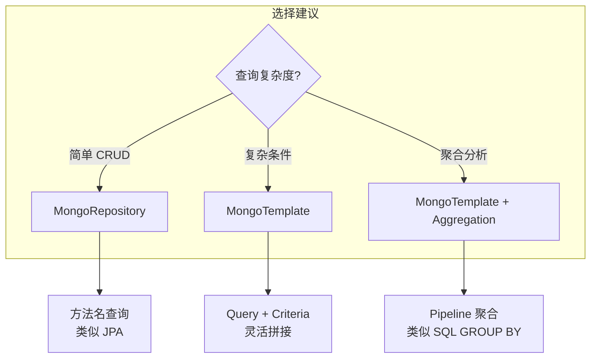

## 第五章 MongoDB 与 NoSQL

### 5.1 MongoTemplate 与 MongoRepository

关系型数据库用了很多年，SQL 写得很顺，但有些场景就是别扭：

- 日志数据：字段不固定，今天多一个 `traceId`，明天多一个 `spanId`，每次加字段都要 `ALTER TABLE`。
- 内容管理系统：一篇文章有标题、正文、标签、评论、嵌套的富文本块，结构不统一。
- 用户画像：每个用户的属性不一样，有的人有"学历"，有的人有"职业"，没法用一张固定表搞定。

这些场景的共同特点：**数据结构不固定，或者层级嵌套很深。** 关系型数据库的"行+列"模型不够灵活。这就是 MongoDB 这类文档数据库的用武之地。

Spring Data MongoDB 提供了两种操作方式：`MongoTemplate`（类似 JdbcTemplate，手动操作）和 `MongoRepository`（类似 JpaRepository，接口自动实现）。

先加依赖和配置：

```xml
<dependency>
    <groupId>org.springframework.boot</groupId>
    <artifactId>spring-boot-starter-data-mongodb</artifactId>
</dependency>
```

```yaml
spring:
  data:
    mongodb:
      uri: mongodb://localhost:27017/mydb
      # 或者分开配置
      # host: localhost
      # port: 27017
      # database: mydb
```

实体类用 `@Document` 注解：

```java
@Document(collection = "articles")
public class Article {

    @Id
    private String id;  // MongoDB 用 String 类型的 ObjectId

    @Field("title")
    private String title;

    private String content;

    private List<String> tags;

    // 嵌套对象 —— MongoDB 的核心优势
    private AuthorInfo author;

    // 动态字段
    @Field
    private Map<String, Object> extra;

    private LocalDateTime createTime;
    private LocalDateTime updateTime;

    // 内嵌对象不需要单独的表
    public static class AuthorInfo {
        private String name;
        private String email;
        private String avatar;
        // getters and setters...
    }
}
```

`@Document` 指定集合名（类似关系型数据库的表名）。`@Id` 标记主键，MongoDB 自动生成的主键是 `ObjectId` 类型（12 字节的十六进制字符串）。`@Field` 指定字段在文档中的键名（不写默认用属性名）。

**MongoRepository** 用法和 JPA 几乎一样：

```java
public interface ArticleRepository extends MongoRepository<Article, String> {

    // 方法名查询 —— 和 JPA 一样的规则
    List<Article> findByAuthorName(String authorName);

    List<Article> findByTagsContaining(String tag);

    List<Article> findByTitleContainingIgnoreCase(String keyword);

    Page<Article> findByCreateTimeBetween(LocalDateTime start, LocalDateTime end, Pageable pageable);

    long countByAuthorName(String authorName);
}
```

简单查询用 MongoRepository 就够了。复杂查询用 `MongoTemplate`：

```java
@Service
public class ArticleService {

    @Autowired
    private MongoTemplate mongoTemplate;

    /**
     * 复杂查询：多条件 + 模糊 + 分页
     */
    public Page<Article> search(String keyword, String tag, 
                                 LocalDateTime startDate, Pageable pageable) {
        Query query = new Query();

        // 关键词搜索（标题或内容包含关键词）
        if (StringUtils.hasText(keyword)) {
            Criteria textCriteria = new Criteria().orOperator(
                Criteria.where("title").regex(keyword, "i"),
                Criteria.where("content").regex(keyword, "i")
            );
            query.addCriteria(textCriteria);
        }

        // 标签筛选
        if (StringUtils.hasText(tag)) {
            query.addCriteria(Criteria.where("tags").in(tag));
        }

        // 时间范围
        if (startDate != null) {
            query.addCriteria(Criteria.where("createTime").gte(startDate));
        }

        // 分页
        long total = mongoTemplate.count(query, Article.class);
        query.with(pageable);

        List<Article> articles = mongoTemplate.find(query, Article.class);
        return new PageImpl<>(articles, pageable, total);
    }

    /**
     * 聚合查询：按标签统计文章数量
     */
    public List<TagCount> countByTag() {
        Aggregation agg = Aggregation.newAggregation(
            Aggregation.unwind("tags"),                         // 展开 tags 数组
            Aggregation.group("tags").count().as("count"),      // 按标签分组计数
            Aggregation.sort(Sort.Direction.DESC, "count"),     // 按数量降序
            Aggregation.limit(10)                               // Top 10
        );

        AggregationResults<TagCount> results = mongoTemplate.aggregate(
            agg, "articles", TagCount.class);

        return results.getMappedResults();
    }

    /**
     * 更新操作：只更新指定字段
     */
    public void updateTitle(String id, String newTitle) {
        Query query = Query.query(Criteria.where("id").is(id));
        Update update = new Update().set("title", newTitle)
                                     .set("updateTime", LocalDateTime.now());
        mongoTemplate.updateFirst(query, update, Article.class);
    }

    /**
     * 数组操作：添加标签
     */
    public void addTag(String id, String tag) {
        Query query = Query.query(Criteria.where("id").is(id));
        Update update = new Update().addToSet("tags", tag);  // addToSet 防止重复
        mongoTemplate.updateFirst(query, update, Article.class);
    }
}

@Data
public class TagCount {
    private String id;   // 标签名（group 的字段作为 id）
    private int count;
}
```

`MongoTemplate` 的 `Query` + `Criteria` API 是构建 MongoDB 查询的核心。`Criteria` 支持链式调用：

```java
// 等于
Criteria.where("status").is("published")

// 大于 / 小于
Criteria.where("views").gt(1000)
Criteria.where("age").gte(18).lte(60)

// 正则匹配（模糊查询）
Criteria.where("title").regex(".*关键词.*", "i")  // i = 不区分大小写

// 数组包含
Criteria.where("tags").all(Arrays.asList("Java", "Spring"))

// 嵌套字段查询
Criteria.where("author.name").is("张三")

// OR 条件
new Criteria().orOperator(
    Criteria.where("title").regex("Spring"),
    Criteria.where("tags").in("Spring")
)
```



**我的建议**：和 JPA + MyBatis 的混用类似，简单 CRUD 用 MongoRepository，复杂查询用 MongoTemplate。两者可以在同一个 Service 中混用，不冲突。

### 5.2 文档映射与索引

MongoDB 的文档结构很灵活，但"灵活"不代表"随意"。文档怎么设计、索引怎么建，直接决定了查询性能。

#### 文档映射：嵌套 vs 引用

关系型数据库有外键和 JOIN，MongoDB 没有 JOIN（严格说有 `$lookup`，但性能远不如关系型数据库）。所以文档设计时要决定：**关联数据是嵌套存储还是引用存储？**

```java
// 方案一：嵌套存储（把关联数据直接放在文档里）
@Document(collection = "orders")
public class Order {
    @Id
    private String id;
    private String orderNo;
    
    // 用户信息直接嵌套在订单里
    private UserInfo user;
    
    // 商品列表也嵌套
    private List<OrderItem> items;
    
    private BigDecimal totalAmount;
    private LocalDateTime createTime;

    @Data
    public static class UserInfo {
        private String userId;
        private String name;
        private String phone;
    }

    @Data
    public static class OrderItem {
        private String productId;
        private String productName;
        private int quantity;
        private BigDecimal price;
    }
}
```

```java
// 方案二：引用存储（只存 ID，查询时再关联）
@Document(collection = "orders")
public class Order {
    @Id
    private String id;
    private String orderNo;
    private String userId;       // 只存用户 ID
    private List<String> productIds;  // 只存商品 ID 列表
    private BigDecimal totalAmount;
    private LocalDateTime createTime;
}
```

怎么选？

| 场景 | 推荐方案 | 原因 |
|------|---------|------|
| 数据量小、经常一起查询 | 嵌套 | 一次查询拿到所有数据，不需要关联 |
| 数据量大、需要独立更新 | 引用 | 嵌套数据太大时文档膨胀，更新也不方便 |
| 数据很少变化 | 嵌套 | 冗余存储，读取快 |
| 数据频繁变化 | 引用 | 嵌套的话要更新所有包含它的文档 |

实际项目中常用混合方案：订单里的商品信息用嵌套（下单时快照，不会变），用户信息用引用（用户改名了不需要更新所有历史订单）。

#### 索引：不建索引的 MongoDB 就是耍流氓

MongoDB 默认只有 `_id` 索引。如果你按 `title` 查询但没建索引，MongoDB 会扫描整个集合——数据量大了直接慢死。

```java
@Document(collection = "articles")
@CompoundIndexes({
    @CompoundIndex(name = "author_time_idx", 
                   def = "{'author.name': 1, 'createTime': -1}"),
    @CompoundIndex(name = "tag_time_idx", 
                   def = "{'tags': 1, 'createTime': -1}")
})
public class Article {

    @Id
    private String id;

    @Indexed  // 单字段索引
    private String title;

    @TextIndexed  // 全文索引（支持文本搜索）
    private String content;

    @Indexed(unique = true)  // 唯一索引
    private String slug;

    private List<String> tags;

    private AuthorInfo author;

    private LocalDateTime createTime;
}
```

索引类型说明：

**单字段索引** `@Indexed`：最常用的索引，等值查询和范围查询都走它。

```java
@Indexed
private String title;
// 对应 MongoDB: db.articles.createIndex({"title": 1})
```

**复合索引** `@CompoundIndex`：多个字段组合的索引。查询条件包含索引的前缀字段时才能命中。

```java
@CompoundIndex(def = "{'author.name': 1, 'createTime': -1}")
// 对应 MongoDB: db.articles.createIndex({"author.name": 1, "createTime": -1})

// 能命中这个索引的查询：
// WHERE author.name = '张三'
// WHERE author.name = '张三' AND createTime > '2024-01-01'

// 不能命中的查询：
// WHERE createTime > '2024-01-01'（缺少前缀字段 author.name）
```

**全文索引** `@TextIndexed`：支持文本搜索。

```java
@TextIndexed
private String content;

// 使用文本搜索
Query query = new Query(Criteria.where("$text").is("$search").is("Spring Boot"));
// 或者用 MongoTemplate
TextQuery<Article> textQuery = TextQuery.queryText("Spring Boot").sortByScore();
List<Article> results = mongoTemplate.find(textQuery, Article.class);
```

**唯一索引** `@Indexed(unique = true)`：类似关系型数据库的 UNIQUE 约束。

```java
@Indexed(unique = true)
private String slug;
// 插入重复 slug 会抛 DuplicateKeyException
```

**索引的代价**：索引不是越多越好。每个索引都会占用存储空间，写入时要维护索引（插入/更新变慢）。一般来说，查询条件中频繁出现的字段建索引，很少用到的不建。

**查看索引使用情况**：

```java
// 在 MongoDB shell 中
db.articles.explain("executionStats").find({"title": "Spring"})

// 关注这几个指标：
// - totalDocsExamined: 扫描了多少文档（理想情况 = 返回的文档数）
// - totalKeysExamined: 扫描了多少索引条目
// - executionTimeMillis: 执行时间
// - stage: COLLSCAN 表示全集合扫描（要建索引），IXSCAN 表示走了索引
```

在 Spring Data MongoDB 中，可以通过配置自动创建索引：

```yaml
spring:
  data:
    mongodb:
      auto-index-creation: true  # 启动时自动根据注解创建索引
```

**一个实战经验**：MongoDB 的索引设计和关系型数据库的思路是一样的——看你的查询模式。先写好查询语句，再根据查询条件建索引。不要凭感觉建一堆用不上的索引。

```mermaid
graph TB
    subgraph "文档设计决策树"
        A[数据是否经常一起查询?] -->|是| B[数据量大吗?]
        A -->|否| C[引用存储]
        B -->|不大| D[嵌套存储]
        B -->|很大| E[混合: 核心字段嵌套<br/>其余引用]
    end
    
    subgraph "索引设计"
        F[看查询条件] --> G[单字段?]
        F --> H[多字段?]
        G --> I[@Indexed]
        H --> J[@CompoundIndex]
        F --> K[文本搜索?]
        K --> L[@TextIndexed]
    end
```

**总结**：MongoDB 不是银弹。它适合数据结构灵活、读多写少、不需要强事务的场景。如果你的数据关系复杂、需要复杂的 JOIN 和事务，关系型数据库仍然是更好的选择。选型时不要被"NoSQL 很酷"冲昏头脑——数据存储的选择应该基于数据特征和查询模式，而不是技术潮流。
