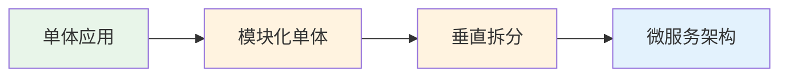
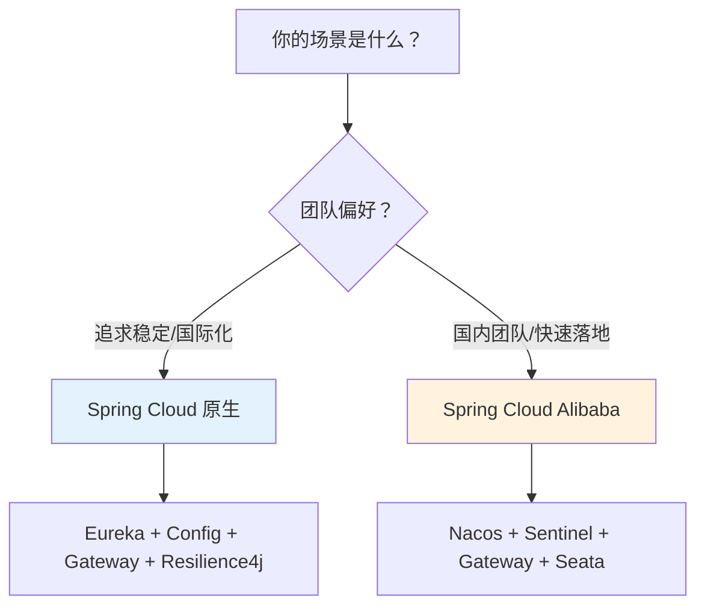

# 微服务概览

## 你真的需要微服务吗？

在聊 Spring Cloud 之前，我想先泼一盆冷水。

2015 年左右，微服务这个词开始在国内技术圈爆发。一时间，仿佛不用微服务就落伍了，不拆成十几个服务都不好意思说自己是做架构的。结果呢？大量团队把一个本来跑得好好的单体应用拆成了十几个服务，然后发现——部署变复杂了、调试变难了、运维成本翻了好几倍，而业务量根本没到需要拆分的程度。

所以，在翻开这一卷之前，请先回答一个问题：**你的系统真的需要微服务吗？**

### 什么时候不该拆

如果你符合以下任何一条，请老老实实写单体：

- **团队不到 10 个人。** 微服务的本质是用架构复杂度换组织扩展性。人少的时候，沟通成本远低于服务间调用的成本。
- **业务还没稳定。** 创业初期，业务模型一周一变，这时候拆微服务等于给自己挖坑——每次改业务都要改好几个服务的接口。
- **日活不到几万。** 单体应用加上合理的缓存和数据库优化，撑到几万日活完全没问题。
- **你只是觉得"微服务更先进"。** 技术选型不是追时髦，是解决问题。

Martin Fowler 说过一句话很经典：**"Almost all the successful microservice stories have started with a monolith that got too big and was broken up."** 几乎所有成功的微服务案例，都是从一个过大的单体开始拆分的。注意关键词——"太大了"。没到"太大"的时候，别拆。

### 什么时候该拆

那什么信号说明该拆了？

**信号一：代码仓库冲突不断。** 一个 50 人的团队改同一个仓库，每天 merge conflict 比写代码的时间还长。这时候按业务域拆分服务，每个团队维护自己的仓库，效率会显著提升。

**信号二：发布互相阻塞。** 你只想改个用户昵称的校验逻辑，但必须等订单模块的开发者一起发版。单体的耦合让你无法独立部署。

**信号三：扩展性瓶颈。** 你的系统里，商品查询占了 80% 的流量，但因为是单体，你不得不把整个应用扩容 10 台机器，而真正需要扩容的只是查询那部分。

**信号四：技术栈需要多样化。** 某个模块适合用 Python 做数据分析，某个模块适合用 Go 做高并发网关，但单体架构限制了你只能用 Java。

如果你命中了两条以上，可以认真考虑微服务了。

### 单体到微服务的演进路径

拆服务不是一蹴而就的。推荐的路径是：



**第一步：模块化单体。** 在单体内部先按业务域划分模块，模块之间通过接口调用，不直接访问对方的数据库。这一步不需要引入任何分布式组件，但能让后续拆分变得容易。

**第二步：垂直拆分。** 把最独立、变更频率最高的模块拆出来，做成独立服务。比如把用户中心拆出来，其他模块通过 HTTP 调用它。

**第三步：逐步微服务化。** 根据实际需要，逐步拆分其他模块。不是一次全拆，而是一个一个来，每拆一个都验证稳定性。

这个过程可能持续几个月甚至一两年，完全正常。

---

## Spring Cloud 版本体系：一个让人头疼的问题

Spring Cloud 的版本管理是出了名的混乱，很多新手在这里踩坑。我们花点时间理清楚。

### 为什么版本对应这么重要

Spring Cloud 是一组组件的集合，它依赖于特定版本的 Spring Boot。如果你用了不匹配的版本，轻则启动报错，重则运行时出现诡异 bug。这不是"推荐"使用对应版本，而是**必须**。

### 版本对应关系

Spring Cloud 从 2020.0（代号 Ilford）开始，改用了年份命名。以下是常用对应关系：

| Spring Cloud 版本 | Spring Boot 版本 | 说明 |
|---|---|---|
| 2022.0.x (Kilburn) | 3.0.x / 3.1.x | 需要 Java 17+ |
| 2021.0.x (Jubilee) | 2.6.x / 2.7.x | 最后支持 Java 8 的大版本 |
| 2020.0.x (Ilford) | 2.4.x / 2.5.x | 版本命名改革的起点 |
| Hoxton | 2.2.x / 2.3.x | 经典稳定版，很多老项目还在用 |
| Greenwich | 2.1.x | 已停止维护 |

**一个避坑经验：** 去 Spring 官网查 [Spring Cloud](https://spring.io/projects/spring-cloud) 的对应关系，不要靠猜。或者用 Spring Initializr 生成项目，它会自动选对版本。

### 版本选择建议

如果你是新项目，2023 年以后开始的，建议直接上 Spring Boot 3.x + Spring Cloud 2022.0.x 或 2023.0.x。虽然要求 Java 17+，但 Java 17 是 LTS 版本，Spring Boot 3.x 会长期维护。

如果你维护老项目，停留在 Hoxton 也不是不行，但要意识到它已经不再更新安全补丁了。

```xml
<!-- parent pom.xml 示例：Spring Boot 3.2 + Spring Cloud 2023.0.x -->
<parent>
    <groupId>org.springframework.boot</groupId>
    <artifactId>spring-boot-starter-parent</artifactId>
    <version>3.2.5</version>
</parent>

<dependencyManagement>
    <dependencies>
        <dependency>
            <groupId>org.springframework.cloud</groupId>
            <artifactId>spring-cloud-dependencies</artifactId>
            <version>2023.0.1</version>
            <type>pom</type>
            <scope>import</scope>
        </dependency>
    </dependencies>
</dependencyManagement>
```

---

## 技术选型：Spring Cloud vs Spring Cloud Alibaba

这是一个必须面对的选择题。

### Spring Cloud 原生全家桶

Spring Cloud 自带的组件生态非常成熟：

- **服务注册：** Eureka（Netflix，已进入维护模式）、Consul
- **配置中心：** Spring Cloud Config
- **网关：** Spring Cloud Gateway
- **负载均衡：** Spring Cloud LoadBalancer（替代了 Ribbon）
- **熔断：** Resilience4j（替代了 Hystrix）
- **调用：** OpenFeign

这套组合的优点是和 Spring 生态无缝集成，文档齐全，社区庞大。缺点是部分组件（如 Eureka、Config）功能偏基础，在大规模场景下需要额外工作。

### Spring Cloud Alibaba

Spring Cloud Alibaba 是阿里巴巴开源的一套增强方案，核心组件：

- **服务注册 / 配置中心：** Nacos（一个组件搞定两件事）
- **限流降级：** Sentinel（功能比 Resilience4j 更丰富，有控制台）
- **分布式事务：** Seata
- **消息驱动：** RocketMQ

它的优点是在国内有极好的生态和社区支持，中文文档齐全，Nacos 和 Sentinel 都有可视化控制台，开箱即用的体验很好。缺点是相对 Spring Cloud 原生方案，版本迭代有时候不太跟得上 Spring Boot 的节奏。

### 怎么选？

我的看法：



**不要纠结太久。** 两套方案的核心理念是一样的，区别在于具体实现。你理解了微服务的原理，换一套组件也就是换几个依赖的事。

本书后面的内容会以 **Spring Cloud Alibaba** 为主线来讲，因为它在国内使用更广泛，配套的控制台也更适合学习和理解原理。但核心概念是通用的，不管你用哪套方案都能用上。

---

## 小结

这一节没有写代码，但可能是最重要的一节。因为技术选型的错误比代码 bug 更难修复。

记住三点：
1. **先问"要不要"，再问"怎么用"。** 微服务不是银弹，用错了比不用更痛苦。
2. **版本对应是硬约束。** Spring Boot 和 Spring Cloud 的版本必须匹配，不然后面全是坑。
3. **选型不纠结。** 理解原理比记住 API 重要，组件随时可以换。

从下一章开始，我们正式进入 Spring Cloud 的核心组件。第一个问题：服务注册与发现——当你的服务越来越多，它们怎么互相找到对方？
