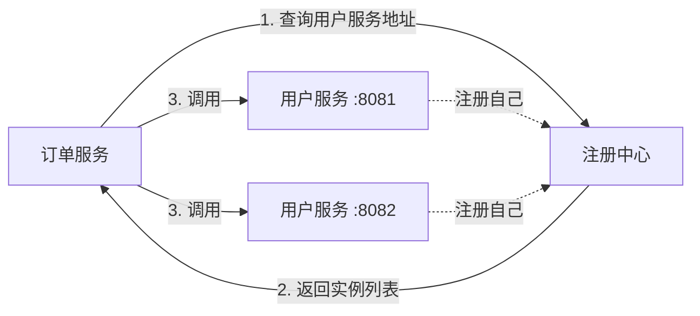
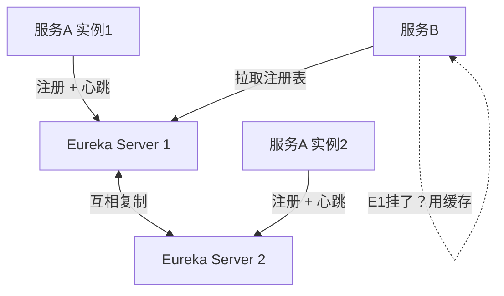
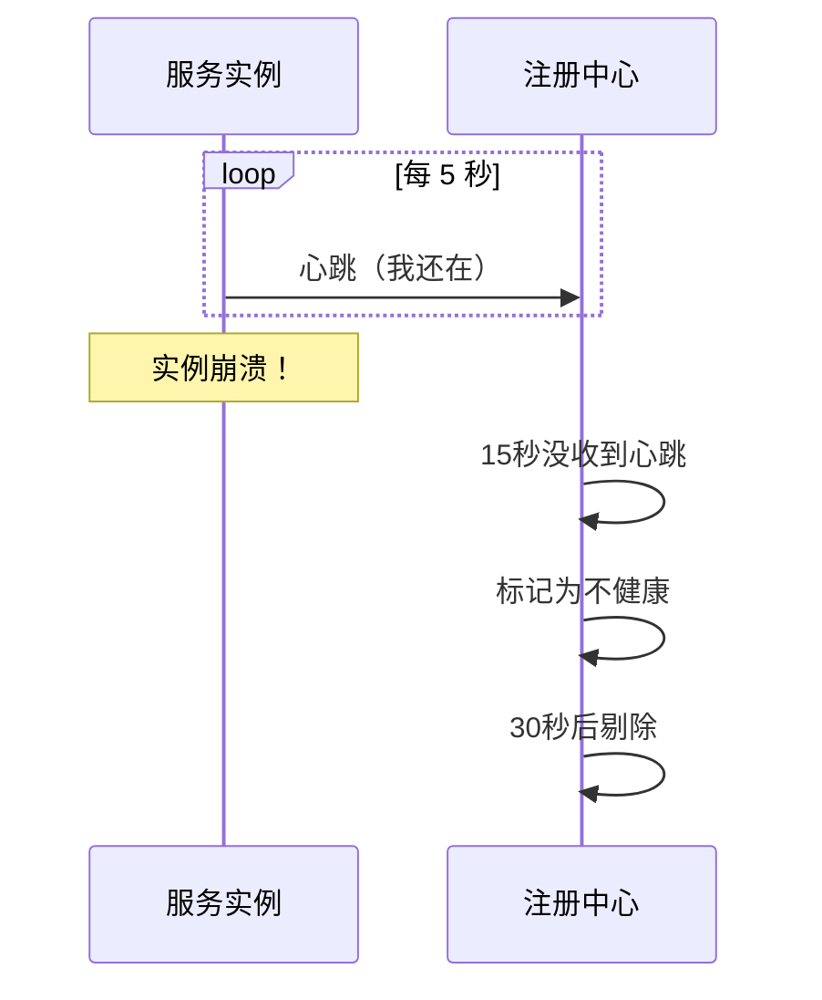

# 服务注册与发现

## 服务多了，怎么互相找到对方？

想象一个场景：你把用户服务、订单服务、商品服务拆成了三个独立进程，跑在三台机器上。订单服务要查用户信息，它怎么知道用户服务在哪台机器的哪个端口？

最原始的办法是硬编码：

```java
String userServiceUrl = "http://192.168.1.10:8081";
```

这在只有两三个服务的时候凑合能用。但现实是：

- 用户服务可能部署了 3 个实例做负载均衡
- 某个实例挂了，你还在往那个地址发请求
- 服务 IP 变了，你得改代码重新部署

服务注册与发现就是解决这个问题的。它的核心思想很简单：**每个服务启动时告诉注册中心"我在哪"，调用方去注册中心问"它在哪"。**



这就是服务注册与发现的全部核心思想。接下来我们看看具体怎么实现。

---

## Nacos：注册中心 + 配置中心，一个顶俩

Nacos（Naming and Configuration Service）是阿里巴巴开源的服务注册与配置中心。它最大的特点是**把注册中心和配置中心合二为一**，你只需要部署一个 Nacos Server，就能同时搞定服务发现和配置管理。

### 安装 Nacos

开发环境最快的方式是用 Docker：

```bash
# 单机模式启动，适合本地开发
docker run -d --name nacos \
  -e MODE=standalone \
  -p 8848:8848 \
  -p 9848:9848 \
  nacos/nacos-server:v2.3.0
```

启动后访问 `http://localhost:8848/nacos`，默认账号密码都是 `nacos`。看到控制台就说明成功了。

### 服务注册到 Nacos

先看一个最简示例。假设我们有一个用户服务：

```xml
<!-- pom.xml -->
<dependency>
    <groupId>com.alibaba.cloud</groupId>
    <artifactId>spring-cloud-starter-alibaba-nacos-discovery</artifactId>
</dependency>
```

```yaml
# application.yml
spring:
  application:
    name: user-service
  cloud:
    nacos:
      discovery:
        server-addr: localhost:8848
```

加一个注解（Spring Boot 3.x 通常自动配置，不需要显式注解）：

```java
@SpringBootApplication
public class UserServiceApplication {
    public static void main(String[] args) {
        SpringApplication.run(UserServiceApplication.class, args);
    }
}
```

启动应用，刷新 Nacos 控制台，你会看到 `user-service` 已经出现在服务列表里了。就这么简单。

**背后的原理：** 应用启动时，Nacos Discovery 的自动配置类会读取 `spring.cloud.nacos.discovery.server-addr`，然后向 Nacos Server 发送一个 HTTP 注册请求，包含服务名、IP、端口等信息。之后每隔一段时间（默认 5 秒）发送心跳，告诉 Nacos "我还活着"。

### 多实例注册

启动第二个 user-service 实例（换个端口）：

```bash
java -jar user-service.jar --server.port=8082
```

Nacos 控制台会显示 `user-service` 有两个实例。这是负载均衡的基础——调用方拿到的是一个实例列表，而不是单个地址。

---

## Eureka：Netflix 的经典方案

Eureka 是 Netflix 开源的注册中心，Spring Cloud 最早默认集成的就是它。虽然 Netflix 已经把 Eureka 进入了维护模式（不再加新功能，只修 bug），但理解它的设计对掌握服务发现的原理很有帮助。

### 核心设计

Eureka 采用的是 **AP 模型**（Availability + Partition tolerance），也就是优先保证可用性，允许在极端情况下返回过期数据。这和它的使用场景有关——注册中心挂了，服务之间还能用缓存的地址互相调用，比整个系统不可用要好。



### Eureka vs Nacos

| 特性 | Eureka | Nacos |
|---|---|---|
| CAP 模型 | AP | AP + CP 可切换 |
| 健康检查 | 客户端心跳 | 客户端心跳 + 服务端探测 |
| 配置管理 | 不支持 | 内置支持 |
| 管理界面 | 简单 | 功能丰富 |
| 维护状态 | 维护模式 | 活跃开发中 |

**选择建议：** 新项目直接用 Nacos。Eureka 适合已有项目不想迁移的情况。两者的客户端用法几乎一样，迁移成本很低。

---

## Consul：HashiCorp 的另一种选择

Consul 是 HashiCorp 出品的服务发现和配置工具，和 Nacos、Eureka 不同的是，它不是 Java 专属的，而是语言无关的。这意味着你的 Go 服务、Python 服务也能用同一个 Consul 集群做服务发现。

Consul 使用 **CP 模型**（基于 Raft 一致性协议），在网络分区时优先保证数据一致性，代价是可能在极端情况下短暂不可用。

```yaml
# Spring Boot 接入 Consul
spring:
  cloud:
    consul:
      host: localhost
      port: 8500
      discovery:
        service-name: user-service
```

Consul 的优势在于多语言支持和内置的健康检查（支持 HTTP、TCP、gRPC、Script 等多种检查方式）。如果你的技术栈不全是 Java，Consul 是个不错的选择。

---

## 健康检查：注册了不代表活着

服务注册到注册中心只是第一步。更重要的是，当服务实例挂了，注册中心要能及时把它从列表里移除，否则调用方还会往一个死掉的实例发请求。

### 三种健康检查模式

**客户端心跳（Client Beat）：** 服务实例定期向注册中心发送"我还活着"的信号。如果超过一定时间没收到心跳（比如 15 秒），就认为实例不健康。Nacos 和 Eureka 都用这种方式。



**服务端探测（Server Probe）：** 注册中心主动去检查服务实例是否健康。Consul 支持这种方式——它会定期调用你配置的健康检查接口（比如 `/actuator/health`）。

**混合模式：** Nacos 2.x 支持同时使用客户端心跳和服务端探测，可靠性更高。

### Spring Boot Actuator 的健康端点

不管用哪种注册中心，建议都开启 Actuator 的健康端点：

```xml
<dependency>
    <groupId>org.springframework.boot</groupId>
    <artifactId>spring-boot-starter-actuator</artifactId>
</dependency>
```

```yaml
management:
  endpoints:
    web:
      exposure:
        include: health,info
```

访问 `/actuator/health`，Spring Boot 会自动检查数据库连接、Redis 连接等组件的健康状态。注册中心可以用这个端点来判断服务是否真的可用，而不只是"进程还在"。

---

## 服务元数据：不只是一个地址

注册到注册中心的不只是 IP 和端口，还有一堆元数据（Metadata）。这些元数据可以用来做很多有趣的事情。

### Nacos 的元数据

```yaml
spring:
  cloud:
    nacos:
      discovery:
        metadata:
          version: v2
          region: hangzhou
          env: production
```

这些元数据有什么用？

- **灰度发布：** 新版本实例注册时带 `version=v2`，网关根据请求参数路由到特定版本的实例。
- **区域路由：** 带 `region=hangzhou` 的实例优先服务杭州地区的请求。
- **环境隔离：** 通过 `env` 区分测试和生产环境的实例，防止测试流量打到生产服务。

### Nacos 的 Namespace + Group

Nacos 提供了两层隔离机制：

- **Namespace：** 一级隔离，通常用来区分环境（dev/test/prod）
- **Group：** 二级隔离，通常用来区分业务线

```yaml
spring:
  cloud:
    nacos:
      discovery:
        namespace: prod-namespace-id
        group: ORDER_GROUP
```

不同 Namespace 下的服务互相看不见，这在多人共用一个 Nacos 集群时特别有用，避免开发环境的服务注册影响到生产环境。

---

## 小结

服务注册与发现解决的核心问题是：**在动态变化的服务实例中，让调用方能找到可用的目标。**

几个要点：

1. **新项目优先选 Nacos**，一个组件搞定注册中心和配置中心，少维护一套中间件。
2. **健康检查很重要。** 注册了不代表活着，心跳和探测缺一不可。
3. **善用元数据和命名空间。** 它们是灰度发布和环境隔离的基础。

下一章我们来看 Nacos 的另一半能力——配置中心。当你需要改一个配置项而不重启服务时，配置中心就成了必需品。
