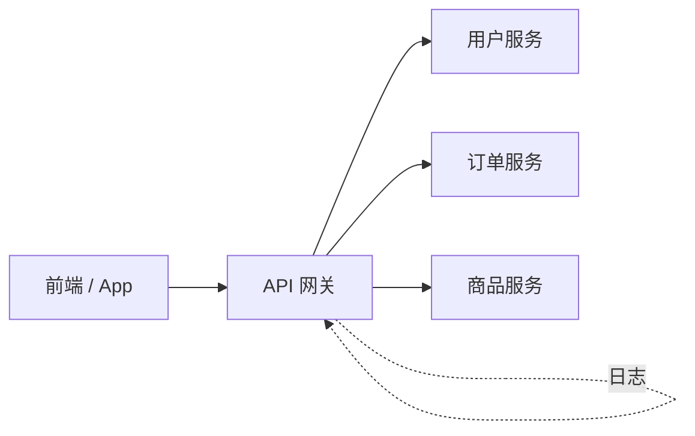

## 外部请求怎么统一入口？

你的微服务拆成了用户服务、订单服务、商品服务，它们各自跑在不同的端口上。现在前端要调用接口，难道让它直接访问每个服务的地址？

如果前端直接连各个服务，你会面临几个问题：

- **跨域：** 前端域名是 `www.example.com`，后端服务分散在不同端口，每个都要处理 CORS。
- **鉴权：** 每个服务都要自己校验 Token？重复代码，还容易漏。
- **协议转换：** 外部用 HTTPS，内部服务间用 HTTP，谁来做这个转换？
- **灰度路由：** 想把 10% 的流量导到新版本，怎么做？

API 网关就是解决这些问题的。它是微服务架构的"门卫"——所有外部请求先经过网关，网关负责路由转发、鉴权、限流、日志记录等横切关注点，然后再把请求转发给后端服务。



---

## Spring Cloud Gateway：官方亲儿子

Spring Cloud Gateway 是 Spring Cloud 官方推出的 API 网关，用来替代 Netflix Zuul。它的核心特点是：

- **基于 Spring WebFlux + Netty**，异步非阻塞，性能比 Zuul 1.x 好很多
- **路由 + 过滤器**的编程模型，简单直观
- **和 Spring Cloud 生态无缝集成**，天然支持服务发现、负载均衡

### 最小示例

创建一个独立的网关服务：

```xml
<dependency>
    <groupId>org.springframework.cloud</groupId>
    <artifactId>spring-cloud-starter-gateway</artifactId>
</dependency>
<dependency>
    <groupId>com.alibaba.cloud</groupId>
    <artifactId>spring-cloud-starter-alibaba-nacos-discovery</artifactId>
</dependency>
```

```yaml
server:
  port: 8080

spring:
  application:
    name: api-gateway
  cloud:
    nacos:
      discovery:
        server-addr: localhost:8848
    gateway:
      routes:
        - id: user-route
          uri: lb://user-service    # lb:// 表示走负载均衡
          predicates:
            - Path=/api/user/**
          filters:
            - StripPrefix=1         # 去掉 /api 前缀
        - id: order-route
          uri: lb://order-service
          predicates:
            - Path=/api/order/**
          filters:
            - StripPrefix=1
```

启动后，访问 `http://localhost:8080/api/user/1` 会被路由到 `user-service` 的 `/user/1`。

### 核心概念拆解

**Route（路由）：** 网关的基本单元。每个路由包含三个部分：

- `id`：路由的唯一标识
- `uri`：目标地址。`lb://service-name` 表示从注册中心获取实例列表并做负载均衡
- `predicates`：断言，决定哪些请求匹配这条路由
- `filters`：过滤器，对请求或响应做处理

**Predicate（断言）：** Spring Cloud Gateway 提供了丰富的内置断言：

```yaml
routes:
  - id: example
    uri: lb://example-service
    predicates:
      - Path=/api/example/**
      - Method=GET                    # 只匹配 GET 请求
      - Header=X-Token, \d+          # 请求头必须包含 X-Token 且值为数字
      - Query=name                    # 必须包含 name 参数
      - After=2024-01-01T00:00:00+08:00  # 只在这个时间之后生效
```

这些断言可以组合使用，全部满足才匹配。

**Filter（过滤器）：** 对请求做各种处理。分两种：

- **GatewayFilter：** 作用于单个路由
- **GlobalFilter：** 作用于所有路由

---

## 内置过滤器

Spring Cloud Gateway 提供了很多开箱即用的过滤器：

### StripPrefix / PrefixPath

```yaml
filters:
  - StripPrefix=1
```

请求 `/api/user/1` → 转发到 `user-service` 的 `/user/1`。去掉了 `/api` 这一层。

反过来，`PrefixPath=/v2` 会给路径加上前缀。

### AddRequestHeader / AddResponseHeader

```yaml
filters:
  - AddRequestHeader=X-Request-Source, gateway
  - AddResponseHeader=X-Gateway, true
```

给请求加一个头告诉后端"这个请求来自网关"，给响应加一个头告诉客户端"这个响应经过了网关"。

### Retry

```yaml
filters:
  - name: Retry
    args:
      retries: 3
      statuses: BAD_GATEWAY,SERVICE_UNAVAILABLE
      methods: GET
```

GET 请求遇到 502 或 503 时自动重试 3 次。注意：**只对幂等请求（GET）做重试**，POST 重试可能导致重复提交。

---

## 自定义过滤器：鉴权实战

内置过滤器不够用的时候，写自定义过滤器。最常见的需求是**统一鉴权**——在网关层校验 Token，通过了才放行。

```java
@Component
public class AuthFilter implements GlobalFilter, Ordered {

    @Override
    public Mono<Void> filter(ServerWebExchange exchange, GatewayFilterChain chain) {
        String token = exchange.getRequest().getHeaders().getFirst("Authorization");
        
        // 白名单路径不需要鉴权
        String path = exchange.getRequest().getPath().value();
        if (path.startsWith("/api/auth/login") || path.startsWith("/api/auth/register")) {
            return chain.filter(exchange);
        }
        
        // 校验 Token
        if (token == null || !isValidToken(token)) {
            exchange.getResponse().setStatusCode(HttpStatus.UNAUTHORIZED);
            return exchange.getResponse().setComplete();
        }
        
        // 把用户信息传递给下游服务
        ServerHttpRequest request = exchange.getRequest().mutate()
                .header("X-User-Id", getUserId(token))
                .build();
        
        return chain.filter(exchange.mutate().request(request).build());
    }

    @Override
    public int getOrder() {
        return -100;  // 优先级，数值越小越先执行
    }
    
    private boolean isValidToken(String token) {
        // 实际项目中用 JWT 校验
        return token.startsWith("Bearer ") && token.length() > 10;
    }
    
    private String getUserId(String token) {
        // 从 Token 中解析用户 ID
        return "user-123";
    }
}
```

这个过滤器做了三件事：

1. **白名单放行：** 登录、注册接口不需要 Token
2. **Token 校验：** 没有 Token 或 Token 无效直接返回 401
3. **用户信息透传：** 把解析出来的用户 ID 放到请求头里，下游服务直接从 header 拿，不用重复解析 Token

---

## 限流：保护后端服务

网关是流量的入口，也是做限流的最佳位置。在网关层限流，可以避免大量请求打到后端服务导致雪崩。

### 基于 Redis 的限流

Spring Cloud Gateway 内置了 `RequestRateLimiter` 过滤器，基于 Redis 实现：

```xml
<dependency>
    <groupId>org.springframework.boot</groupId>
    <artifactId>spring-boot-starter-data-redis-reactive</artifactId>
</dependency>
```

```yaml
routes:
  - id: user-route
    uri: lb://user-service
    predicates:
      - Path=/api/user/**
    filters:
      - name: RequestRateLimiter
        args:
          redis-rate-limiter.replenishRate: 10    # 每秒放 10 个请求
          redis-rate-limiter.burstCapacity: 20     # 突发最多 20 个
          key-resolver: "#{@userKeyResolver}"      # 按什么维度限流
```

```java
@Configuration
public class RateLimiterConfig {
    
    @Bean
    public KeyResolver userKeyResolver() {
        // 按用户 ID 限流（从请求头中获取）
        return exchange -> {
            String userId = exchange.getRequest().getHeaders().getFirst("X-User-Id");
            return Mono.just(userId != null ? userId : "anonymous");
        };
    }
}
```

这段配置的意思是：每个用户每秒最多 10 个请求，突发允许 20 个。超出的请求直接返回 429 Too Many Requests。

你也可以按 IP 限流：

```java
@Bean
public KeyResolver ipKeyResolver() {
    return exchange -> Mono.just(
        exchange.getRequest().getRemoteAddress().getAddress().getHostAddress()
    );
}
```

---

## Gateway vs Zuul

| 特性 | Spring Cloud Gateway | Zuul 1.x | Zuul 2.x |
|---|---|---|---|
| 编程模型 | WebFlux（异步非阻塞） | Servlet（同步阻塞） | Netty（异步非阻塞） |
| 性能 | 高 | 一般 | 高 |
| Spring 集成 | 原生支持 | 需要额外配置 | 需要额外配置 |
| 长连接支持 | 好（WebSocket） | 差 | 好 |
| 维护状态 | 活跃 | 维护模式 | Netflix 内部使用 |

**结论：** Zuul 1.x 已经不推荐使用了。新项目用 Spring Cloud Gateway，老项目如果是 Zuul 1.x，建议有空的时候迁移。

迁移的工作量其实不大——路由规则从 Zuul 的 `zuul.routes.*` 改成 Gateway 的 `spring.cloud.gateway.routes.*`，过滤器从 `ZuulFilter` 改成 `GatewayFilter`，核心逻辑基本不变。

---

## 跨域配置

前后端分离的项目，跨域（CORS）是绕不开的问题。在网关层统一处理比每个服务单独处理要干净：

```yaml
spring:
  cloud:
    gateway:
      globalcors:
        cors-configurations:
          '[/**]':
            allowedOrigins: "https://www.example.com"
            allowedMethods:
              - GET
              - POST
              - PUT
              - DELETE
            allowedHeaders: "*"
            allowCredentials: true
            maxAge: 3600
```

注意 `allowedOrigins` 不要用 `*`，尤其是在 `allowCredentials: true` 的情况下，浏览器不允许两者同时出现。

---

## 小结

API 网关是微服务架构的"门面"，它把横切关注点（鉴权、限流、日志、跨域）集中处理，让后端服务专注于业务逻辑。

几个要点：

1. **路由规则是核心。** 理解 Predicate + Filter 的组合，就能应对大部分路由需求。
2. **自定义 GlobalFilter 是扩展点。** 鉴权、日志、审计都在这里做。
3. **限流在网关做最合适。** 流量入口就一个，在这里挡掉恶意请求，后端服务压力小很多。
4. **`lb://` 是关键。** 它让网关和注册中心联动，自动发现后端服务实例。

下一章我们深入服务间的调用——OpenFeign 是怎么让 HTTP 调用变得像调本地方法一样简单的？Spring Cloud LoadBalancer 又是怎么做负载均衡的？
