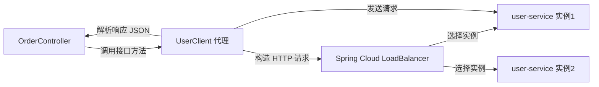
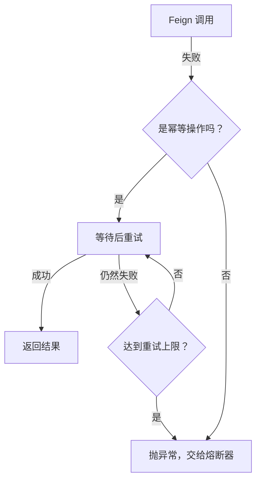

# 服务调用与负载均衡

## 服务之间怎么调用？

订单服务要查用户信息，商品服务要查库存，支付服务要通知订单服务更新状态——微服务架构下，服务间调用是最频繁的操作。

最原始的方式是用 `RestTemplate`：

```java
@RestController
public class OrderController {

    @Autowired
    private RestTemplate restTemplate;

    @GetMapping("/order/{id}")
    public Order getOrder(@PathVariable Long id) {
        Order order = orderService.getById(id);
        // 手动拼 URL，手动处理响应
        User user = restTemplate.getForObject(
            "http://user-service/user/" + order.getUserId(), 
            User.class
        );
        order.setUser(user);
        return order;
    }
}
```

这段代码有几个痛点：

- **URL 硬编码：** `http://user-service` 虽然用了服务名，但每次调用都要写完整的路径。
- **序列化/反序列化手动处理：** 得自己处理 JSON 转换。
- **没有类型安全：** 如果用户接口改了参数，编译期不会报错，运行时才炸。
- **样板代码太多：** 每次调用都是一堆重复的 `restTemplate.getForObject(...)` 代码。

OpenFeign 就是来解决这些问题的。

---

## OpenFeign：声明式 HTTP 调用

OpenFeign 的核心理念是：**把 HTTP 调用伪装成 Java 接口方法调用。** 你只需要定义一个接口，标注好请求路径和参数，Feign 会自动帮你生成实现类，处理 HTTP 请求、负载均衡、序列化等所有事情。

### 基本用法

首先添加依赖：

```xml
<dependency>
    <groupId>org.springframework.cloud</groupId>
    <artifactId>spring-cloud-starter-openfeign</artifactId>
</dependency>
```

定义 Feign 客户端接口：

```java
@FeignClient(name = "user-service")
public interface UserClient {

    @GetMapping("/user/{id}")
    User getUserById(@PathVariable("id") Long id);

    @PostMapping("/user")
    User createUser(@RequestBody User user);
    
    @GetMapping("/user/search")
    List<User> searchUsers(@RequestParam("name") String name);
}
```

然后像调用本地方法一样使用它：

```java
@RestController
public class OrderController {

    @Autowired
    private UserClient userClient;

    @GetMapping("/order/{id}")
    public Order getOrder(@PathVariable Long id) {
        Order order = orderService.getById(id);
        // 像调本地方法一样调远程服务
        User user = userClient.getUserById(order.getUserId());
        order.setUser(user);
        return order;
    }
}
```

代码干净了很多。没有 URL 拼接，没有手动序列化，接口定义就是文档。

### 启用 Feign

在启动类上加 `@EnableFeignClients`：

```java
@SpringBootApplication
@EnableFeignClients
public class OrderServiceApplication {
    public static void main(String[] args) {
        SpringApplication.run(OrderServiceApplication.class, args);
    }
}
```

### 工作原理



Feign 在启动时扫描所有 `@FeignClient` 注解的接口，为每个接口生成一个代理对象（基于 JDK 动态代理）。当你调用接口方法时，代理对象会：

1. 根据注解构造 HTTP 请求（方法、路径、参数、请求体）
2. 通过 LoadBalancer 选择一个服务实例
3. 发送 HTTP 请求
4. 把响应 JSON 反序列化成返回类型

整个过程对你透明，你只看到一个 Java 接口。

---

## 请求拦截器：统一添加 Token

服务间调用经常需要传递认证信息。用 Feign 的 `RequestInterceptor` 可以统一处理：

```java
@Configuration
public class FeignAuthInterceptor implements RequestInterceptor {

    @Override
    public void apply(RequestTemplate template) {
        // 从当前请求上下文中获取 Token
        ServletRequestAttributes attributes = 
            (ServletRequestAttributes) RequestContextHolder.getRequestAttributes();
        
        if (attributes != null) {
            String token = attributes.getRequest().getHeader("Authorization");
            if (token != null) {
                template.header("Authorization", token);
            }
        }
    }
}
```

这样所有 Feign 调用都会自动带上当前请求的 Token，不用每个调用都手动传。

**但要注意：** `RequestContextHolder` 依赖于 Servlet 的 ThreadLocal，在异步场景下（比如 `@Async`、CompletableFuture）会失效。这时候需要手动传递上下文，或者用 `TransmittableThreadLocal`。

---

## 错误解码器：优雅处理异常

默认情况下，Feign 调用失败会抛出 `FeignException`，信息比较粗糙。你可以自定义错误解码器：

```java
public class FeignErrorDecoder implements ErrorDecoder {

    @Override
    public Exception decode(String methodKey, Response response) {
        if (response.status() == 404) {
            return new NotFoundException("资源不存在: " + methodKey);
        }
        if (response.status() == 400) {
            return new BadRequestException("请求参数错误: " + methodKey);
        }
        return new FeignException.InternalServerError(
            "服务调用失败", response.request(), null, null
        );
    }
}

@Configuration
public class FeignConfig {
    @Bean
    public ErrorDecoder errorDecoder() {
        return new FeignErrorDecoder();
    }
}
```

---

## Spring Cloud LoadBalancer：负载均衡

Feign 调用 `user-service`，但 `user-service` 可能有 3 个实例。选哪个？这就是负载均衡的事。

Spring Cloud LoadBalancer 是 Spring Cloud 官方的负载均衡器，用来替代 Netflix Ribbon。

### 轮询策略（默认）

默认策略是**轮询（Round Robin）**——请求依次分配到每个实例：

```
请求1 → 实例A
请求2 → 实例B
请求3 → 实例C
请求4 → 实例A（循环）
```

对于大多数场景，轮询策略够用了。

### 随机策略

```java
@Configuration
@LoadBalancerClient(name = "user-service", configuration = LoadBalancerConfig.class)
public class UserLoadBalancerConfig {
}

public class LoadBalancerConfig {
    @Bean
    public ReactorLoadBalancer<ServiceInstance> randomLoadBalancer(
            Environment environment,
            LoadBalancerClientFactory loadBalancerClientFactory) {
        String name = environment.getProperty(LoadBalancerClientFactory.PROPERTY_NAME);
        return new RandomLoadBalancer(
            loadBalancerClientFactory.getLazyProvider(name, ServiceInstanceListSupplier.class),
            name
        );
    }
}
```

### 自定义策略：基于元数据的路由

还记得上一章提到的服务元数据吗？这里就能用上了。比如你想把请求路由到特定版本的实例：

```java
public class MetadataVersionBalancer implements ReactorServiceInstanceLoadBalancer {

    private final String targetVersion;
    // ... 构造函数省略

    @Override
    public Mono<Response<ServiceInstance>> choose(Request request) {
        // 从请求头中获取目标版本
        HttpHeaders headers = ((RequestDataContext) request.getContext()).getClientRequest().getHeaders();
        String version = headers.getFirst("X-Target-Version");
        
        return serviceInstanceListSupplier.get()
                .map(instances -> {
                    List<ServiceInstance> filtered = instances.stream()
                            .filter(i -> version == null || 
                                    version.equals(i.getMetadata().get("version")))
                            .collect(Collectors.toList());
                    
                    if (filtered.isEmpty()) {
                        filtered = instances; // 降级到全部实例
                    }
                    
                    // 轮询选择
                    int index = position.incrementAndGet() % filtered.size();
                    return new DefaultResponse(filtered.get(index));
                });
    }
}
```

配合网关的灰度路由，就能实现：**特定用户 → 网关标记版本 → Feign 调用时路由到对应版本的实例。**

---

## 超时与重试：调用失败了怎么办？

微服务间调用不可能 100% 成功。网络抖动、目标服务短暂不可用、响应慢……你需要合理的超时和重试策略。

### Feign 超时配置

```yaml
# 全局配置
spring:
  cloud:
    openfeign:
      client:
        config:
          default:
            connectTimeout: 3000    # 连接超时 3 秒
            readTimeout: 5000       # 读取超时 5 秒

# 针对特定服务的配置（覆盖全局）
          user-service:
            connectTimeout: 2000
            readTimeout: 3000
```

**一个常见的坑：** Feign 底层默认用的是 `HttpURLConnection`，它不支持连接池。如果你的服务间调用量大，建议切换到 OkHttp 或 Apache HttpClient：

```xml
<!-- 切换到 OkHttp -->
<dependency>
    <groupId>io.github.openfeign</groupId>
    <artifactId>feign-okhttp</artifactId>
</dependency>
```

```yaml
spring:
  cloud:
    openfeign:
      okhttp:
        enabled: true
```

### 重试策略

Feign 默认不重试（`Retryer.NEVER_RETRY`）。你可以启用重试：

```java
@Configuration
public class FeignRetryConfig {
    @Bean
    public Retryer feignRetryer() {
        // 初始间隔 100ms，最大间隔 1s，最多重试 3 次
        return new Retryer.Default(100, 1000, 3);
    }
}
```

**但重试要谨慎：**

- **只对幂等操作重试。** GET 请求可以重试，POST/PUT 要确保幂等性（比如用请求 ID 去重），否则可能导致重复下单。
- **重试次数不要太多。** 3 次是上限，再多就是在给下游服务"雪上加霜"。
- **配合退避策略。** 不要立刻重试，等一会儿再试（指数退避）。



---

## 调试技巧：Feign 日志

Feign 调用出了问题，怎么排查？开启 Feign 的日志：

```yaml
logging:
  level:
    com.example.orderclient: DEBUG   # 你的 Feign 客户端接口所在包
```

还需要配置日志级别 Bean：

```java
@Configuration
public class FeignLogConfig {
    @Bean
    Logger.Level feignLoggerLevel() {
        return Logger.Level.FULL;  // 记录请求和响应的所有细节
    }
}
```

日志输出会包含完整的请求 URL、请求头、请求体、响应状态码、响应体，非常方便排查问题。**注意：生产环境不要开 FULL 级别**，日志量太大。用 BASIC（只记录 URL 和状态码）就够了。

---

## 小结

OpenFeign + Spring Cloud LoadBalancer 是微服务间调用的标准组合。

几个要点：

1. **Feign 把 HTTP 调用变成了接口方法调用。** 减少样板代码，提高可读性和类型安全。
2. **LoadBalancer 负责选择实例。** 默认轮询，可以自定义策略（随机、基于元数据等）。
3. **超时和重试必须配置。** 默认值往往不适合生产环境。
4. **重试要谨慎。** 只对幂等操作重试，次数不要太多，要有退避策略。
5. **拦截器是扩展点。** Token 传递、日志记录、链路追踪 ID 透传都在这里做。

调用链路变长之后，一个新的问题出现了：一个服务调用另一个，那个服务又调第三个……如果其中某个服务挂了，会不会把整条链路拖垮？下一章我们来看熔断与限流——微服务架构的安全网。
