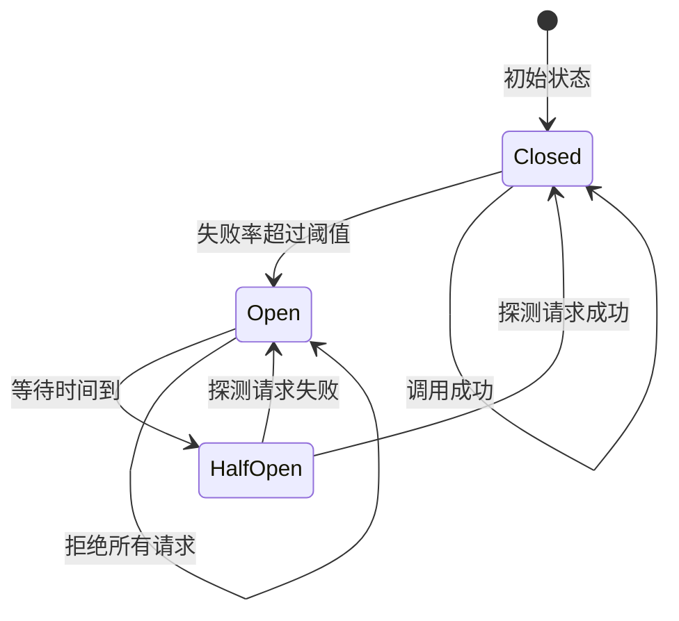
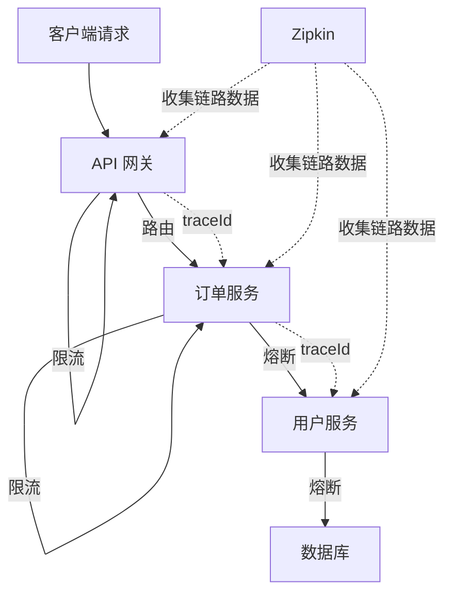

## 一个服务挂了，会不会拖垮整个系统？

这个问题，2012 年的 Netflix 给出了血淋淋的答案。

那年圣诞节前夕，Netflix 的一个推荐服务出了问题，响应变慢。上游服务没有做任何保护，一直傻等推荐服务返回。等待期间，线程被占满，上游服务也无法处理其他请求，也开始变慢。然后上游的上游也开始等……最终，整个系统像多米诺骨牌一样，一个接一个地倒下。

这就是**级联故障（Cascading Failure）**，也叫**雪崩**。

问题的根源在于：**同步调用链中，任何一个节点的故障都会向上传导。** 在单体应用里，最慢的函数会拖慢整个请求；在微服务架构里，最慢的服务会拖垮整条调用链。

解决方案就是我们这一章要讲的：**熔断（Circuit Breaker）、降级（Fallback）、限流（Rate Limiting）。**

---

## 熔断器：像电路保险丝一样工作

熔断器的灵感来自家里的电路保险丝。当电流过大时，保险丝自动熔断，切断电路，保护后面的电器不被烧毁。

软件熔断器的工作原理完全一样：



**关闭状态（Closed）：** 正常放行所有请求。但会记录失败次数，如果失败率超过阈值（比如 50%），切换到打开状态。

**打开状态（Open）：** 直接拒绝所有请求，不调用下游服务。返回一个降级响应（fallback）。等一段时间后，进入半开状态。

**半开状态（HalfOpen）：** 放行少量请求去"试探"下游服务是否恢复了。如果试探成功，回到关闭状态；如果还是失败，回到打开状态。

这个机制的核心价值是：**快速失败，不让一个已经出问题的服务继续拖累调用方。** 与其等 30 秒超时，不如立刻返回一个降级结果。

---

## Resilience4j：轻量级容错库

Resilience4j 是 Spring Cloud 官方推荐的容错库，用来替代已经停止维护的 Netflix Hystrix。它是一个轻量级的 Java 库，采用函数式编程风格，每个功能（熔断、限流、重试、Bulkhead）都是独立的模块，按需引入。

### 引入依赖

```xml
<dependency>
    <groupId>org.springframework.cloud</groupId>
    <artifactId>spring-cloud-starter-circuitbreaker-resilience4j</artifactId>
</dependency>
```

### 配置熔断器

```yaml
resilience4j:
  circuitbreaker:
    instances:
      userService:
        slidingWindowSize: 10           # 统计最近 10 次调用
        failureRateThreshold: 50        # 失败率超过 50% 触发熔断
        waitDurationInOpenState: 10s    # 熔断后等 10 秒进入半开
        permittedNumberOfCallsInHalfOpenState: 3  # 半开时放 3 个请求试探
        minimumNumberOfCalls: 5         # 至少 5 次调用才开始统计
        slowCallDurationThreshold: 2s   # 超过 2 秒算"慢调用"
        slowCallRateThreshold: 80       # 慢调用率超过 80% 也触发熔断
```

### 在 Feign 调用中使用熔断

方式一：使用 `@CircuitBreaker` 注解：

```java
@Service
public class UserServiceCaller {

    @Autowired
    private UserClient userClient;

    @CircuitBreaker(name = "userService", fallbackMethod = "getUserFallback")
    public User getUser(Long id) {
        return userClient.getUserById(id);
    }

    // 降级方法：参数要和原方法一致，最后一个参数可以是异常
    public User getUserFallback(Long id, Throwable t) {
        // 返回一个默认用户，或者从缓存中取
        User fallback = new User();
        fallback.setId(id);
        fallback.setName("用户信息暂不可用");
        return fallback;
    }
}
```

方式二：在 Feign Client 上配合 `fallbackFactory`，这是 Spring Cloud 集成方式：

```java
@FeignClient(name = "user-service", fallbackFactory = UserClientFallbackFactory.class)
public interface UserClient {
    @GetMapping("/user/{id}")
    User getUserById(@PathVariable("id") Long id);
}

@Component
public class UserClientFallbackFactory implements FallbackFactory<UserClient> {
    @Override
    public UserClient create(Throwable cause) {
        return new UserClient() {
            @Override
            public User getUserById(Long id) {
                // 记录日志
                log.warn("用户服务调用失败，降级处理: {}", cause.getMessage());
                User fallback = new User();
                fallback.setId(id);
                fallback.setName("暂不可用");
                return fallback;
            }
        };
    }
}
```

> **注意：** 使用 Feign 的 `fallbackFactory` 时需要额外配置 `spring.cloud.openfeign.circuitbreaker.enabled=true`。

---

## Sentinel：阿里巴巴的全方位防护

Sentinel 是阿里巴巴开源的流量治理组件，和 Resilience4j 的定位类似，但功能更全面。它最大的特色是有一个**可视化控制台**，你可以在控制台上实时看到流量数据、动态调整规则，不用重启服务。

### 安装 Sentinel Dashboard

```bash
docker run -d --name sentinel \
  -p 8858:8858 \
  bladex/sentinel-dashboard:1.8.7
```

访问 `http://localhost:8858`，默认账号密码都是 `sentinel`。

### 接入 Sentinel

```xml
<dependency>
    <groupId>com.alibaba.cloud</groupId>
    <artifactId>spring-cloud-starter-alibaba-sentinel</artifactId>
</dependency>
```

```yaml
spring:
  cloud:
    sentinel:
      transport:
        dashboard: localhost:8858
```

接入就这么简单。启动应用后，Sentinel Dashboard 会自动显示你的服务和接口。

### Sentinel 的三种防护策略

**1. 流量控制（Flow Control）**

限制接口的 QPS 或并发数：

```java
@GetMapping("/api/hot")
@SentinelResource(value = "hotApi", blockHandler = "hotApiBlock")
public String hotApi() {
    return "success";
}

public String hotApiBlock(BlockException ex) {
    return "请求太频繁，请稍后再试";
}
```

在 Sentinel Dashboard 上可以动态配置：QPS 限制为 100，超过的请求直接走 `blockHandler`。

**2. 熔断降级（Degrade）**

和 Resilience4j 类似，基于慢调用比例或异常比例触发熔断：

```java
@GetMapping("/api/order/{id}")
@SentinelResource(
    value = "getOrder",
    fallback = "getOrderFallback",
    exceptionsToIgnore = {IllegalArgumentException.class}
)
public Order getOrder(@PathVariable Long id) {
    if (id <= 0) {
        throw new IllegalArgumentException("无效的订单 ID");
    }
    return orderService.queryWithUser(id);
}

public Order getOrderFallback(Long id, Throwable t) {
    Order order = new Order();
    order.setId(id);
    order.setStatus("查询失败");
    return order;
}
```

**3. 热点参数限流**

这是 Sentinel 独有的能力——对特定参数值做限流。比如你的商品详情接口，某个热门商品 ID 的请求量特别大，可以只对这个商品 ID 限流：

```java
@GetMapping("/api/product/{id}")
@SentinelResource(value = "getProduct", blockHandler = "getProductBlock")
public Product getProduct(@PathVariable Long id) {
    return productService.getById(id);
}
```

在 Dashboard 配置热点参数规则：参数索引 0（即 `id`），当 `id=1001` 时 QPS 限制为 5，其他 ID 不限流。

### Resilience4j vs Sentinel

| 特性 | Resilience4j | Sentinel |
|---|---|---|
| 定位 | 轻量级容错库 | 全方位流量治理 |
| 配置方式 | 配置文件 / 代码 | Dashboard 动态配置 |
| 热点限流 | 不支持 | 支持 |
| 集群限流 | 不支持 | 支持 |
| 可视化 | 无（需集成 Actuator） | 内置 Dashboard |
| 学习成本 | 低 | 中 |

**选择建议：** 简单场景用 Resilience4j，够用且轻量。如果需要动态规则调整、热点限流、集群限流，或者团队在用 Spring Cloud Alibaba，Sentinel 是更好的选择。

---

## 降级策略：熔断之后返回什么？

熔断只是"止损"，真正让用户有感知的是**降级**——熔断之后返回什么？

好的降级策略应该是：

1. **返回缓存数据。** 如果你有本地缓存或 Redis 缓存，返回上一次成功的数据，比报错体验好得多。
2. **返回默认值。** 比如商品推荐服务挂了，返回"热门商品"列表而不是空。
3. **返回友好提示。** 不要返回 500 错误栈，返回"该功能暂时不可用，请稍后再试"。
4. **记录日志。** 降级发生时一定要记录日志，方便事后排查。

```java
public User getUserFallback(Long id, Throwable t) {
    // 1. 先尝试从缓存获取
    User cached = redisTemplate.opsForValue().get("user:" + id);
    if (cached != null) {
        return cached;
    }
    
    // 2. 缓存也没有，返回默认值
    log.warn("用户服务不可用，id={}, 原因={}", id, t.getMessage());
    User fallback = new User();
    fallback.setId(id);
    fallback.setName("未知用户");
    fallback.setAvatar("/default-avatar.png");
    return fallback;
}
```

---

## 限流：在入口处挡掉过载流量

限流和熔断是互补的：

- **熔断**解决的是"下游挂了，我怎么办"
- **限流**解决的是"流量太大，我扛不住"

限流通常在两个层面做：

1. **网关层：** 上一章讲的 Gateway 限流，挡掉绝大部分恶意和过载流量
2. **服务层：** 每个服务对自己的核心接口做限流，作为最后的防线

Sentinel 的限流在 Dashboard 上配置就行，Resilience4j 的限流模块用法：

```yaml
resilience4j:
  ratelimiter:
    instances:
      orderApi:
        limitForPeriod: 100         # 一个周期内允许 100 个请求
        limitRefreshPeriod: 1s      # 周期 1 秒
        timeoutDuration: 0          # 超过限制直接拒绝，不等待
```

```java
@RateLimiter(name = "orderApi", fallbackMethod = "orderRateLimitFallback")
public Order createOrder(OrderRequest request) {
    return orderService.create(request);
}

public Order orderRateLimitFallback(OrderRequest request, Throwable t) {
    throw new RuntimeException("系统繁忙，请稍后再试");
}
```

---

## 链路追踪：出了问题怎么定位？

微服务架构的一个大痛点是**排查问题困难**。一个请求经过了网关 → 订单服务 → 用户服务 → 数据库，中间某一步出了问题，你怎么知道是哪一步？

链路追踪（Distributed Tracing）就是解决这个问题的。它给每个请求分配一个唯一的 `traceId`，贯穿整个调用链。每经过一个服务，记录一个 `span`（包含耗时、状态等）。最终你可以看到完整的调用链路和每一跳的耗时。

### Micrometer Tracing + Zipkin

Spring Boot 3.x 使用 Micrometer Tracing 替代了原来的 Spring Cloud Sleuth。配合 Zipkin 做可视化展示。

```xml
<dependency>
    <groupId>io.micrometer</groupId>
    <artifactId>micrometer-tracing-bridge-brave</artifactId>
</dependency>
<dependency>
    <groupId>io.zipkin.reporter2</groupId>
    <artifactId>zipkin-reporter-brave</artifactId>
</dependency>
```

```yaml
management:
  tracing:
    sampling:
      probability: 1.0   # 采样率，1.0 表示 100%，生产环境建议 0.1
  zipkin:
    tracing:
      endpoint: http://localhost:9411/api/v2/spans
```

启动 Zipkin：

```bash
docker run -d --name zipkin -p 9411:9411 openzipkin/zipkin
```

### 效果

请求经过网关、订单服务、用户服务后，在 Zipkin UI 上可以看到：

```
traceId: abc123def456
├── api-gateway (15ms)
│   └── order-service (120ms)
│       ├── user-service (80ms)
│       │   └── MySQL (30ms)
│       └── inventory-service (45ms)
```

一眼就能看出哪个环节耗时最长，哪个环节报错了。

### traceId 透传

Feign 调用时，`traceId` 需要在服务间传递。Micrometer Tracing + Brave 会自动处理这个事情——它通过 `TracingFeignClient` 把 `traceId` 放到请求头里（`b3` 或 `traceparent`），下游服务从请求头中取出并继续传播。

如果你用了自定义的 Feign 拦截器，确保不要覆盖这些 header。

---

## 实战：一个完整的容错方案

把这一章的内容串起来，一个生产级的微服务容错方案通常是这样的：



具体配置：

1. **网关层：** Sentinel 或 Gateway 内置限流，按 IP / 用户限流
2. **服务层：** Feign 调用加 Resilience4j 或 Sentinel 熔断，配置降级方法
3. **链路层：** Micrometer Tracing + Zipkin，全链路 traceId 透传
4. **监控层：** Actuator 暴露 metrics，接 Prometheus + Grafana 看板

```yaml
# 一个服务的完整容错配置示例
resilience4j:
  circuitbreaker:
    instances:
      userService:
        slidingWindowSize: 10
        failureRateThreshold: 50
        waitDurationInOpenState: 10s
  timelimiter:
    instances:
      userService:
        timeoutDuration: 3s   # 整体超时，包括 Feign 调用

management:
  tracing:
    sampling:
      probability: 0.1
  zipkin:
    tracing:
      endpoint: http://zipkin:9411/api/v2/spans
  endpoints:
    web:
      exposure:
        include: health, metrics, circuitbreakers
```

---

## 小结

这一章讲的熔断、限流、降级、链路追踪，是微服务架构的"安全网"。没有它们，你的系统就像没有保险丝的电路——平时好好的，一出问题就是全挂。

几个要点：

1. **熔断是快速失败，不是消灭错误。** 目标是不让一个服务的故障传导到整个系统。
2. **降级策略比熔断本身更重要。** 熔断之后返回什么，决定了用户的体验。
3. **限流是主动防御，熔断是被动防御。** 两个都要有。
4. **Resilience4j 轻量够用，Sentinel 功能全面。** 根据团队情况选择。
5. **链路追踪是排查问题的利器。** 没有 traceId 的微服务系统，出了问题只能靠猜。

到这里，Spring Cloud 的核心组件我们都过了一遍。回顾一下：

- **第一章** 回答了"要不要用微服务"
- **第二章** 解决了"服务怎么互相找到"
- **第三章** 解决了"配置怎么集中管理"
- **第四章** 解决了"外部请求怎么统一入口"
- **第五章** 解决了"服务间怎么高效调用"
- **第六章** 解决了"怎么防止雪崩"

这六个问题覆盖了微服务架构最核心的挑战。掌握了它们，你就具备了搭建和维护一套微服务系统的基础能力。剩下的，就是在实际项目中不断踩坑、不断优化了。
