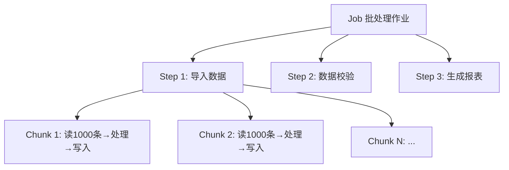

# Spring Batch

## 为什么需要 Spring Batch

先说一个真实场景：公司每天凌晨要把前一天的交易数据从核心系统导出，做对账、计算佣金、生成报表。数据量 300 万条。

用普通的 for 循环？内存爆了。分页查？效率低，还要处理失败重试。用消息队列？太重了，而且你要的是顺序执行、有明确的开始和结束。

Spring Batch 就是为这种场景设计的——**大规模、可重复、有状态的批处理**。

它不是消息队列，不是定时任务框架（虽然经常和 `@Scheduled` 配合用），而是一个专门处理"大量数据一批一批过"的引擎。

## Job / Step / Chunk：三层模型

Spring Batch 的核心概念就三个：



- **Job**：一个完整的批处理作业。比如"每日对账"就是一个 Job。
- **Step**：Job 由多个 Step 组成。Step 之间默认顺序执行，上一个成功才执行下一个。
- **Chunk**：Step 内部的处理单元。每次读一批数据（比如 1000 条），处理完后一次性写入。

先看一个最小可运行的例子。假设需求：把 CSV 文件里的用户数据导入数据库。

```java
@Configuration
@EnableBatchProcessing
public class ImportUserJobConfig {

    @Autowired
    private JobBuilderFactory jobBuilderFactory;

    @Autowired
    private StepBuilderFactory stepBuilderFactory;

    // 1. 读：从 CSV 文件读
    @Bean
    public FlatFileItemReader<User> reader() {
        return new FlatFileItemReaderBuilder<User>()
            .name("userReader")
            .resource(new ClassPathResource("users.csv"))
            .delimited()
            .names("name", "email", "age")
            .fieldSetMapper(fieldSet -> {
                User user = new User();
                user.setName(fieldSet.readString("name"));
                user.setEmail(fieldSet.readString("email"));
                user.setAge(fieldSet.readInt("age"));
                return user;
            })
            .build();
    }

    // 2. 处理：过滤或转换
    @Bean
    public ItemProcessor<User, User> processor() {
        return user -> {
            if (user.getAge() < 0 || user.getAge() > 150) {
                return null; // 返回 null = 跳过这条
            }
            user.setEmail(user.getEmail().toLowerCase().trim());
            return user;
        };
    }

    // 3. 写：写入数据库
    @Bean
    public JdbcBatchItemWriter<User> writer(DataSource dataSource) {
        return new JdbcBatchItemWriterBuilder<User>()
            .dataSource(dataSource)
            .sql("INSERT INTO users (name, email, age) VALUES (:name, :email, :age)")
            .beanMapped()
            .build();
    }

    // 4. 组装 Step
    @Bean
    public Step importStep() {
        return stepBuilderFactory.get("importStep")
            .<User, User>chunk(1000)  // 每 1000 条一个 chunk
            .reader(reader())
            .processor(processor())
            .writer(writer())
            .build();
    }

    // 5. 组装 Job
    @Bean
    public Job importUserJob() {
        return jobBuilderFactory.get("importUserJob")
            .start(importStep())
            .build();
    }
}
```

启动后，Spring Batch 会：
1. 从 CSV 文件每次读一条 User
2. 调用 processor 处理（过滤无效数据、清洗格式）
3. 累积 1000 条后，一次性写入数据库
4. 循环直到 CSV 读完

**为什么是 chunk 而不是逐条处理？** 因为数据库写入的开销大头是事务和网络往返。逐条写 100 万条 = 100 万次事务。chunk=1000 只需要 1000 次事务。性能差距是数量级的。

## 读-处理-写：三剑客

`ItemReader`、`ItemProcessor`、`ItemWriter` 是 Spring Batch 的三个核心接口，理解了它们就理解了整个框架。

```java
// 最简单的接口定义
public interface ItemReader<T> {
    T read() throws Exception;  // 返回 null 表示读完了
}

public interface ItemProcessor<I, O> {
    O process(I item) throws Exception;  // 返回 null 表示跳过
}

public interface ItemWriter<T> {
    void write(List<? extends T> items) throws Exception;  // 注意是 List
}
```

**ItemReader 的常见实现：**

```java
// 从数据库读
@Bean
public JdbcPagingItemReader<Order> dbReader(DataSource ds) {
    return new JdbcPagingItemReaderBuilder<Order>()
        .name("orderReader")
        .dataSource(ds)
        .selectClause("SELECT id, amount, status")
        .fromClause("FROM orders")
        .whereClause("WHERE status = 'PENDING'")
        .sortKeys(Map.of("id", Order.ASCENDING))
        .rowMapper((rs, rowNum) -> {
            Order o = new Order();
            o.setId(rs.getLong("id"));
            o.setAmount(rs.getBigDecimal("amount"));
            o.setStatus(rs.getString("status"));
            return o;
        })
        .pageSize(500)
        .build();
}

// 从 JPA 读
@Bean
public JpaPagingItemReader<User> jpaReader(EntityManager em) {
    return new JpaPagingItemReaderBuilder<User>()
        .name("userReader")
        .entityManagerFactory(em.getEntityManagerFactory())
        .queryString("SELECT u FROM User u WHERE u.active = true")
        .pageSize(200)
        .build();
}
```

**ItemProcessor 不是必须的**。如果你只是搬运数据，不需要转换或过滤，可以不配 processor。但实际项目中几乎都会用——数据清洗、格式转换、业务校验都在这一步。

一个实用技巧：processor 可以链式组合。

```java
@Bean
public CompositeItemProcessor<User, User> compositeProcessor() {
    CompositeItemProcessor<User, User> composite = new CompositeItemProcessor<>();
    composite.setDelegates(List.of(
        validationProcessor(),    // 先校验
        enrichmentProcessor(),    // 再补充数据
        formatProcessor()         // 最后格式化
    ));
    return composite;
}
```

**ItemWriter 有一个关键特性：它的参数是 List**。这保证了 chunk 内的所有数据在同一个事务中写入。如果其中一条写入失败，整个 chunk 回滚。

## 容错与重启：生产环境的命脉

批处理跑 300 万条数据，总有几条有问题。你不能因为一条脏数据就把整个 Job 搞挂。

**跳过（Skip）**：遇到指定异常就跳过，继续处理下一条。

```java
@Bean
public Step importStep() {
    return stepBuilderFactory.get("importStep")
        .<User, User>chunk(1000)
        .reader(reader())
        .processor(processor())
        .writer(writer())
        .faultTolerant()
        .skip(DataIntegrityViolationException.class)  // 数据重复等
        .skipLimit(100)  // 最多跳过 100 条，超过就报错
        .skip(ValidationException.class)
        .build();
}
```

**重试（Retry）**：临时性故障（网络抖动、数据库连接池满）重试几次。

```java
.faultTolerant()
.retry(DeadlockLoserDataAccessException.class)  // 死锁重试
.retryLimit(3)  // 最多重试 3 次
```

**跳过和重试可以组合使用**：先重试 3 次，还是失败再跳过。

**断点续传（Restart）**：Job 跑到一半挂了（服务器重启、OOM 等），下次从断点继续，不用从头来。

Spring Batch 用数据库的 `BATCH_JOB_EXECUTION`、`BATCH_STEP_EXECUTION` 等元数据表来记录执行进度。重启时自动读取上次的状态：

```java
@Bean
public Step importStep() {
    return stepBuilderFactory.get("importStep")
        .<User, User>chunk(1000)
        .reader(reader())
        .processor(processor())
        .writer(writer())
        .allowStartIfComplete(false)  // 已完成的 step 不再执行
        .startLimit(3)  // 最多启动 3 次（包括重启）
        .build();
}
```

```java
// 手动触发 Job，支持 restart
@Autowired
private JobLauncher jobLauncher;

@Autowired
private Job importUserJob;

public void run(Long executionId) throws Exception {
    JobParameters params = new JobParametersBuilder()
        .addLong("executionId", executionId)
        .toJobParameters();

    // 如果 executionId 相同的 Job 失败过，会自动从断点重启
    jobLauncher.run(importUserJob, params);
}
```

**生产建议**：
- Skip 的数据要有地方记录——要么写入"异常表"，要么输出到文件。不然你不知道哪些数据被跳过了。
- chunk 大小不是越大越好。太大会撑爆内存，太小事务太多。一般 500-5000 之间，看数据单条大小调。
- Spring Batch 的元数据表不要和业务表混在一个库，方便管理和清理。

## 与 Spring Boot 的整合

Spring Boot 对 Spring Batch 做了大量自动配置：

```yaml
# application.yml
spring:
  batch:
    jdbc:
      initialize-schema: always  # 自动建元数据表
    job:
      enabled: true  # 启动时自动执行所有 Job
```

`spring.batch.job.enabled: true` 是个双刃剑。开发阶段方便，上线前一定要改成 `false`，改成通过接口或定时任务手动触发。否则每次重启都会执行一遍 Job。

和 `@Scheduled` 配合用是最常见的模式：

```java
@Scheduled(cron = "0 0 2 * * ?")  // 每天凌晨 2 点
public void dailyReconciliation() throws Exception {
    JobParameters params = new JobParametersBuilder()
        .addLong("timestamp", System.currentTimeMillis())
        .toJobParameters();
    jobLauncher.run(reconciliationJob, params);
}
```

Spring Batch 不是万能的。如果你的数据量不到 10 万条，普通的 JDBC 批量插入 + 分页查询就够了。Spring Batch 的价值在于：**当数据量大到需要认真对待失败、重启、监控的时候，它给你一套现成的、经过验证的基础设施**。
