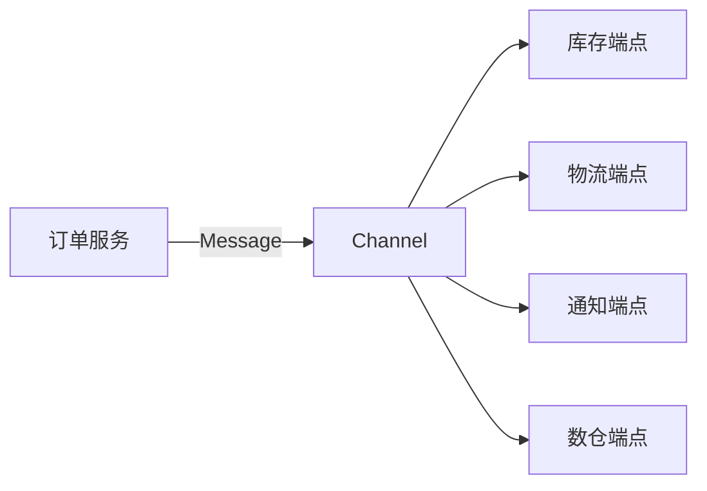
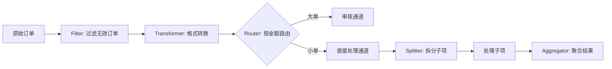

## 系统集成的痛点

假设你在做一个电商系统。订单创建后，要：
1. 调用库存服务扣减库存
2. 调用物流服务预分配仓库
3. 发一条消息到通知服务，给用户发短信
4. 把订单数据同步到数据仓库

如果全写在 `OrderService.createOrder()` 里，这个方法就变成了灾难——它知道太多其他系统的细节，任何一个下游服务挂了都会影响下单。

```java
// 耦合的写法——别这样
public Order createOrder(OrderRequest request) {
    Order order = doCreateOrder(request);
    inventoryService.deduct(order);        // 库存挂了？下单也失败？
    logisticsService.preAssign(order);     // 物流超时？用户等半天？
    notificationService.sendSMS(order);    // 短信发不了？订单创建不了？
    dataWarehouseService.sync(order);      // 数仓同步失败？重来？
    return order;
}
```

解耦的思路是：**用消息通道代替直接调用**。订单服务只管把消息发出去，不关心谁来消费。这就是 Spring Integration 解决的问题。

## 消息通道与端点

Spring Integration 的核心模型是：**消息（Message）通过通道（Channel）在端点（Endpoint）之间流转**。



用 Spring Integration 实现上面的场景：

```xml
<!-- build.gradle 依赖 -->
implementation 'org.springframework.integration:spring-integration-core'
```

```java
@Configuration
@EnableIntegration
public class OrderIntegrationConfig {

    // 定义通道：订单创建后的消息发到这里
    @Bean
    public MessageChannel orderCreatedChannel() {
        // PublishSubscribeChannel：一条消息，多个消费者都能收到
        return new PublishSubscribeChannel();
    }

    // 端点 1：库存扣减
    @Bean
    @ServiceActivator(inputChannel = "orderCreatedChannel")
    public MessageHandler inventoryHandler() {
        return message -> {
            Order order = (Order) message.getPayload();
            inventoryService.deduct(order);
        };
    }

    // 端点 2：物流预分配
    @Bean
    @ServiceActivator(inputChannel = "orderCreatedChannel")
    public MessageHandler logisticsHandler() {
        return message -> {
            Order order = (Order) message.getPayload();
            logisticsService.preAssign(order);
        };
    }

    // 端点 3：通知
    @Bean
    @ServiceActivator(inputChannel = "orderCreatedChannel")
    public MessageHandler notificationHandler() {
        return message -> {
            Order order = (Order) message.getPayload();
            notificationService.sendOrderCreatedSMS(order);
        };
    }
}
```

```java
// 订单服务只管发消息，不直接调下游
@Service
public class OrderService {

    @Autowired
    private MessageChannel orderCreatedChannel;

    public Order createOrder(OrderRequest request) {
        Order order = doCreateOrder(request);

        // 发消息到通道，然后就不管了
        orderCreatedChannel.send(
            MessageBuilder.withPayload(order)
                .setHeader("orderId", order.getId())
                .build()
        );

        return order;
    }
}
```

**Channel 的类型决定了消息的分发方式**：

| 通道类型 | 行为 | 适用场景 |
|----------|------|----------|
| `DirectChannel` | 点对点，只有一个消费者收到 | 任务分发 |
| `PublishSubscribeChannel` | 发布订阅，所有消费者都收到 | 事件广播 |
| `QueueChannel` | 队列，先进先出 | 流量削峰 |
| `PriorityChannel` | 优先级队列 | 高优先消息先处理 |

**用 QueueChannel 做流量削峰**：

```java
@Bean
public MessageChannel orderQueueChannel() {
    QueueChannel channel = new QueueChannel();
    channel.setQueue(new LinkedBlockingQueue<>(10000)); // 缓冲 1 万条
    return channel;
}
```

消息先进 QueueChannel 排队，消费者按自己的速度从队列里取。上游不管下游忙不忙，下游也不怕上游突发流量。

## 企业集成模式（EIP）

Spring Integration 是 [Enterprise Integration Patterns](https://www.enterpriseintegrationpatterns.com/) 这本书的 Java 实现。这本书定义了 65 种集成模式，Spring Integration 实现了其中大部分。

几个最常用的模式：

**1. 路由器（Router）—— 根据条件走不同的路**

```java
@Bean
public MessageRouter orderRouter() {
    return new AbstractMessageRouter() {
        @Override
        protected Collection<MessageChannel> determineTargetChannels(Message<?> message) {
            Order order = (Order) message.getPayload();
            if (order.getAmount().compareTo(new BigDecimal("10000")) > 0) {
                return Collections.singletonList(largeOrderChannel()); // 大单走审核
            }
            return Collections.singletonList(normalOrderChannel());   // 普通单直接处理
        }
    };
}
```

**2. 过滤器（Filter）—— 过滤掉不需要的消息**

```java
@Filter(inputChannel = "rawOrders", outputChannel = "validOrders")
public boolean filterInvalidOrders(Order order) {
    return order.getItems() != null
        && !order.getItems().isEmpty()
        && order.getTotalAmount().compareTo(BigDecimal.ZERO) > 0;
}
```

**3. 转换器（Transformer）—— 把消息从一种格式变成另一种**

```java
@Transformer(inputChannel = "orderChannel", outputChannel = "warehouseChannel")
public WarehouseRequest transformToWarehouseRequest(Order order) {
    WarehouseRequest req = new WarehouseRequest();
    req.setOrderId(order.getId());
    req.setItems(order.getItems().stream()
        .map(item -> new WarehouseItem(item.getSku(), item.getQuantity()))
        .collect(Collectors.toList()));
    return req;
}
```

**4. 分拆器（Splitter）和聚合器（Aggregator）—— 拆分和合并**

```java
// 把一个订单拆成多个子任务
@Splitter(inputChannel = "orderChannel", outputChannel = "itemChannel")
public List<OrderItem> splitOrder(Order order) {
    return order.getItems();
}

// 多个子任务完成后聚合结果
@Aggregator(inputChannel = "resultChannel", outputChannel = "finalResult")
public OrderResult aggregate(List<ItemResult> results) {
    OrderResult result = new OrderResult();
    result.setAllProcessed(results.stream().allMatch(ItemResult::isSuccess));
    return result;
}
```

这几个模式组合起来，就能构建出复杂的集成流程：



## 与外部系统的集成

Spring Integration 不只是进程内的消息传递，它还提供了各种适配器（Adapter）和网关（Gateway），对接外部系统：

```java
// 对接 HTTP
@Bean
public IntegrationFlow httpFlow() {
    return IntegrationFlow.from(Http.inboundGateway("/api/orders"))
        .handle(message -> {
            // 处理 HTTP 请求
        })
        .get();
}

// 对接文件系统
@Bean
public IntegrationFlow fileFlow() {
    return IntegrationFlow
        .from(Files.inboundAdapter(new File("/data/incoming"))
            .patternFilter("*.csv"))
        .handle(Files.outboundAdapter(new File("/data/processed")))
        .get();
}

// 对接 Kafka
@Bean
public IntegrationFlow kafkaFlow() {
    return IntegrationFlow
        .from(Kafka.messageDrivenChannelAdapter(kafkaConsumerFactory, "order-topic"))
        .handle(message -> {
            // 处理 Kafka 消息
        })
        .get();
}
```

**Spring Integration vs 消息队列（Kafka / RabbitMQ）**

很多人会问：我都用 Kafka 了，还需要 Spring Integration 吗？

答案是看场景：
- **跨进程通信**：用 Kafka / RabbitMQ。它们天生就是干这个的，有持久化、高可用、消费组等能力。
- **进程内解耦**：用 Spring Integration。它不需要额外的中间件，纯 Java 调用，性能高，测试方便。
- **两者配合**：Spring Integration 作为进程内的集成层，通过适配器接入 Kafka。消息进来后用 EIP 模式做路由、转换、分发。

Spring Integration 的存在感确实不高，很多项目用了 Kafka 就觉得够了。但如果你的系统内部有复杂的业务流转逻辑——多个步骤有条件分支、需要拆分聚合、失败要走补偿流程——Spring Integration 的 EIP 模型比你手写 if-else + 状态机要清晰得多。

**我的判断**：大多数项目不需要 Spring Integration。但如果你的业务复杂到"一张流程图都画不完"的程度，它是比硬编码更好的选择。
