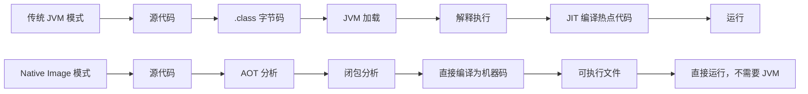
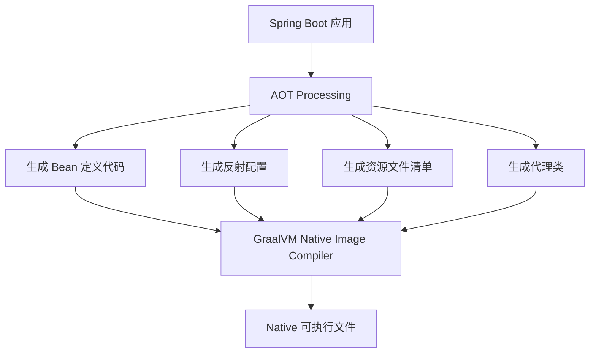

# Spring Native 与 GraalVM

## Spring Boot 启动慢在哪

一个典型的 Spring Boot 应用启动时间：

| 阶段 | 耗时 |
|------|------|
| JVM 启动 | 0.5s |
| 类加载 + 字节码验证 | 1-2s |
| 组件扫描 + Bean 实例化 | 3-8s |
| 自动配置 | 1-3s |
| **总计** | **6-15s** |

对于微服务来说，6-15 秒不算什么。但在 Serverless（函数计算）场景下，冷启动 15 秒意味着用户要等 15 秒才能看到响应。K8s 滚动更新时，新 Pod 启动慢也会影响可用性。

问题出在哪？**JVM 是解释执行 + JIT 编译的**。启动时要加载几千个类，扫描注解，生成代理，这些工作每次启动都要重做一遍。

GraalVM Native Image 的思路是：**在编译时就把这些事情做完，直接生成机器码的可执行文件**。



## AOT 编译原理

AOT（Ahead-of-Time）编译的核心挑战是：**Java 大量使用反射、动态代理、SPI，这些在编译时无法完全确定**。

看一个典型例子：

```java
// Spring 怎么知道要创建这个 Bean？
// 靠 @Component 注解 + 组件扫描
// 组件扫描是运行时通过反射完成的
@Service
public class UserService {
    @Autowired
    private UserRepository repo;
}
```

GraalVM Native Image 的做法是 **closed-world assumption（封闭世界假设）**：编译时扫描所有可达代码，认为程序用到的所有类都在编译时已知。这意味着：

- 运行时不能动态加载新类
- 反射必须提前声明
- 动态代理必须提前生成

Spring Boot 3.0 + Spring Framework 6.0 原生支持 AOT。它在编译阶段做这些事：

1. **组件扫描**：把运行时的组件扫描结果在编译时确定
2. **Bean 定义**：生成 `BeanFactoryInitializationAotProcessor`，提前处理 Bean 定义
3. **反射配置**：收集所有需要反射的类，生成 `reflect-config.json`
4. **代理生成**：提前生成 CGLIB 代理类



## 构建 Native Image

Spring Boot 3.x 用 GraalVM 构建 Native Image 非常简单：

**第一步：安装 GraalVM**

```bash
# 用 SDKMAN 安装
sdk install java 22.3.r19-grl
sdk use java 22.3.r19-grl

# 确认 native-image 命令可用
native-image --version
```

**第二步：配置 Maven / Gradle**

```xml
<!-- pom.xml -->
<plugin>
    <groupId>org.graalvm.buildtools</groupId>
    <artifactId>native-maven-plugin</artifactId>
    <configuration>
        <mainClass>com.example.Application</mainClass>
    </configuration>
</plugin>
```

**第三步：构建**

```bash
# Maven
mvn -Pnative native:compile

# Gradle
bootBuildImage --builder=paketobuildpacks/builder:tiny
```

构建完成后会生成一个可执行文件：

```bash
# 直接运行，不需要 JVM
./target/application

# 看看启动速度
time ./target/application
# 通常 0.05-0.5 秒，比 JVM 模式快 10-50 倍
```

对比一下：

| 指标 | JVM 模式 | Native Image |
|------|----------|-------------|
| 启动时间 | 6-15s | 0.05-0.5s |
| 内存占用 | 200-500MB | 30-100MB |
| 构建时间 | 10-30s | 2-10min |
| 峰值性能 | 更好（JIT 优化） | 略低 |
| 文件大小 | 20MB jar + JVM | 50-100MB 单文件 |

**关键结论**：Native Image 启动快、内存省，但峰值性能不如 JIT。如果你的服务是长期运行的，JIT 的运行时优化最终会反超。Native Image 的价值在于**短生命周期**和**资源受限**的场景。

## 反射、资源、代理的配置

这是 Native Image 最容易踩坑的地方。GraalVM 的闭包分析不知道你运行时会用反射访问哪些类，所以你得告诉它。

**反射配置**：

```json
// src/main/resources/META-INF/native-image/reflect-config.json
[
  {
    "name": "com.example.entity.User",
    "allDeclaredConstructors": true,
    "allDeclaredMethods": true,
    "allDeclaredFields": true
  }
]
```

或者用注解声明（Spring Boot 推荐的方式）：

```java
// 告诉 Spring 这个类在 AOT 阶段需要反射访问
@RegisterReflectionForBinding({User.class, Order.class})
@Configuration
public class NativeConfig {
}
```

**资源文件配置**：

```properties
# src/main/resources/META-INF/native-image/resource-config.json
{
  "resources": {
    "includes": [
      {"pattern": ".*\\.properties$"},
      {"pattern": ".*\\.xml$"},
      {"pattern": "templates/.*"},
      {"pattern": "static/.*"}
    ]
  }
}
```

或者在 `application.properties` 里声明：

```properties
spring.aot.resources.patterns=*.properties,*.xml,templates/**,static/**
```

**动态代理配置**：

Spring 大量使用 CGLIB 代理。AOT 模式下会自动生成，但有些场景需要手动声明：

```json
// proxy-config.json
[
  ["com.example.service.UserService", "org.springframework.aop.SpringProxy"],
  ["com.example.service.OrderService", "org.springframework.aop.SpringProxy"]
]
```

**常见的坑和解决方案**：

```java
// 坑 1：JSON 序列化用了反射
// Jackson 默认用反射访问 getter/setter
// 解决：声明 @RegisterReflectionForBinding
@RegisterReflectionForBinding({User.class, Order.class})

// 坑 2：自定义的反射调用
// 你的代码里直接用了 Class.forName() 或 Method.invoke()
// 解决：用 RuntimeHints API 注册
@Configuration
public class MyRuntimeHints implements RuntimeHintsRegistrar {
    @Override
    public void registerHints(RuntimeHints hints, ClassLoader classLoader) {
        hints.reflection().registerType(User.class,
            MemberCategory.values());
        hints.resources().includePattern("templates/*");
    }
}
```

```java
// 坑 3：序列化框架
// 有些框架（Kryo、Hessian）大量使用反射
// 解决方案：换成 Jackson + 注解声明，或者等框架官方支持 AOT

// 坑 4：测试
// Native Image 的行为和 JVM 不完全一样
// 建议加一个 nativeTest 阶段
```

**什么时候该用 Native Image？**

| 场景 | 推荐 |
|------|------|
| Serverless / 函数计算 | ✅ 强烈推荐 |
| CLI 工具 | ✅ 推荐 |
| K8s sidecar | ✅ 推荐 |
| 长期运行的微服务 | ⚠️ 看情况 |
| 大型单体应用 | ❌ 不推荐 |

**我的判断**：Native Image 是未来方向，但现阶段还有不少摩擦成本。如果你的项目大量依赖第三方库（特别是老库），适配 AOT 的工作量可能不小。先把 JVM 模式优化好（用 Spring Boot 3.x 的分层 jar、CDS 等技术），大多数场景够用了。等 GraalVM 生态再成熟一些，切换的成本会更低。

Spring Boot 3.x 的策略是对的：**AOT 作为可选能力，不影响现有开发体验**。你不需要为了用 Native Image 而改变开发方式，只是在构建阶段多一步处理。
